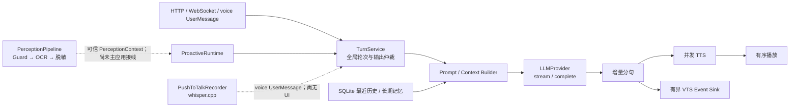

# Mac 可验证 AI 后端实现报告

> 报告日期：2026-07-13  
> 最终交付栈：PR #2～#10，全部保持 Draft  
> 验证范围：Python 3.11 后端与可独立实例化的本地输入/感知模块  
> 明确不包含：Windows UI、前台窗口捕获、全局热键、打包、真实设备与体验人工关卡

## 1. 结论与范围

本次完成了 Day 8～27 中可在 Mac 自动验证的 AI 后端代码：

- OpenAI-compatible LLM streaming/complete 与依赖注入；
- GPT-SoVITS `/tts`、校验、原子文件和可选隐私缓存；
- VTube Studio WebSocket 认证、请求关联、有界动作队列和重连；
- 确定性情绪状态、Prompt、TTS/VTS 语义映射；
- SQLite 7 天历史、长期记忆、FTS5、候选分析和管理 API；
- 平台无关的视觉隐私流水线与真实 RapidOCR 合成图推理；
- 主动发话评分、抑制、用户抢占和功能生命周期；
- 无 shell 的 whisper.cpp STT 与 push-to-talk 状态机；
- 跨模块故障风暴、隐私哨兵、资源清理和 Hypothesis 不变量。

默认启动仍使用 Mock LLM/TTS、静默播放，不连接真实外部服务。仓库没有安装或调用付费 LLM、GPT-SoVITS、VTube Studio 或 Whisper 模型，也没有提交角色、声音或屏幕资产。

本报告只说明“代码已实现且 Mac 自动门禁通过”。它**不表示** Windows、真实模型、麦克风、音质、表情、屏幕隐私体验或 Gate B～G 已通过。

## 2. 最终架构



核心边界：

1. `TurnService` 是显式用户输入和主动轮次的唯一仲裁点。
2. 每轮拥有独立 cancellation token、LLM stream、分句/TTS/播放状态。
3. VTS sink 只做同步有界入队，网络永不反压对话。
4. 历史/记忆通过原子 `PromptContextSnapshot` 进入 Prompt；屏幕和记忆内容始终是不可信数据，不是指令。
5. 感知与 STT 都通过依赖注入构造；没有平台适配器或 UI 时不会采集屏幕/麦克风。

## 3. 测试环境、门禁与 PR 栈

### 3.1 本机环境

- MacBook Pro，Apple M4 Pro，12 核，24 GB；
- macOS 26.5.1，arm64；
- Python 3.11.15；
- uv 0.11.25。

报告不记录序列号、硬件 UUID 或设备标识。

### 3.2 每层完整门禁

```text
uv sync --frozen --all-groups --all-extras
uv run pytest
uv run ruff check .
uv run ruff format --check .
uv run mypy
```

`pytest` 对 `app` 与 `desktop_client` 同时统计 statement/branch coverage，综合门槛为 90%。Hypothesis 用于情绪范围、主动评分、凭据永拒和临时视觉数据清理不变量。PR8/PR9 还执行了 `uv build` 并核对 wheel 内包含 `desktop_client.inputs`。

### 3.3 九个堆叠 Draft PR

下表的测试数是该层堆叠后的累计测试数；覆盖率是主协调 Agent 在最终回放时于上述 M4 环境取得的一次完整结果。Hypothesis 的随机样例可能令不同成功运行的覆盖率在小数点后轻微波动。

| 栈 | Draft PR | Head branch | Base | 本机测试 | 综合分支覆盖 | 实现锚点 |
| --- | --- | --- | --- | ---: | ---: | --- |
| PR1 | [#2](https://github.com/mizusawa-matsuri937/megumin_companion_ai/pull/2) | `codex/ai-provider-runtime` | `main` | 70 | 91.96% | `3faf33a38e33` |
| PR2 | [#3](https://github.com/mizusawa-matsuri937/megumin_companion_ai/pull/3) | `codex/gpt-sovits-runtime` | PR1 | 115 | 91.08% | `0c4fcf81f90c` |
| PR3 | [#4](https://github.com/mizusawa-matsuri937/megumin_companion_ai/pull/4) | `codex/vts-bridge` | PR2 | 140 | 90.59% | `861dae505314` |
| PR4 | [#5](https://github.com/mizusawa-matsuri937/megumin_companion_ai/pull/5) | `codex/emotion-prompt` | PR3 | 179 | 91.84% | `1682e0a1e5bc` |
| PR5 | [#6](https://github.com/mizusawa-matsuri937/megumin_companion_ai/pull/6) | `codex/memory-context` | PR4 | 271 | 93.00% | `440f79dac103` |
| PR6 | [#7](https://github.com/mizusawa-matsuri937/megumin_companion_ai/pull/7) | `codex/perception-privacy` | PR5 | 340 | 93.14% | `5b08e9942466` |
| PR7 | [#8](https://github.com/mizusawa-matsuri937/megumin_companion_ai/pull/8) | `codex/proactive-engine` | PR6 | 403 | 92.54% | `fe6ecd3d7fc2` |
| PR8 | [#9](https://github.com/mizusawa-matsuri937/megumin_companion_ai/pull/9) | `codex/local-stt` | PR7 | 449 | 92.55% | `37cd737a21be` |
| PR9 | [#10](https://github.com/mizusawa-matsuri937/megumin_companion_ai/pull/10) | `codex/ai-backend-report` | PR8 | 460 | 92.71% | E2E `c4721b1`；property `c90fcb7`；docs `664b207` |

PR9 最终 460 个测试、Ruff、格式和 strict mypy 全部通过。GitHub workflow 使用 `macos-latest` 和相同 frozen/all-extras 命令；最终 CI 状态记录在第 12 节。

## 4. 默认配置与真实数据含义

必须区分“默认不联网”和“默认不保存任何数据”。仓库 `config.yaml` 的实际默认如下：

| 模块 | 默认值 | 默认行为 |
| --- | --- | --- |
| LLM | `mock` | 不联网 |
| TTS | `mock` | 生成测试 WAV |
| Playback | `silent` | 不打开音频设备 |
| GPT-SoVITS persistent cache | `false` | 不持久缓存派生音频 |
| VTS | `false` | 不连接 WebSocket |
| Emotion | `true` | 仅本机内存状态 |
| Storage | `true` | 打开本机 SQLite |
| Recent history | migration 默认 `true` | 显式用户消息和成功助手消息保留 7 天 |
| Long-term memory | `false` | 不读写长期记忆 |
| Memory candidate LLM | `false` | 不调用候选分析模型 |
| Vision / cloud vision | `false` | 不轮询、不截图、不 OCR、不上传 |
| Proactive | `false` | 不创建 idle scheduler |
| STT | `false` | 不加载模型、不打开麦克风 |

因此默认启动不会访问外部服务或发声，但会把显式发送的用户消息及成功助手回复写入 `data/private/companion.sqlite3`。该数据库没有加密，也没有接入 macOS Keychain、Windows Credential Manager 或文件级加密。

## 5. PR1：Provider runtime 与共享契约

### 5.1 接口

冻结的 provider 接口：

```text
LLMProvider.stream(ChatRequest, CancellationToken)
LLMProvider.complete(ChatRequest, CancellationToken)
LLMProvider.close()
```

公共契约包括 `ChatMessage`、文本/图片 content parts、`ChatRequest`、`ChatCompletion`、`TurnOutcome(full_text, segments, metrics)`、非阻塞 `TurnEventSink`、`ExternalContextBlock(origin, trust, persistable)`、FeatureFlag 订阅与 `UserMessageSink`。

### 5.2 实现

- 将硬编码 Mock 组装改为依赖注入；默认仍为 Mock，无真实 provider 时不会伪装回退。
- 实现通用 `/v1/chat/completions` streaming 和 complete、JSON response mode、文本/图片消息序列化。
- SSE 支持 keepalive、Unicode、list content 和 `[DONE]`。
- 401/403、429、5xx、timeout、连接失败、拒绝和协议错误映射为稳定错误码；异常文本不包含远端响应正文。
- 配置的 `temperature=0.8`、`max_tokens=600` 会在请求没有覆盖值时生效。
- cancellation token 与 HTTP send/read 并发竞速：等待响应头、complete 请求或 stream body 阻塞时，取消会终止底层 task；stream response 在所有退出路径关闭。
- 请求验证错误删除原始 input/context，避免 FastAPI 把用户输入回显到 422。

### 5.3 测试与边界

- `httpx.MockTransport` 使用假密钥，覆盖 401/429/503/400、timeout、连接失败、畸形 JSON、多模态 payload 和关闭后调用。
- Unicode SSE 被逐个原始 byte 切分，包括多字节中文和 emoji，仍正确重组。
- 单独覆盖“响应头阻塞时取消 streaming/complete”和“响应体阻塞时取消并关闭 stream”。
- 没有调用真实模型；provider 方言、模型质量和真实网络代理仍未验证。

## 6. PR2：GPT-SoVITS runtime

### 6.1 配置与协议

- 默认 `tts.provider=mock`；真实地址默认示例为 `http://127.0.0.1:9880`。
- 对齐 GPT-SoVITS `api_v2.py` 的 `/tts` POST JSON，固定请求 WAV、非 streaming。
- preset 可配置文本/参考音频语言、参考文本、采样、分句、batch、速度和 repetition penalty。
- 单次响应最大 32 MiB；持久缓存默认关闭，上限 512 MiB、TTL 7 天。

### 6.2 安全与生命周期

- probe 和 synthesize 不通过时给出明确 provider 错误，不回退 Mock。
- 校验 HTTP 状态、content-type、Content-Length、实际流大小、RIFF/WAVE 与完整 PCM frame。
- 先写同目录 `.part`，校验后原子 replace；失败、取消、timeout、close 清理所有 partial/ephemeral 文件。
- close 会跟踪、取消并 drain 在途 synthesis，包含底层取消被延迟/吞掉的路径。
- 缓存 key 和文件名使用散列，不含原始对话文本；同 key 请求合并，支持 TTL/LRU、容量限制和播放 lease。
- 命中敏感文本或敏感 predicate 自身异常时，持久缓存 fail-closed 跳过。
- TTS 失败不撤回已经产生的文字/字幕，只跳过对应音频。

### 6.3 测试与边界

假 HTTP/WAV 覆盖损坏、空、超大、错误 content-type、流中取消、并发 cache、TTL/LRU、敏感文本、重复 close 与 shutdown race。没有启动真实 GPT-SoVITS，没有参考音频、音质、延迟或角色声音人工验收。

## 7. PR3：VTube Studio bridge

### 7.1 实现

- 用 `requestID` 关联并发乱序响应，并严格校验 response type。
- 执行 APIState、token 申请/复用、身份匹配、认证和撤销恢复。
- token JSON 原子写入；POSIX 目录尝试 0700、文件 0600；token 不出现在 repr 或普通日志。
- 有界 drop-oldest 表情动作队列，TurnService 只做非阻塞发布。
- 断线后指数退避重连；缺失 hotkey、API error 和 VTS 不可用只降级表情，不影响文字/语音。
- VTS 动作只携带 expression→hotkey ID；原始对话文本不会进入动作队列。
- connect/close、bridge 并发 close、认证撤销和重连 race 已线性化。

### 7.2 测试与边界

测试使用随机 loopback WebSocket server 和 fake bridge client，覆盖乱序、非请求消息、错误响应类型、APIError、认证撤销、断线、重连和队列溢出。没有启动真实 VTS；首次 Allow、真实模型、hotkey/表情质量和 Windows 文件权限语义未验证。

## 8. PR4：Emotion 与 Prompt

### 8.1 情绪状态

- 八维 `EmotionState` 全部 clamp 到 `[0,1]`。
- 单事件最大变化 0.15，每维每分钟累计绝对变化最大 0.25。
- 假时钟 decay、dominant-label 15 秒稳定期、explosion 300 秒冷却和 expression 4 秒冷却。
- LLM emotion suggestion 只能选择受限 stimulus；confidence/intensity 再次限幅，确定性规则拥有最终权威。
- 将语义映射为 TTS style/speed 与 VTS expression metadata。

### 8.2 Prompt

- 固定系统角色/隐私策略，当前用户消息始终位于最后。
- history 预算 6000 字符、external context 4000、单 block 1000。
- 外部上下文按 origin 优先级裁剪并序列化为不可信 JSON 数据；`persistable=True` block 被拒绝。
- emotion 关闭只冻结情绪更新和表现 decorator，不会移除核心系统 Prompt 或记忆上下文。
- history 与 context 通过一个原子 `PromptContextSnapshot` 取得，避免功能关闭时混入旧快照。

### 8.3 测试与边界

Hypothesis 覆盖生成情绪建议的范围不变量；假时钟覆盖 decay、限幅、label 稳定和冷却；Prompt injection 字符串按数据处理。情绪状态未持久化，角色人格、表达自然度和真实模型遵循程度仍需人工评审。

## 9. PR5：SQLite 历史与长期记忆

### 9.1 SQLite v1

表/索引包括：

- `schema_migrations`；
- `conversation_messages`；
- `memories`、`memory_sources`、`user_profiles`；
- `feature_flags`；
- FTS5 `memories_fts` 与 insert/update/delete triggers；
- active-memory 唯一索引和历史/管理查询索引。

迁移使用显式事务、幂等初始化，并拒绝未知未来版本。SQLite 启用 foreign keys、WAL、busy timeout 和 `secure_delete`。删除会清理 source/profile/FTS/运行上下文并 checkpoint；clear 额外执行整理流程。

这些机制减少普通逻辑删除后的可见残留，但数据库**没有加密**，Python 对象 wipe、SQLite `secure_delete` 和 VACUUM 都不能证明物理介质已不可恢复。

### 9.2 写入规则

- 显式用户消息在 `turn.accepted` 后写入最近历史，即使后续失败或取消。
- 助手消息只在 turn 成功完成后写入。
- 长期记忆默认关闭；只有成功轮次的显式用户消息可产生候选。
- assistant、screen 和 `ProactiveIntent` 永远不是候选来源。
- voice transcript 是显式 `UserMessage(input_mode="voice")`，因此会遵循同一 7 天历史和长期候选规则。

### 9.3 候选、冲突与隐私

- 可选 LLM analyzer 使用独立 provider、JSON mode、最多五条 claim，且 evidence quote 必须存在于用户原文。
- 凭据在 analyzer 前、parse 后、policy、确认和手工更新多层拒绝，二次确认不能绕过。
- 普通高置信事实可保存；健康、地址等敏感事实进入仅内存、15 分钟 TTL 的确认队列。
- exact duplicate 合并 source；同 canonical slot 冲突时旧值变为 superseded。
- FTS5 trigram 支持中文；短查询使用转义 LIKE。
- feature 关闭、update/delete/clear/confirm/history clear 都推进 context epoch；正在构建的旧 Prompt 快照会重试。

### 9.4 API

```text
GET    /api/features
PATCH  /api/features/{feature}
GET    /api/memory
GET    /api/memory/search
GET    /api/memory/confirmations
POST   /api/memory/confirm/{id}
PATCH  /api/memory/{id}
DELETE /api/memory/{id}
GET    /api/memory/export
DELETE /api/memory
POST   /api/history/clear
```

### 9.5 测试与边界

真实临时 SQLite 覆盖 migration 幂等/失败回滚/未来版本拒绝、并发初始化/写入、7 天边界、中文 FTS、去重/冲突、删除后零召回、关闭后零运行时读写和在途 Prompt 撤销。Hypothesis 生成 assignment secret、已知 token、OTP、身份证和 Luhn 卡号，验证多种落点与 text/voice/manual 来源都得到 `credential_forbidden`，且 memory/source/profile/FTS 均为零。

确认 UX、导出内容人工审阅、Windows SQLite/FTS 和数据库加密未完成。

## 10. PR6：视觉隐私

### 10.1 固定处理顺序

```text
Feature Guard
→ active window metadata
→ pre-capture Guard
→ capture
→ change detection
→ RapidOCR
→ content Guard
→ local coarse classifier
→ text redaction
→ 全 OCR bbox + policy bbox 图像遮挡
→ cloud rate limit
→ optional cloud analyzer
→ summary 再脱敏
→ cleanup
```

### 10.2 fail-closed 规则

- vision 关闭、敏感窗口、Guard 异常/timeout 时，零截图、零 OCR、零网络。
- unknown 普通窗口只有在 Guard 成功检查后才允许捕获。
- 敏感进程/标题、凭据、邮箱、电话、长数字、身份和支付关键词在本地拦截。
- change detector 只保存 digest/hash 和 sticky-sensitive 状态，不保存图片。
- cloud vision 独立 feature gate 和 6 次/60 秒限流。
- 每个 OCR 检出的非空文本 span bbox 都并入遮挡区域，包括低置信度结果。
- 任一文本 span 无 bbox、负坐标、越界或尺寸元数据不一致时，只返回本地分析，零 cloud 调用。
- sanitizer 异常/timeout/返回原 frame 时，同样本地降级，零 cloud 调用。
- 默认 Pillow sanitizer 的合成像素 E2E 验证 bbox 内变为黑色、bbox 外不变。
- 所有 owned `ImageFrame` 使用可变 buffer，并在成功、错误和取消路径 best-effort wipe；OCR spans 被清空。
- vision revoke 会停止并等待在途 observation、清理 change state；cloud revoke 独立阻止上传。

### 10.3 RapidOCR 离线证据

- 可选依赖锁定 `rapidocr 3.9.1`、`onnxruntime 1.27.0`、Pillow。
- 默认构造显式绑定 wheel 内 Det/Cls/Rec 三个 ONNX 文件，并预检 rec 模型内置 character metadata。
- 模型缺失、损坏或无字符表时安全失败，不进入 RapidOCR 自动下载路径。
- M4 上用 Pillow 合成图片做真实 OCR 推理；额外在 macOS deny-network sandbox 中通过。
- GitHub all-extras CI 执行真实合成图推理，不 skip。

### 10.4 剩余边界

只有平台无关 `ActiveWindowSource`/`WindowCapture` 协议，没有 macOS 或 Windows 前台窗口捕获器，也没有接入 `app.main`。没有真实 cloud analyzer。OCR false negative 无法由 bbox 遮挡机制消除；默认实现对“已检出但 bbox 不可靠”安全降级。没有使用真实屏幕材料，也没有验证 OS 屏幕录制权限或真实隐私体验。

Hypothesis 清理属性覆盖 cloud success/error/cancel 下原图、OCR result、脱敏图的 owned buffer；它不代表第三方进程、immutable copy、allocator 或物理内存被密码学擦除。

## 11. PR7：主动发话

### 11.1 引擎

- 支持 `idle`、`task_complete`、`emotion_shift`、`visual_change`、`scheduled` 五种 trigger。
- 固定 trigger weight、confidence、novelty、urgency 评分并 clamp。
- 抑制顺序覆盖：feature 关闭、用户轮次、focus、敏感状态、视觉不可用、DND、quiet hours、日限额、cooldown、idle 不足和低分。
- 默认 minimum score 0.62、cooldown 1200 秒、idle minimum 180 秒、daily limit 8、quiet hours 23:00～08:00。
- `ProactiveIntent` 使用固定 literal objective；caller instruction 会被替换，reason 只能是机器码。
- `proactive.accepted` 不发布 score、reason 或原始触发文本。

### 11.2 生命周期与隐私

- 显式用户 turn 原子抢占主动 turn；主动 turn 永远不能抢占用户 turn。
- 所有 session 共享输出仲裁，避免音频/事件交错。
- 主动 turn 不构造 `UserMessage`，不调用 history/memory observer。
- visual context 只能由可信 `update_perception` 发布；submit 参数不能注入或推进 generation。
- generation 高水位和 vision epoch 拒绝乱序、重放、关闭期间的迟发 observation。
- vision revoke 只取消视觉主动轮次；sensitive perception 会同步取消当前主动轮次。
- proactive 默认关闭时 `start()` 只保存配置，不创建 `proactive-idle-scheduler`。
- feature 开启才创建 scheduler；关闭 API 返回前会停止 scheduler，并等待活动主动 runner 的 cleanup。
- 并发 close 只执行一次、等待 scheduler/runner/feature transition 全部结束。

### 11.3 生产接线边界

`app.main` 目前只接入 30 秒 idle scheduler。task complete、emotion shift、visual change、scheduled producer、系统 Focus/DND 与感知发布者没有生产接线；这些仅以依赖注入 hook 和 fake context 自动测试。主动体验仍需至少两个自然日人工观察，本次不执行。

## 12. PR8：本地 whisper.cpp STT

### 12.1 实现

- 使用 `asyncio.create_subprocess_exec` 参数数组，不经过 shell。
- 输入严格为 16 kHz、单声道、16-bit、未压缩 PCM WAV。
- executable、model、language、thread 和 JSON output 均为独立参数，不把文本放入 shell/stdin。
- 验证 executable/model、WAV/JSON 最大尺寸、JSON shape、segments 和非空文本。
- timeout/cancel/close 执行 terminate → 0.5 秒 grace → kill → wait，并用单一 reaper 处理并发清理。
- push-to-talk 是显式状态机；只有 `start()` 才懒加载 sounddevice 并打开输入流。
- 原始 PCM 保存为 `bytearray`；WAV/JSON 位于私有临时目录，所有路径删除。
- 从录音源真正开始时启动独立墙钟 watchdog；即使声卡没有继续产生 PCM，也会在 120 秒上限停止、wipe 并拒绝发送。
- `stop_and_send(UserMessageSink)` 只发送一个统一的 `UserMessage(input_mode="voice")`。
- `tools/stt_smoke.py` 支持 check/file/microphone，绝不自动下载模型。
- wheel 已确认包含 `desktop_client` 及全部 `inputs` 模块。

### 12.2 隐私说明

原始音频不会被此 STT 模块上传；但成功 transcript 是用户显式消息，会像文字输入一样发送给用户配置的 LLM，并在仓库默认配置下写入 7 天本地历史。若长期记忆另行开启，成功 voice turn 也可能产生受相同 policy 约束的候选。

### 12.3 测试与边界

测试使用 fake CLI/process/audio stream，覆盖格式、路径、错误退出、畸形/超大 JSON、timeout、terminate→kill、预取消/中途取消、重复取消、并发 close、无声 watchdog、overflow、PCM/WAV 生命周期和 sink 单次投递。

没有下载 Whisper 模型，没有执行真实 `whisper-cli`、麦克风、macOS 权限、中文准确率或延迟体验。没有桌面按钮、托盘、全局热键或主应用 lifecycle 接线。

## 13. PR9：跨模块 E2E 与隐私证据

### 13.1 隐私哨兵

测试使用合成字符串 `SCREEN_PRIVACY_SENTINEL`，同时经过屏幕 OCR Guard、主动触发、Prompt/LLM fake transport、事件 sink、SQLite、日志、Mock TTS cache 和临时目录。结束后扫描：

```text
日志文件
SQLite 主文件及临时目录内全部文件
pipeline/event JSON
记录的网络 request body
音频 cache
临时目录
```

哨兵在所有禁止边界均为零；截图 frame 和 OCR spans 已清空；history/memory 行数为零；shutdown 后没有已知前缀的 backend task 残留。

### 13.2 故障风暴与竞态

- 主动 runner 正在运行时，显式用户消息抢占并等待其取消。
- 连续用户 turn 仍维持全局单 active pipeline，不发生输出交错。
- pipeline、observer、event sink 和 close 同时注入异常，错误正文不进入日志。
- 三个并发 shutdown 调用只关闭 pipeline/sink 一次，并 all-settled 清理。
- idle scheduler 产生的主动 turn 能完成事件发布，但 SQLite user/history/memory 始终为零。

### 13.3 属性测试

- Emotion：随机 stimulus/suggestion 后所有维度保持范围和限幅。
- Proactive：随机评分输入始终 clamp，抑制规则稳定。
- Credential：五类生成凭据、三种落点、多种 input mode 永远不写 memory/source/profile/FTS。
- Cleanup：生成原图/OCR/脱敏图 payload，在 cloud success/error/cancel 后所有 pipeline-owned buffer 清空且 provider 关闭。

## 14. 真实执行、测试替身与未验证矩阵

| 模块 | 本次真实执行 | 自动测试替身 | 未验证 |
| --- | --- | --- | --- |
| LLM | 真实 HTTPX adapter/cancellation 代码 | MockTransport、假 key、分块 byte stream | 真实 provider、模型质量/方言 |
| GPT-SoVITS | 真实 WAV/cache 文件生命周期 | fake HTTP 与合成 WAV | 真实服务、参考音频、音质/延迟 |
| VTS | 真实 WebSocket client/token store | loopback server、fake bridge client | VTS Allow、真实模型/hotkey/表情 |
| Emotion/Prompt | 完整本地确定性实现 | fake clock、Hypothesis | 人格和表达人工审查 |
| Memory | 真实 SQLite/WAL/FTS5 | 临时数据库、fake LLM analyzer | 加密、UX、Windows SQLite |
| Perception | 真实 RapidOCR/ONNX 合成图 | fake window/capture/cloud | OS capture、真实屏幕、真实 cloud |
| Proactive | 真实引擎/仲裁/idle scheduler | fake clock/flags/runner | 非 idle producer、Focus/DND、长期体验 |
| STT | 真实 subprocess/WAV/state-machine 代码 | fake CLI/process/audio stream | 模型、麦克风、权限、中文体验 |

## 15. 官方协议依据

- [VTube Studio Public API](https://github.com/DenchiSoft/VTubeStudio)：WebSocket、requestID、认证 token 和 hotkey request。
- [GPT-SoVITS `api_v2.py`](https://github.com/RVC-Boss/GPT-SoVITS/blob/main/api_v2.py)：`/tts` GET/POST、请求字段、WAV 和 streaming 语义。
- [whisper.cpp README](https://github.com/ggml-org/whisper.cpp/blob/master/README.md)：`whisper-cli` 与 16-bit WAV；官方转换示例使用 16 kHz 单声道 PCM。
- [RapidOCR 安装文档](https://rapidai.github.io/RapidOCRDocs/main/install_usage/rapidocr/install/) 与 [使用文档](https://rapidai.github.io/RapidOCRDocs/main/install_usage/rapidocr/usage/)：`rapidocr + onnxruntime`、`RapidOCR()` 和 ONNX CPU 推理。

## 16. Windows 与人工验收清单

以下项目故意延期，均未勾选：

### 16.1 Windows 工程

- [ ] Windows 11 干净环境执行 frozen sync、460 项回归、Ruff、mypy。
- [ ] 实现并测试 foreground window metadata/capture adapter。
- [ ] 验证屏幕录制、麦克风和音频输出权限/设备切换。
- [ ] 实现桌面对话框、托盘 feature 控制、push-to-talk 按钮。
- [ ] 实现并审查全局热键注册、冲突和释放。
- [ ] 验证 SQLite FTS5、路径权限、token 权限的 Windows 语义。
- [ ] 完成 Windows 打包、安装/卸载、升级和残留检查。

### 16.2 真实服务与体验

- [ ] 用专用低额度 key 验证真实 OpenAI-compatible provider、错误和流延迟。
- [ ] 启动真实 GPT-SoVITS，验证 preset、参考音频、音质、延迟和故障恢复。
- [ ] 启动真实 VTube Studio，人工 Allow，验证 token 撤销、hotkey 和表情。
- [ ] 下载用户自行选择的 Whisper 模型，验证真实 CLI、麦克风权限、中文准确率/延迟。
- [ ] 使用专门准备的非敏感/敏感测试窗口审查 Guard、OCR false negative 和遮挡效果。
- [ ] 审查真实 cloud vision 的数据处理、日志、区域与服务条款。
- [ ] 审查 7 天历史、memory CRUD/export/confirm/clear 的用户理解与恢复行为。
- [ ] 连续至少两个自然日评估主动发话频率、打扰、Focus/DND 和停用体验。
- [ ] 人工审查人格、依赖风险、版权、角色资产和公开发布命名边界。

### 16.3 Gate 声明

- Gate A：此前已完成。
- Gate B～G：**本报告不宣称通过**。任何后续 Gate 必须按原计划完成真实服务、Windows 和人工关卡后单独记录。

## 17. GitHub macOS CI 最终状态

九个 Draft PR 的实现/文档锚点均在 `macos-latest` 完成 frozen/all-extras 安装、pytest 90% branch gate、Ruff、format 和 strict mypy。每个 head 同时记录 push 与 pull_request 两条成功 run：

| PR | 验证 head | push run | pull_request run | 结果 |
| --- | --- | --- | --- | --- |
| PR1 | `3faf33a3` | [29232646284](https://github.com/mizusawa-matsuri937/megumin_companion_ai/actions/runs/29232646284) | [29232648200](https://github.com/mizusawa-matsuri937/megumin_companion_ai/actions/runs/29232648200) | success / success |
| PR2 | `0c4fcf81` | [29232669289](https://github.com/mizusawa-matsuri937/megumin_companion_ai/actions/runs/29232669289) | [29232671836](https://github.com/mizusawa-matsuri937/megumin_companion_ai/actions/runs/29232671836) | success / success |
| PR3 | `861dae50` | [29232683036](https://github.com/mizusawa-matsuri937/megumin_companion_ai/actions/runs/29232683036) | [29232685331](https://github.com/mizusawa-matsuri937/megumin_companion_ai/actions/runs/29232685331) | success / success |
| PR4 | `1682e0a1` | [29232693159](https://github.com/mizusawa-matsuri937/megumin_companion_ai/actions/runs/29232693159) | [29232695436](https://github.com/mizusawa-matsuri937/megumin_companion_ai/actions/runs/29232695436) | success / success |
| PR5 | `440f79da` | [29232708911](https://github.com/mizusawa-matsuri937/megumin_companion_ai/actions/runs/29232708911) | [29232712157](https://github.com/mizusawa-matsuri937/megumin_companion_ai/actions/runs/29232712157) | success / success |
| PR6 | `5b08e994` | [29232747830](https://github.com/mizusawa-matsuri937/megumin_companion_ai/actions/runs/29232747830) | [29232749624](https://github.com/mizusawa-matsuri937/megumin_companion_ai/actions/runs/29232749624) | success / success |
| PR7 | `fe6ecd3d` | [29232763301](https://github.com/mizusawa-matsuri937/megumin_companion_ai/actions/runs/29232763301) | [29232765191](https://github.com/mizusawa-matsuri937/megumin_companion_ai/actions/runs/29232765191) | success / success |
| PR8 | `37cd737a` | [29232781851](https://github.com/mizusawa-matsuri937/megumin_companion_ai/actions/runs/29232781851) | [29232783976](https://github.com/mizusawa-matsuri937/megumin_companion_ai/actions/runs/29232783976) | success / success |
| PR9 docs anchor | `664b2073` | [29232932536](https://github.com/mizusawa-matsuri937/megumin_companion_ai/actions/runs/29232932536) | [29232934601](https://github.com/mizusawa-matsuri937/megumin_companion_ai/actions/runs/29232934601) | success / success |

GitHub 给出两个信息性 annotation：`macos-latest` runner 映射迁移，以及部分 action 的 Node 运行时弃用提示；两者没有跳过或失败任何门禁步骤。后续维护应按上游 action 的正式迁移说明升级 action major version。

## 18. 最终判断

Mac 可自动验证的 AI 后端实现与自动测试范围已经收口：本机最终栈 460 tests / 92.71% 综合分支覆盖，所有静态门禁通过；九个模块化 Draft PR 已建立并保持堆叠关系。

当前仍是“后端代码完成、平台与体验待验收”的状态，不是可发布的 Windows MVP。最重要的剩余工作不是继续扩展后端能力，而是完成明确列出的平台接线、真实服务、设备、隐私和人工体验验证。
