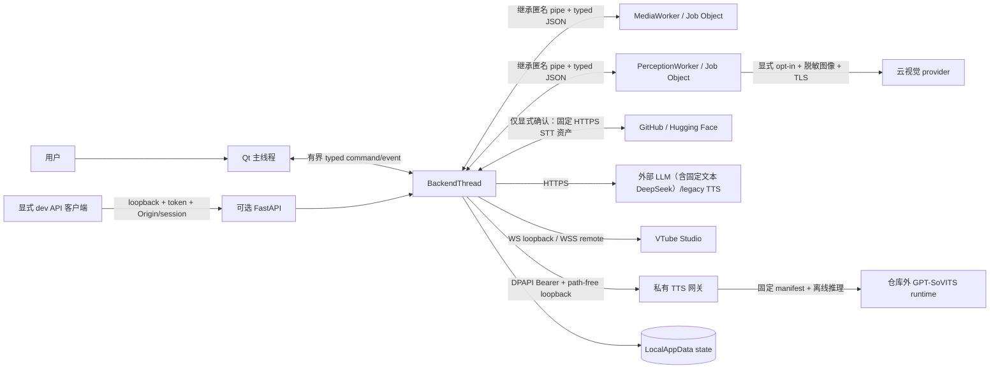
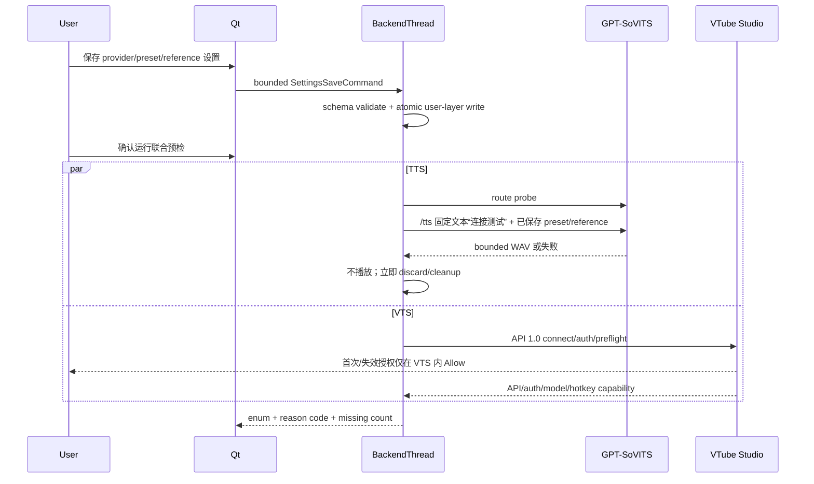
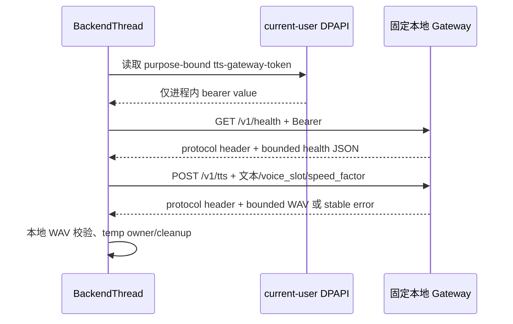
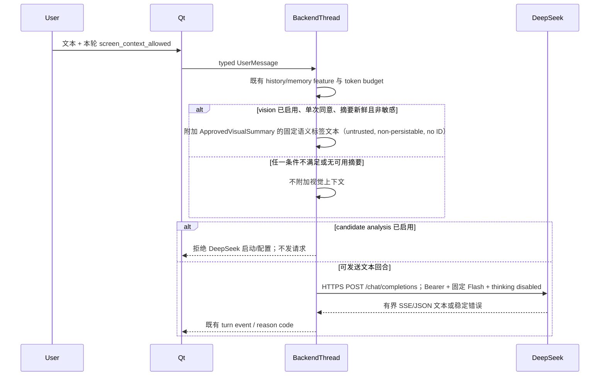
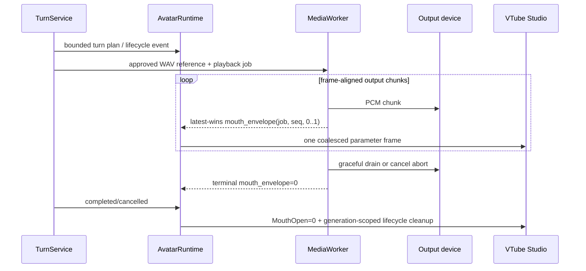
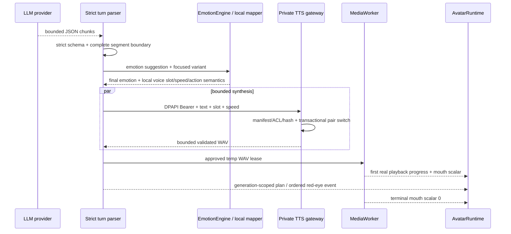
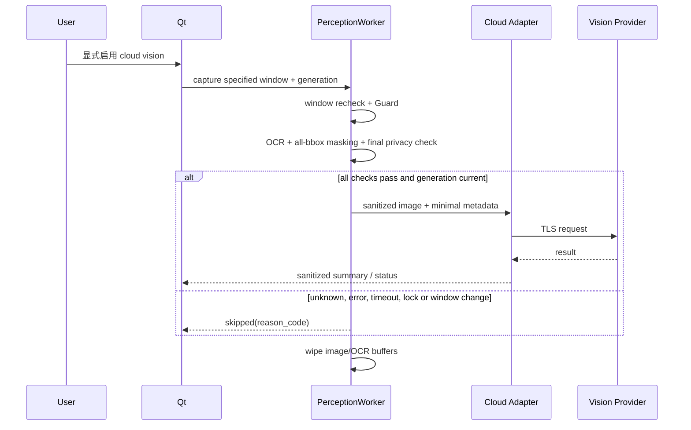

# Windows 数据流与保留清单

> 版本：2026-08-01
> 状态：Gate W0 已批准的目标契约；W17/W18 的 MediaWorker 音频路径已实现并验证，W19 的 provider
> 配置与显式联合 preflight 已实现并完成聚焦 fake/headless 验证。W28 的单写者
> AvatarRuntime、标量 mouth progress 和真实输出 drain 已完成自动/实机验证；W29 的结构化回合、私有五槽
> TTS 网关、真实中文播放与 VTS 联动已完成自动/实机验证。受管中文 STT
> runtime 已由 [`224e06f`](https://github.com/mizusawa-matsuri937/megumin_companion_ai/commit/224e06f9cbb1d2ab0cc2260fb244b1f74cd7dfbc)
> 加入并完成该 code head 的 CI。W19、W28、W29 与 W30 最终已按 PR #34、#35、#33、#32 的顺序合入
> `agent/windows-development-baseline@83f52e228d8df6df9abf08ce492192752ff113c2`；W30 最终组合同时包含
> DeepSeek Flash 文本出口、专用密钥、脱敏摘要与既有本地 GPT-SoVITS Gateway 最小兼容。合并关闭只稳定
> MockTTS CI 夹具并更新状态，不改变下述数据流。真实 DeepSeek Key、账号、计费与远端保留仍未由本地自动化验证。
> 关联：[`../adr/README.md`](../adr/README.md)、[`../decisions/w00_owner_decisions.md`](../decisions/w00_owner_decisions.md)、
> [`../decisions/w18_managed_chinese_stt_runtime.md`](../decisions/w18_managed_chinese_stt_runtime.md)

## Trust boundary

用户输入、dev API、helper protocol、外部 provider 和屏幕内容都属于不可信边界。截图/PCM 原始数据留在 worker；云视觉
是独立网络出口，不因 vision 本地启用而自动启用。STT runtime 下载也是单独网络边界：仅用户确认安装/修复时访问固定
GitHub/Hugging Face HTTPS URL，绝不发送录音、转写、设备名或用户路径。W29 私有 TTS 网关不是普通
loopback 信任：peer、Host、Origin、Bearer、body、JSON 和 admission 均在解析/推理前验证。

DeepSeek 是与云视觉分离的文本 HTTPS 出口：只在用户启用专用 provider 后，才可能发送当前用户文字和既有开关
已允许的历史/长期记忆检索/有限语义标签生成的摘要文本。它不接收截图、图像 URL、窗口标题、OCR 原文、bbox、路径或 observation ID；
关闭视觉或单次不同意时不附加摘要。远端对文本的处理、保留和地域仍是外部服务边界，不能由本地 TLS 或 DPAPI 消除。

本地 GPT-SoVITS Gateway 是与 DeepSeek 和直连 GPT-SoVITS 分离的兼容出口：仅在已保存的 Gateway provider
被选择时，BackendThread 才向固定 `127.0.0.1:9880` 发出助手待合成文本、有限 voice slot 与 speed factor，并以
专用 current-user DPAPI bearer token 鉴权。它没有 preset/reference、持久音频缓存、代理或自定义 CA 配置面，且不能
重定向到其他地址；Gateway 进程及其可能的下游转发不由本项目启动、管理或验证。这个本机明文 loopback 边界不等同于
端到端远端安全保证，具体残余风险见威胁模型。

## W19 provider preflight 数据流（2026-07-25）

确认边界：

- Qt↔BackendThread preflight event 不含固定测试正文、token、模型/hotkey ID、reference 路径、prompt、provider body
  或 WAV 路径。
- reference 路径与 prompt 作为用户配置保存在 current-user YAML；显式预检和正常 TTS 会把它们发给用户指定的
  GPT-SoVITS endpoint。`service_resource` 的可见性只能由该服务本次 `/tts` 结果证明。
- 预检 WAV 使用既有 TTS temp owner，cache 关闭，不进入 MediaWorker/playback；成功、失败和 close 都走既有清理。
- VTS token 仍只在 current-user DPAPI store 与 VTS 官方认证请求之间流动；设置页和 preflight snapshot 不回显。

## W30 既有本地 Gateway 兼容数据流（2026-07-31，跟进中）

- endpoint 固定为数值 loopback `http://127.0.0.1:9880`；client 使用 `trust_env=false`、禁止重定向，且
  配置组合拒绝代理、自定义 CA 和音频缓存。它不会读取通用 LLM/DeepSeek secret，也不会把 token 放入 UI、事件、日志或 YAML。
- W30 的全局 emotion mapper 仍服务直连 GPT-SoVITS；Gateway client 只在请求边界把有限 `TTSJob.emotion`
  映射为其五个 voice slot。未知标签在出网前拒绝，原始 emotion/source、WAV body 和临时绝对路径不跨 UI/worker 边界。
- `/v1/health` 和固定短语 `/v1/tts` 只在用户显式触发设置预检时发生；正常回合不增加新的网络目的地，仍在已选择的
  Gateway 内合成。该服务的进程身份、模型、后续转发、保留或漏洞不能由本项目验证。

## W30 DeepSeek Flash 文本出站数据流（2026-07-30）

W30 的以下事实是接口契约，不是对真实服务或视觉生产链路的验收声明：

- endpoint 固定为 `https://api.deepseek.com/chat/completions`，模型固定为 `deepseek-v4-flash`，请求带
  `thinking: {"type":"disabled"}`；用户不能以通用 Provider 设置覆盖这些字段。
- Provider 在请求离开进程前拒绝 image content 或 non-string multipart content，响应 tool call 也拒绝；
  `insufficient_system_resource` 映射为可重试的 unavailable。原始截图、脱敏图像、image URL、窗口标题、OCR 原文、
  bbox、屏幕路径和未脱敏摘要均不在该序列中。
- `PerceptionPromptContextSource` 只能接收 privacy-reviewed 的有限标签 `ApprovedVisualSummary`，并在本地映射为固定
  文本后再次脱敏；没有自由文本入口，因此泛用 `PerceptionContext`、OCR/title/path 文本及其 observation ID 不能进入
  prompt。敏感、过期、视觉关闭、无单次同意或生成文本含 URL/路径会清除/省略该上下文。它不捕获窗口、不运行 OCR，也不保存摘要。
- 近期历史和长期记忆**检索**继续使用原有 feature/预算；W30 不开启它们，也不允许 Flash 走长期记忆候选分析或写入。
- 响应和错误仍经过既有有界流式/JSON 路径；本地取消只能关闭本地 HTTP 请求，不能保证远端已停止处理。

## W28 实际播放口型与 Avatar 数据流（2026-07-29）

确认边界：

- PCM/WAV body、设备名、正文和路径不随 `job.progress` 离开 MediaWorker；父进程只收严格的 job/sequence/
  finite scalar。
- progress latest-wins 且不能饿死 heartbeat/cancel/terminal；父侧对全部 terminal path 独立归零。
- AvatarRuntime 是唯一参数 writer。离散动作与高频参数帧分通道，重连/切模/取消会使旧 generation 失效。
- VTS health/管理面只显示四层 availability、稳定 reason code 和聚合计数，不显示模型、hotkey、
  Expression 或逐帧值。

## W29 结构化回合与私有 TTS 数据流（2026-07-30）

确认边界：

- parser 只释放完整、严格校验的段；半成品 JSON、字段名、非法正文和控制值不显示、不朗读、不进入历史。
- LLM 只建议受限 emotion/focused variant 和逐段红眼；声音槽、速率、动作语义、爆裂/中二病最低红眼规则
  均由本地确定，LLM 不能提供路径、权重、VTS 入口或任意动作名。
- 网关请求不含 reference、prompt、权重路径或 VTS 信息；私有 manifest 才拥有五槽权重、参考 WAV、
  日语提示和哈希。网关一次只持有一个槽位，切换 pair 失败时完整回滚，回滚失败进入 quarantine。
- 主体动作和红眼跟随实际有序播放，不跟随 LLM 到达或并行合成完成顺序。取消使 generation 失效并清理
  未消费 WAV；迟到音频、动作、红眼和口型均被拒绝。

## W18 实现状态（2026-07-23）

- 已确认：PTT 按钮仅在按下后让 MediaWorker 打开麦克风；原始 PCM 留在预分配 ring，WAV/JSON 留在该 worker 的私有
  录音目录。helper pipe 回传的只有有界转写元数据，backend 将成功结果转为一条 voice `UserMessage`。
- 已确认：取消、超时、callback overflow/device status 和 helper shutdown 走 wipe/删除或 retryable temp-registry 清理；
  无法确认删除时不将转写报告为成功。
- 已确认（`224e06f` code head 已核验）：受管 profile 只在显式 UI/CLI 操作后下载固定的 `whisper.cpp` v1.9.1 archive 和
  `ggml-base-q5_1.bin`；无启动下载、默认 `stt.enabled=false`。assets 在私有 staging 验证 archive/model/CLI hash 后原子
  切换到 LocalAppData，MediaWorker 首次使用时再验证 CLI/model 全量 hash。状态、稳定 reason code 和 `NOTICE.txt` 不含录音、
  转写或完整用户路径。
- 未验证：真实 Windows 麦克风、录音指示、锁屏和系统级 global hotkey。W18 未启用 global hotkey，W20 lock/session
  adapter 也尚未实现，因此这些不能从本文推导为通过。真实 `PeakWorkingSetSize` 也尚未测量，57 MiB 模型文件不能代替
  ≤512 MiB 的峰值工作集 Gate。

## 数据分类

| 数据 | 产生者与 owner | 进程间流动 | 持久位置 | 允许出口 | 保留与清理 | 日志规则 |
| --- | --- | --- | --- | --- | --- | --- |
| 文本草稿 | Qt/UI | 发送后经 bridge 到 BackendThread | 草稿默认不持久化 | 仅显式发送后进入 LLM/TTS | 未发送草稿随 UI 生命周期清除 | 不记录正文 |
| 已发送用户文字 | TurnService/history owner | bridge/API → backend | LocalAppData SQLite，默认近期历史 7 天 | 用户配置的 LLM/TTS；不得进入云视觉 metadata | retention/clear/卸载策略 | 只记 turn/session fingerprint、长度和状态 |
| 助手回复/字幕 | TurnService/history owner | backend → UI/VTS generation | 成功回复可存近期历史 | TTS；VTS 只收表现事件 | 同历史策略；取消后的旧 delta 不恢复 | 不记录正文 |
| 结构化回合控制 | LLM adapter → strict parser → EmotionEngine | 只传受限 emotion/focused variant/red-eye；本地再派生声音/动作 | 不单独持久化；成功正文按助手回复规则 | 仅本地 mapper、TTS owner 和 AvatarRuntime | turn/generation 结束释放；parse 失败丢弃未播放段 | 不记录原始 JSON、控制字段或非法正文 |
| 麦克风 PCM/WAV | MediaWorker | 原始数据不离开 worker；只返回有界 transcript metadata | 预分配 ring + 每次录音私有 worker temp；parent 仅有 registry lease，默认无持久缓存 | 本地 whisper；未经另行批准不得上传 STT 云服务 | stop/cancel/failure/watchdog 后 wipe + 删除；crash 后 scavenger | 不记 PCM、WAV 路径或 transcript |
| transcript | MediaWorker → Qt/Backend | typed result，转为 voice `UserMessage` | 按显式用户消息规则进入近期历史 | LLM/TTS | 与用户文字一致 | 不记录正文 |
| 原始指定窗口截图 | PerceptionWorker | 不返回主进程 | 默认内存 only；无普通 temp | 禁止直接上传 | 本地处理结束立即 wipe；worker kill 后残留扫描 | 不记图像、标题或路径 |
| OCR 文本/bbox | PerceptionWorker | 只返回必要的脱敏摘要；bbox 用于本地遮挡 | 默认不持久化 | 原始 OCR 禁止外发；只用于生成脱敏图像 | 单帧生命周期后 wipe | 不记 OCR 文本 |
| 脱敏窗口图像 | PerceptionWorker | 默认不返回主进程；由受控 cloud adapter 发送 | 默认不持久化 | 仅用户显式启用云视觉、全部本地检查成功时通过 TLS 上传 | 请求完成/取消后 wipe；禁止缓存 | 只记 provider、bytes、latency、reason code，不记内容 |
| PerceptionContext / ApprovedVisualSummary | PerceptionWorker/Backend | 泛用 `PerceptionContext` 不进入 W30 prompt；仅有限非敏感语义标签可映射为固定文本、二次脱敏后进入，标记 untrusted | 默认不单独持久化；内存中至多保留一条最新摘要至新鲜期 | 仅作为本轮文本 LLM 上下文；**禁止**原图/image URL/OCR 原文/title/bbox/path/observation ID/自由文本出口 | 敏感、过期、视觉关闭、URI/path 或失效代际时清除；不得生成长期记忆候选 | 不记摘要正文 |
| 近期历史 | MemoryRuntime/SQLite | backend 内部 | `state/companion.sqlite3` + WAL | 用户显式 export；作为 LLM 上下文 | 默认 7 天、clear/retention/checkpoint | 不记录记录内容 |
| 长期记忆 | MemoryService/SQLite | backend 内部 | 同一 DB，显式 opt-in | 用户显式 export；作为 LLM 上下文 | confirm/update/delete/clear；凭据永不成为候选 | 只记记录 id/操作/状态 |
| 通用 LLM API key/VTS token | Secret store | 对应 provider adapter 只在使用时读取 | DPAPI current-user 密文文件 | 仅发给对应 endpoint/协议 | replace/revoke/reset；普通卸载默认删除 | 不记录值、密文、header 或路径 |
| DeepSeek API key（W30） | 专用 Secret store | 仅 `DeepSeekFlashLLMProvider` 读取；桌面配置命令 write-only | 独立、purpose-bound 的 DPAPI current-user 密文槽；不写 YAML 或通用 LLM 槽 | 仅作为 Bearer 发至固定 `https://api.deepseek.com/chat/completions` | 停用时先切 `llm.provider=none` 并 reload，再 revoke；撤销失败仍保持远端 provider 禁用 | 不记录值、密文、header、文件路径或请求正文 |
| 本地 GPT-SoVITS Gateway token（W30 兼容） | 专用 Secret store | 仅 Gateway client 在运行/显式预检时读取 | 独立、purpose-bound 的 DPAPI current-user 密文槽；不写 YAML 或 LLM/DeepSeek 槽 | 仅作为 Bearer 发至固定 `http://127.0.0.1:9880` 的私有 Gateway 协议 | replace/revoke/reset；不创建音频 cache | 不记录值、密文、header、文件路径或请求正文 |
| DeepSeek Chat 请求（W30） | Backend/固定 Flash provider | 仅进程内组合用户文字与已获现有开关允许的历史、记忆检索、无 ID 的批准有限语义标签摘要 | 不新增请求正文持久化；既有历史/记忆各自按其行的保留规则 | 仅 HTTPS 的固定 DeepSeek chat endpoint；文本模型，不含图像、multipart content 或 tool call | 响应/取消后释放本地请求对象；远端处理/保留由 DeepSeek 外部政策决定 | 只记稳定状态、provider/model、长度/延迟；不记正文、摘要或 header |
| 用户设置 | Config owner | UI command → config service | `config/settings.yaml`，带 schema version；W19 preset/reference/prompt 属于用户私密配置但不是 secret；W29 只保存 gateway/system playback/VTS/Avatar 开关与私有语义映射 | 无，除非对应 provider 请求需要最小配置 | 升级迁移/卸载选择 | 只记 schema/version/字段类别；不记 reference/prompt/完整路径或私有入口名 |
| 日志/健康/诊断 | 单 writer/exporter | allowlist event | `logs`，10 MiB × 5 且最多 14 天 | 用户显式导出脱敏诊断包 | rotation + retention | 禁止正文、截图、OCR、音频、secret、完整路径 |
| TTS 临时 WAV | TTS owner；正常播放期间由 MediaWorker 独占消费；W19 preflight WAV 不播放 | 正常播放只提交批准根下的 `ResourceReference`；preflight WAV 不跨入 helper；W29 loopback response 只由 provider 写入原子受管临时文件；worker wire 不含绝对路径、PCM、WAV body 或 native device index | `temp/audio`；可选 `cache/audio` 默认关闭，W19 preflight 与 W29 gateway provider 强制关闭 cache | 正常路径仅到本地 MediaWorker playback；preflight 无播放出口 | 取消/消费后 release；preflight 成功立即 discard；provider close/terminal/scavenger 清理；受 W07 在途音频预算约束 | 只记 job id、bytes、duration、稳定 error/notice code |
| Mouth envelope / Avatar frame | MediaWorker / AvatarRuntime | helper 只返回 job、sequence、finite 0～1 scalar；AvatarRuntime 单写 VTS | 不持久化；latest sample/frame 仅在内存 | 仅到本机 VTS API | terminal/cancel/failure/crash/close 归零；generation 失效即丢弃 | 只记 sent/coalesced/dropped 和稳定 reason code；不记逐帧值 |
| 受管中文 STT runtime/model | 显式安装服务 | BackendThread/CLI 只下载固定公开 URL；worker 只读本地已验证文件 | `%LOCALAPPDATA%\MeguminCompanion\models\stt\whispercpp\v1.9.1\`，安装包/wheel/CI artifact 外 | 仅用户确认时从 GitHub/Hugging Face 下载 asset bytes；**不发送音频或转写** | staging 失败/取消清理；已验证资产保留到用户修复/删除；不后台更新 | 不记完整本地路径、下载 token、音频或转写；本地 NOTICE 仅含公开来源/许可证/hash |
| W29 私有 GPT-SoVITS runtime/manifest | 仓库外 gateway owner | 主应用只发送 text/slot/speed；gateway 读取固定权重、参考 WAV、日语提示和公共模型 | Git、wheel、CI artifact、诊断包外的 current-user 私有根 | 安装阶段仅访问固定公开源码/模型来源；推理无云端出口 | 失败 staging 清理；已验证 runtime 保留；不后台启动、上传或更新 | 不记权重/参考/提示/hash/路径；只记稳定状态码和内容无关计数 |
| 模型/角色/参考音频 | 用户/外部路径 | W19 legacy provider 可将 reference 配置交给用户指定服务；W29 主应用不能读取或传递 reference/path | 安装包外；W19 用户 YAML 可记录 reference 字符串，W29 私有 manifest 留在仓库外 | 只发给用户明确配置的 legacy 服务；W29 仅本机离线 gateway 读取 | 用户管理；卸载不复制或删除原资产 | 不记录完整路径、prompt、hash 或内容 |

## 云视觉序列

云端返回内容是不可信数据，只能作为本轮上下文；不得直接执行命令或产生长期记忆候选。

## Shutdown 和删除不变量

1. feature 的 `disabled` 必须代表 worker、queue、在途上传、buffer 和 temp 已停止/清理，而不只是 desired=false。
2. 新用户输入取消旧 turn 后，旧字幕、音频、VTS 和 cloud result 不得恢复。
3. 任何 Guard/删除/清理未知或失败都显示明确状态并保持 fail closed。
4. 所有 queue、文件、缓存、日志和状态表都使用 Windows 计划第 4.8 节硬上限。
5. best-effort wipe/secure delete 不描述为 SSD 物理擦除保证。
6. Avatar shutdown 在断开 VTS 前拒绝新 callback、令嘴归零、release 主体动作并显式关闭程序红眼；失败只降级
   Avatar，不能阻断文字或安全音频关闭。
7. DeepSeek 停用先使 `llm.provider=none` 生效，再撤销专用密钥；撤销、reload 或密钥状态未知时不得恢复远端 provider，
   更不得回退为通用密钥或图像输入。
8. W29 gateway 不由主程序自动启动；关闭桌面启动器必须关闭 Job Object 并清理整个推理子进程树。网关
   失败或未运行时文字和安全视觉 fallback 继续，嘴保持闭合。
