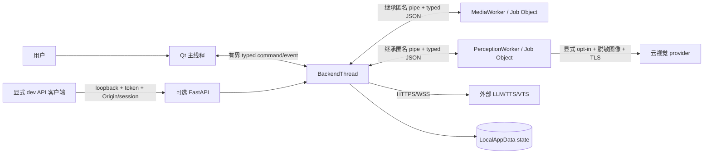
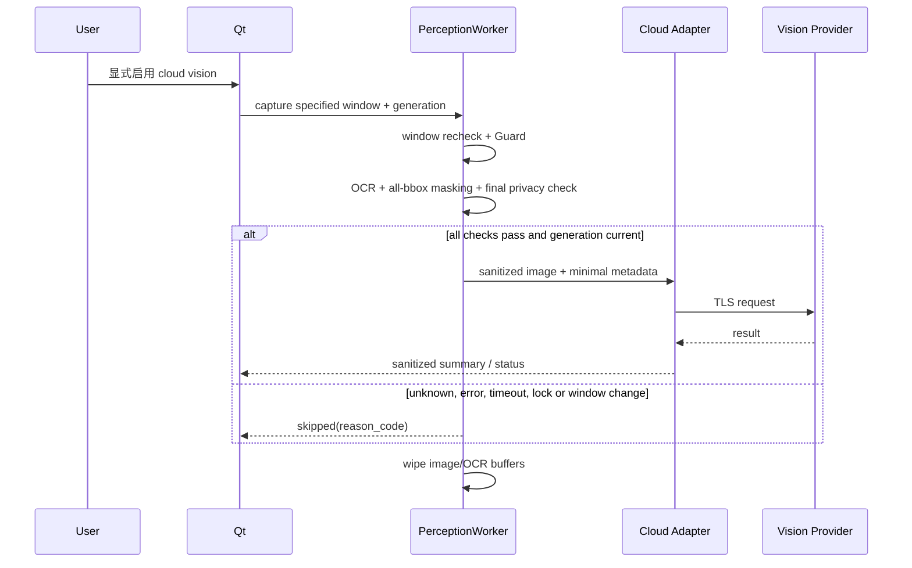

# Windows 数据流与保留清单

> 版本：2026-07-22
> 状态：Gate W0 已批准的目标契约；W17/W18 的 MediaWorker 音频路径已在本地实现并验证，其他行仍不代表代码已经实现
> 关联：[`../adr/README.md`](../adr/README.md)、[`../decisions/w00_owner_decisions.md`](../decisions/w00_owner_decisions.md)

## Trust boundary

用户输入、dev API、helper protocol、外部 provider 和屏幕内容都属于不可信边界。截图/PCM 原始数据留在 worker；云视觉是独立网络出口，不因 vision 本地启用而自动启用。

## W18 实现状态（2026-07-22）

- 已确认：PTT 按钮仅在按下后让 MediaWorker 打开麦克风；原始 PCM 留在预分配 ring，WAV/JSON 留在该 worker 的私有
  录音目录。helper pipe 回传的只有有界转写元数据，backend 将成功结果转为一条 voice `UserMessage`。
- 已确认：取消、超时、callback overflow/device status 和 helper shutdown 走 wipe/删除或 retryable temp-registry 清理；
  无法确认删除时不将转写报告为成功。
- 未验证：真实 Windows 麦克风、录音指示、锁屏和系统级 global hotkey。W18 未启用 global hotkey，W20 lock/session
  adapter 也尚未实现，因此这些不能从本文推导为通过。

## 数据分类

| 数据 | 产生者与 owner | 进程间流动 | 持久位置 | 允许出口 | 保留与清理 | 日志规则 |
| --- | --- | --- | --- | --- | --- | --- |
| 文本草稿 | Qt/UI | 发送后经 bridge 到 BackendThread | 草稿默认不持久化 | 仅显式发送后进入 LLM/TTS | 未发送草稿随 UI 生命周期清除 | 不记录正文 |
| 已发送用户文字 | TurnService/history owner | bridge/API → backend | LocalAppData SQLite，默认近期历史 7 天 | 用户配置的 LLM/TTS；不得进入云视觉 metadata | retention/clear/卸载策略 | 只记 turn/session fingerprint、长度和状态 |
| 助手回复/字幕 | TurnService/history owner | backend → UI/VTS generation | 成功回复可存近期历史 | TTS；VTS 只收表现事件 | 同历史策略；取消后的旧 delta 不恢复 | 不记录正文 |
| 麦克风 PCM/WAV | MediaWorker | 原始数据不离开 worker；只返回有界 transcript metadata | 预分配 ring + 每次录音私有 worker temp；parent 仅有 registry lease，默认无持久缓存 | 本地 whisper；未经另行批准不得上传 STT 云服务 | stop/cancel/failure/watchdog 后 wipe + 删除；crash 后 scavenger | 不记 PCM、WAV 路径或 transcript |
| transcript | MediaWorker → Qt/Backend | typed result，转为 voice `UserMessage` | 按显式用户消息规则进入近期历史 | LLM/TTS | 与用户文字一致 | 不记录正文 |
| 原始指定窗口截图 | PerceptionWorker | 不返回主进程 | 默认内存 only；无普通 temp | 禁止直接上传 | 本地处理结束立即 wipe；worker kill 后残留扫描 | 不记图像、标题或路径 |
| OCR 文本/bbox | PerceptionWorker | 只返回必要的脱敏摘要；bbox 用于本地遮挡 | 默认不持久化 | 原始 OCR 禁止外发；只用于生成脱敏图像 | 单帧生命周期后 wipe | 不记 OCR 文本 |
| 脱敏窗口图像 | PerceptionWorker | 默认不返回主进程；由受控 cloud adapter 发送 | 默认不持久化 | 仅用户显式启用云视觉、全部本地检查成功时通过 TLS 上传 | 请求完成/取消后 wipe；禁止缓存 | 只记 provider、bytes、latency、reason code，不记内容 |
| PerceptionContext | PerceptionWorker/Backend | 脱敏摘要进入 prompt，标记 untrusted | 默认不单独持久化 | 可作为本轮 LLM 上下文 | turn 结束释放；不得生成长期记忆候选 | 不记摘要正文 |
| 近期历史 | MemoryRuntime/SQLite | backend 内部 | `state/companion.sqlite3` + WAL | 用户显式 export；作为 LLM 上下文 | 默认 7 天、clear/retention/checkpoint | 不记录记录内容 |
| 长期记忆 | MemoryService/SQLite | backend 内部 | 同一 DB，显式 opt-in | 用户显式 export；作为 LLM 上下文 | confirm/update/delete/clear；凭据永不成为候选 | 只记记录 id/操作/状态 |
| API key/VTS token | Secret store | provider adapter 只在使用时读取 | DPAPI current-user 密文文件 | 仅发给对应 endpoint/协议 | replace/revoke/reset；普通卸载默认删除 | 不记录值、密文、header 或路径 |
| 用户设置 | Config owner | UI command → config service | `config/settings.yaml`，带 schema version | 无，除非对应 provider 请求需要最小配置 | 升级迁移/卸载选择 | 只记 schema/version/字段类别 |
| 日志/健康/诊断 | 单 writer/exporter | allowlist event | `logs`，10 MiB × 5 且最多 14 天 | 用户显式导出脱敏诊断包 | rotation + retention | 禁止正文、截图、OCR、音频、secret、完整路径 |
| TTS 临时 WAV | TTS owner；播放期间由 MediaWorker 独占消费 | 父侧只提交批准根下的 `ResourceReference`；helper 打开/复核 descriptor，wire 不含绝对路径、PCM、WAV body 或 native device index | `temp/audio`；可选 `cache/audio` 默认关闭 | 本地 MediaWorker playback | 取消/消费后 release；W12 terminal cleanup 与 scavenger；受 W07 在途音频预算约束 | 只记 job id、bytes、duration、稳定 error/notice code |
| 模型/角色/参考音频 | 用户/外部路径 | worker/provider 读取批准路径 | 安装包外；只记录路径和 fingerprint | 只发给用户明确配置的本地/远端服务 | 用户管理；卸载不复制或删除原资产 | 不记录完整路径或内容 |

## 云视觉序列

云端返回内容是不可信数据，只能作为本轮上下文；不得直接执行命令或产生长期记忆候选。

## Shutdown 和删除不变量

1. feature 的 `disabled` 必须代表 worker、queue、在途上传、buffer 和 temp 已停止/清理，而不只是 desired=false。
2. 新用户输入取消旧 turn 后，旧字幕、音频、VTS 和 cloud result 不得恢复。
3. 任何 Guard/删除/清理未知或失败都显示明确状态并保持 fail closed。
4. 所有 queue、文件、缓存、日志和状态表都使用 Windows 计划第 4.8 节硬上限。
5. best-effort wipe/secure delete 不描述为 SSD 物理擦除保证。
