# Day 1：MVP 范围与合规边界冻结记录

> 状态：已通过人工关卡
>
> 确认日期：2026-07-10
>
> 适用范围：当前个人私用的 Megumin Desktop Companion AI MVP
>
> 变更规则：本文件冻结的是产品和数据边界；后续若改变默认权限、数据出口、记忆写入策略、角色资产分发方式或 Post-MVP 范围，必须重新进行人工确认并同步开发计划。

---

## 1. 冻结后的产品目标

MVP 是一个面向 Windows 单用户、个人私用的桌面陪伴原型，而不是效率助手、直播工具或电脑操作 Agent。它必须提供：

- 最小文字对话框和按键说话（push-to-talk）语音输入。
- 本地 STT、云端 OpenAI-compatible LLM、本地 GPT-SoVITS 和 VTube Studio 联动。
- 流式文字、分句 TTS、有序播放、打断和外部服务降级。
- 可查看、修改、删除、禁用的最近对话与长期记忆。
- 默认关闭、用户开启后才运行的屏幕视觉和主动发话。
- 隐私授权、记忆、视觉、主动发话、调试与退出所需的最小桌面控制。

真实语音输入的定义是：

```text
用户按住或点击说话
→ 本地采集临时音频
→ 本地 STT 得到文本
→ 立即清理原始音频
→ 统一生成 UserMessage(input_mode="voice")
→ 与文字输入复用同一对话流水线
```

持续监听、唤醒词和云端 STT 不属于 MVP。

---

## 2. 架构冻结

MVP 使用单个模块化 Python App；桌面对话框、输入控制、FastAPI 后端、音频播放、VTS Bridge、屏幕观察和主动发话是同一进程内的模块边界，不是独立部署服务。

外部进程只有：

1. VTube Studio。
2. GPT-SoVITS。

当前代码只为真实存在的替换需求保留 LLM、TTS、STT、VTS 接口。插件、向量库和复杂 Diary 只在架构文档中保留扩展位置，不创建空目录、假实现或未使用 Schema。

### 2.1 关键依赖

```mermaid
flowchart LR
    SCOPE["Day 1<br/>范围与边界冻结"] --> BASE["Day 2-4<br/>工程、配置、日志、统一消息协议"]
    BASE --> MOCK["Day 5-7<br/>Mock 流式主链路与取消"]
    MOCK --> REAL["Day 8-14<br/>真实 VTS / LLM / TTS"]
    REAL --> EMOTION["Day 15-16<br/>情绪与角色表现"]
    EMOTION --> MEMORY["Day 17-20<br/>可控自动记忆"]
    MEMORY --> PRIVACY["Day 21-24<br/>视觉与隐私审计"]
    PRIVACY --> PROACTIVE["Day 25-26<br/>主动发话与试用"]
    PROACTIVE --> STT["Day 27<br/>本地 STT 与按键说话"]
    STT --> DESKTOP["Day 28-31<br/>桌面控制、打包、回归与发布判断"]
```



依赖约束：

- 没有统一 `UserMessage` 和取消机制，不接真实 STT、LLM、TTS 或 VTS。
- 没有通过 Privacy Guard 前置拦截测试，不开发可运行截图入口。
- 没有记忆查看、修改、删除和禁用能力，不启用自动长期记忆。
- 没有完成至少两个自然日的主动发话体验，不通过主动行为关卡。
- 没有完成干净 Windows 环境验证，不宣布 MVP 可发布。

加入真实本地 STT 后，原 30 日目标使用 1 天缓冲，任务表扩展到 31 个有效开发日；仍处于原计划允许的 `+5` 天浮动内。

---

## 3. 隐私边界

### 3.1 默认开关

以下能力首次启动均默认关闭，并且互相独立：

- 长期记忆。
- 屏幕视觉。
- 主动发话。

关闭任一开关后，对应后台任务、采集、写入和上传必须立即停止。未发送的文字草稿不得离开桌面客户端内存。

### 3.2 数据处理矩阵

| 数据 | 产生条件 | 本地留存 | 云端出口 | 可进入长期记忆 |
| --- | --- | --- | --- | --- |
| 已发送文字/语音转写文本 | 用户显式发送 | 最近对话默认保留 7 天 | 可发送给用户配置的 LLM | 仅按第 4 节规则 |
| 未发送文字草稿 | 用户编辑中 | 仅客户端内存 | 禁止 | 禁止 |
| 麦克风原始音频 | 用户按键说话 | 仅内存或临时文件，STT 完成立即清理 | 禁止 | 禁止 |
| 活动窗口元数据 | 视觉开关开启 | 仅保留脱敏状态和必要指标 | 可作为脱敏上下文 | 禁止 |
| 屏幕截图 | 视觉开关开启且 Guard 允许 | 仅内存或临时文件，分析后立即清理 | 可发送给用户配置的云端视觉服务 | 禁止 |
| OCR 全文 | 视觉开关开启且 Guard 允许 | 仅处理期临时存在 | 默认不直接上传全文 | 禁止 |
| 脱敏屏幕摘要 | 视觉开关开启且 Guard 允许 | 可短期用于当前上下文 | 可发送给用户配置的 LLM | 禁止 |
| 密钥、密码、验证码、支付凭据、证件号码 | 任意入口 | 不写日志或记忆库 | 不作为上下文主动发送 | 禁止，即使用户要求记住 |

### 3.3 视觉授权与 Guard 语义

视觉开关旁必须直接显示：**开启后会低频截取当前活动窗口，截图可能发送到用户配置的云端视觉服务。** 不再增加逐张预览或每次确认弹窗。

视觉开关开启后：

1. 只低频处理当前活动窗口，不能截取其他显示器或后台窗口。
2. 先根据进程、标题、窗口类型等元数据执行捕获前 Guard。
3. 密码/登录、支付/银行、密码管理器、聊天/邮件、远程桌面、无痕窗口和系统凭据窗口命中规则时，不截图、不 OCR、不上传。
4. 捕获后的图像仍须在本地执行敏感内容检测、裁剪、遮挡、变化检测和限流；命中敏感信息时立即丢弃。
5. Guard 是黑名单式拦截：成功检查且未发现敏感信息时允许，包括无法归入已知业务类别的普通窗口。
6. Guard 自身异常、超时或无法完成检查时，跳过本次截图/上传。该情况记为 `guard_error`，不是把内容判定为敏感，也不能当作允许。
7. 截图、OCR 全文和中间文件不得写入普通日志、数据库、长期记忆或持久缓存。

隐私模式或视觉开关关闭时，活动窗口轮询、截图、OCR、场景分析和云端视觉请求全部停止。

### 3.4 外部能力失败时的降级

- 云端 LLM 不可用：显示可解释错误并结束当前 turn；生产模式不自动切换到 Mock 或本地 LLM。
- GPT-SoVITS 不可用：继续流式显示文字，不阻塞整轮。
- VTube Studio 不可用：继续文字与语音输出，后台按限流策略重连。
- 本地 STT 不可用：继续支持键盘输入，不启用云端转写。
- Privacy Guard 异常或超时：跳过本次截图/上传，不把异常当作内容敏感，也不把它当作允许。

---

## 4. 记忆边界

长期记忆总开关开启后，AI 可以从用户主动发送的对话中自动判断并保存高重要度、高置信度信息，例如：

- 用户姓名和稳定偏好。
- 用户明确陈述的人物关系。
- 对未来对话有持续意义的重要事件经过。

写入规则：

1. 自动记忆只能来自用户主动发送的对话，不能来自屏幕、插件、AI 猜测或助手自己的输出。
2. 每条自动记忆必须保存来源消息、时间、重要度、置信度，并对用户可见、可修改、可删除。
3. 普通闲聊、低置信度推断、临时状态和未经用户陈述的心理判断不写长期记忆。
4. 健康、住址等敏感个人事实必须二次确认后才能保存。
5. 密码、验证码、API key、支付凭据和证件号码永不保存，二次确认不能绕过。
6. 屏幕上下文永远不能产生长期记忆候选。
7. 关闭记忆后不读、不写；删除后立即从主数据库和运行上下文移除，不保留自动备份。
8. 普通最近对话跨重启保留 7 天，超过期限自动清理；用户可随时提前清空。

MVP 使用 SQLite 结构化字段、全文搜索和确定性去重，不接入 ChromaDB、FAISS 或 Embedding。

---

## 5. 角色、版权与关系边界

当前产品是个人私用项目，内部名称固定为 `Megumin`。私用角色 Prompt 可以让角色自称惠惠并偶发使用标志性表达，但运行和分发边界如下：

- 源码仓库不提交 Live2D 模型、立绘、动画音频、声音模型、参考音频、原作台词库或其他受保护素材。
- 项目只实现通用加载接口；角色资产和私用角色 Prompt 由用户自行提供，放在 Git 忽略目录或仓库外路径。
- 不获取、提取、训练或提交未经授权的声优克隆数据。
- 隐私授权、数据删除、错误提示和 Debug 界面必须明确这是非官方本地 AI 应用，不能用角色话术模糊实际行为。
- 如果仓库或安装包改为公开分享，发布前必须移除角色资产、原作台词和角色名称/品牌表达，并重新完成许可审查和命名。

角色可以表现一次简短、低程度的失落、不舍或内疚感，但不得反复施压、威胁、自伤暗示、贬低真人关系或要求排他依赖；用户拒绝或要求停止后必须立即停止。

---

## 6. MVP 与延后功能

### 6.1 MVP 必须完成

- 单进程模块化 Python App，VTS 和 GPT-SoVITS 为外部进程。
- FastAPI `/health`、WebSocket/输入入口、生命周期和统一 `UserMessage`。
- 文字输入、本地按键说话与本地 STT，共用同一会话和对话流水线。
- Mock 与真实 OpenAI-compatible LLM streaming。
- Segmenter、TTS 队列、有序播放、取消、超时和降级。
- VTS 认证、基础表情、重连和无 VTS 降级。
- 最小情绪对 Prompt、TTS 和 VTS 的映射。
- 7 天最近对话、自动重要记忆、用户画像，以及查看、修改、删除、禁用。
- 默认关闭的视觉观察、Guard、受控截图、变化检测、本地 OCR、基础场景分类和可选云端视觉分析。
- 默认关闭的主动发话、评分、冷却、抑制和总开关。
- 桌面对话框、托盘核心开关、脱敏 Debug 状态、Windows 打包和回归测试。

### 6.2 Post-MVP

- 持续监听和唤醒词、云端 STT。
- 通用插件系统、插件沙箱、插件市场和复杂权限 UI。
- AstrBot、QQ/微信、日程和游戏插件。
- ChromaDB、FAISS、Embedding 和大规模 RAG。
- 复杂 Diary、复杂记忆合并和自动屏幕记忆。
- 精美设置页、复杂皮肤/字幕/消息动画和自研 Live2D 渲染器。
- 自动控制电脑、本地大语言模型、模型训练和移动端。

Post-MVP 能力只在文档中保留扩展边界；当前不创建实现文件、空目录或未使用 Schema。

---

## 7. 已解决的范围冲突

| 原冲突 | 冻结结果 |
| --- | --- |
| MVP 声称支持语音交流，但计划没有真实 STT | 加入本地按键说话和独立 STT 开发日，计划延至 Day 31 |
| 计划要求显式长期记忆，产品决定允许 AI 自动记重要信息 | 改为开关授权后的自动重要记忆，并增加来源、置信度、敏感二次确认和禁存凭据规则 |
| 屏幕信息曾可成为 `MemoryItem.source` | MVP 明确禁止屏幕内容产生长期记忆或候选 |
| 复杂 Diary 已延后，但仍出现在运行任务和记忆主流程 | 从 MVP 运行任务、配置和完成标准移除，只留文档扩展位置 |
| 插件/Embedding/向量库出现在 MVP 主架构 | 从 MVP 主运行图和当前 Schema 移除，只保留 Post-MVP 说明 |
| 屏幕截图是否上云、如何授权不明确 | 视觉总开关默认关闭；开关文案明确云端出口；开启后允许低频自动上传合规的活动窗口截图 |
| Guard 对未知窗口和自身失败的处理不明确 | 未命中敏感的成功检查允许；Guard 异常/超时跳过本次处理 |
| 独立 Desktop Client 与单进程要求冲突 | Desktop Client 定义为同一 Python App 内的模块边界，Post-MVP 才考虑拆进程 |
| 私用角色还原与公开仓库合规边界混在一起 | 私用角色资产由用户自行提供且不进源码；任何公开分享前重新命名和许可审查 |

---

## 8. Day 1 验收清单

- [x] 人工确认产品目标。
- [x] 人工确认真实语音输入、默认权限和失败降级。
- [x] 人工确认最近对话、自动长期记忆、敏感信息和删除边界。
- [x] 人工确认视觉开关、敏感窗口、云端截图和 Guard 语义。
- [x] 人工确认私用角色资产、非官方操作界面和未来公开发布边界。
- [x] 人工确认 Post-MVP 清单及只留文档扩展位置。
- [x] 架构进程模型、任务依赖和阶段关卡已整理。
- [x] 真实 STT、自动记忆、Diary、插件/向量库、屏幕记忆和客户端进程冲突均已有处理结论。
- [x] 未向仓库加入密钥、真实聊天、真实截图、真实记忆、声音、图片或模型资产。

Day 1 的人工关卡通过不代表后续隐私、版权、真实设备或发布关卡自动通过；每个对应阶段仍须按开发计划重新进行人工验收。
