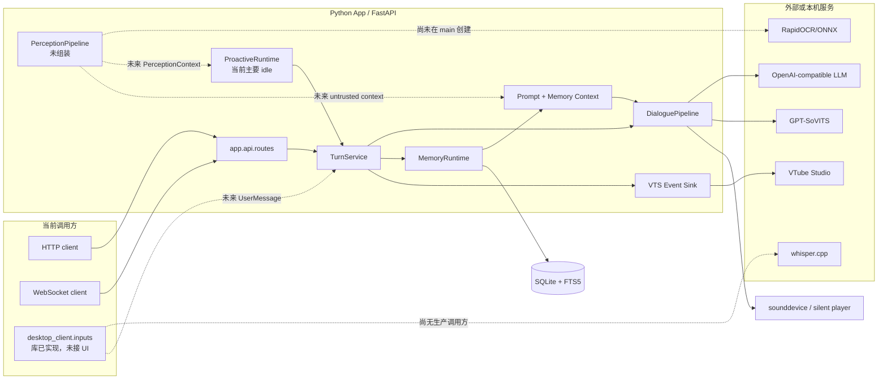
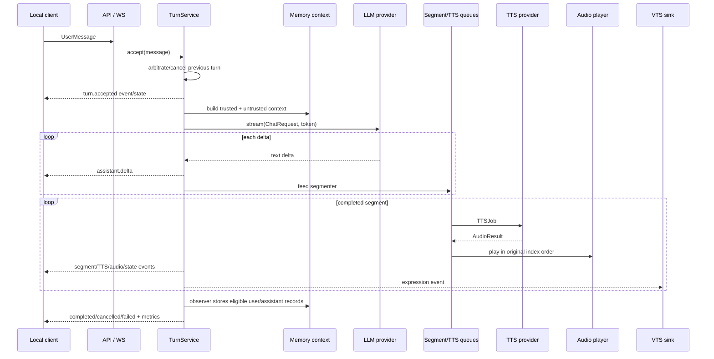
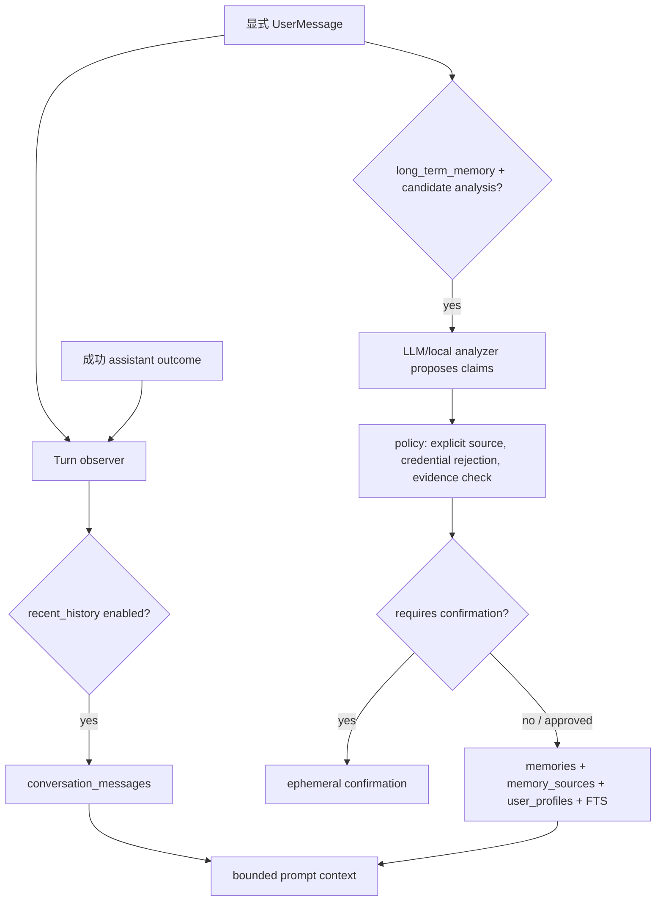

# 当前架构、运行时与数据流

> 版本基线：`d56cfbd`。实线表示当前生产入口已组装，虚线/说明表示代码存在但尚未接入主生命周期。

## 1. 当前运行拓扑



当前 backend 默认监听 `127.0.0.1:8765`。默认 LLM/TTS 为 Mock、音频为 silent；因此无需外部服务也能跑核心测试链。真实 LLM/GPT-SoVITS/VTS 由配置显式开启。

## 2. 启动与依赖组装

`app.main:create_app()` 创建 FastAPI；lifespan 启动时按以下顺序组装：

1. 配置 JSON 日志。
2. 如果 `storage.enabled`，打开 SQLite、执行迁移并创建 `MemoryRuntime`。
3. 如果开启记忆候选分析，单独创建 LLM analyzer provider。
4. 基于 memory feature store 创建 `ProactiveRuntime`，注册 feature transition handler。
5. 如果 `vts.enabled`，创建并启动 VTS bridge/event sink。
6. `build_dialogue_pipeline()` 创建 LLM、TTS、audio player、emotion engine、prompt context builder 和 segment decorator。
7. 创建 `TurnService`，注入 memory observer、VTS sink 和 proactive priority controller。
8. 启动 proactive runtime；feature 默认关闭时不应产生主动对话。
9. Uvicorn 对外提供路由。

没有在这里创建的模块：

- Perception pipeline 和 Windows capture/window adapters。
- Voice input/STT recorder。
- GUI、托盘、热键和客户端连接管理。
- 安装/升级/单实例服务。

## 3. 显式对话 turn



重要实现语义：

- 文字和未来语音都应走相同 `UserMessageSink`。
- `TurnService` 决定抢占和原子终态；provider 不拥有 turn 状态。
- `DialoguePipeline` 允许 TTS 并发，但 audio queue 按 segment index 播放。
- VTS sink 的同步 `publish()` 只能入队，不能在 turn 回调中做网络 I/O。
- memory observer 是副作用，不应把存储故障变成“模型回复已经播放但状态未知”的协议混乱。
- 当前缺少幂等、事件序号/replay、有界 subscriber queue；详见 P1-01/P1-02。

## 4. 取消、打断与资源所有权

### 4.1 预期所有权

| 资源 | 当前主要 owner | 取消/关闭职责 |
|---|---|---|
| 活动 turn/task/token | `TurnService` | 新输入、API interrupt、shutdown 时取消并等待终态 |
| LLM HTTP stream | provider + pipeline | token 取消时关闭 response/operation |
| TTS HTTP/WAV | TTS provider | 取消 request，删除 `.part` 与临时 WAV |
| TTS/audio queues | `DialoguePipeline` | 结束时发 sentinel、清理未播放结果 |
| PortAudio stream | `SystemAudioPlayer` | stop/abort/close，退出时释放设备 |
| VTS connection/actions | `VTSBridge` | stop event、取消 worker、关闭 socket/token store |
| SQLite/memory tasks | `MemoryRuntime` | 停维护任务、关闭 analyzer/candidate、checkpoint/cleanup |
| STT subprocess/temp WAV | whisper/recorder adapter | terminate→grace→kill，删除临时目录 |
| Perception raw buffers | `PerceptionPipeline`/owned jobs | 每条成功/失败/取消路径 wipe，关闭时 drain |

### 4.2 当前关键矛盾

Python 无法强制停止卡死的 `asyncio.to_thread` worker。现有代码为了隐私清理会等待 OCR、图像、PortAudio 等 native 调用结束；这能避免“取消返回但敏感 worker 仍在跑”，却可能让 Windows 关闭永久挂起。Pro 必须在独立进程、hard deadline、共享内存清零与用户可见降级之间做架构选择。

## 5. 历史与长期记忆数据流



Feature flags存于 SQLite，初始值：recent history 开启；long-term memory、vision、cloud vision、proactive 关闭。

当前主要风险：关闭 recent history 后到期清理也被停掉；maintenance task 一次异常会永久退出；source 保存范围过大；逻辑删除与 WAL/物理清理失败语义混在一起。

## 6. Perception 隐私流水线

Perception 是“实现了核心但尚未接 Windows”的模块。其设计不允许 GUI 或 proactive 直接接触原图：

1. 获取前台窗口元数据。
2. Window Guard 在截图前阻断密码、支付、聊天、邮件、远程桌面等敏感窗口。
3. 只捕获被允许的窗口，不应退化成全屏截图。
4. 变化检测减少 OCR/云调用。
5. 本地 OCR 提取 spans；Content Guard 检测凭据、账户、隐私内容。
6. 若允许云端分析，先遮挡所有 OCR 区域，再受 feature flag 和 rate limiter 控制。
7. 只发布短小 `PerceptionContext`；原图与 OCR 结果在所有路径 wipe。
8. 关闭 vision 必须等待在途任务跨过清理屏障。

Windows adapter 尚需解决：前台窗口切换 race、多显示器负坐标、DPI、最小化/全屏、UWP/管理员窗口、锁屏/RDP、权限拒绝、捕获 API 与 buffer ownership。

## 7. Proactive 数据流

`ProactiveRuntime` 只生成内部 intent，不伪装成用户输入：

```text
safe trigger + optional sanitized perception
→ suppression checks
→ score/threshold
→ fixed ProactiveIntent objective
→ TurnService.run_proactive
→ same prompt/LLM/TTS/audio pipeline
```

用户显式 turn 拥有更高优先级。抑制条件包括 feature disabled、用户活动/已有主动 turn、focus/DND、敏感状态、quiet hours、cooldown、daily limit、idle 不足和低分。当前计数在内存中，生产主程序也没有真实 Windows focus/DND/lock/fullscreen 信号。

## 8. Voice/STT 数据流

```text
未来 UI 按钮/热键
→ PushToTalkRecorder.start()
→ sounddevice callback 收集有界 PCM（当前实现仍需改进）
→ stop() 写私有临时 WAV
→ whisper-cli subprocess
→ transcript
→ UserMessage(input_mode=voice)
→ same TurnService
→ 删除 WAV/JSON/temp directory
```

工厂本身不会在构造时请求麦克风；只有显式 `start()` 才应打开设备。当前缺少 UI 调用方、Windows Job Object、`CREATE_NO_WINDOW`、可靠的 exe/model discovery 与设备热插拔状态。

## 9. API 与客户端契约

### 9.1 HTTP

- `GET /health`
- `POST /api/chat`
- `POST /api/interrupt`
- `GET /debug/state`
- `GET/PATCH /api/features`
- memory list/search/confirm/export/update/delete/clear
- `POST /api/history/clear`

### 9.2 WebSocket

- `WS /ws/client`：接收 `user.message`、`turn.cancel`，发送 pipeline events。
- `WS /ws/echo`：开发回显。

当前 client route 订阅 `"*"` session，没有 token、Origin 校验、事件 seq/ack/replay 或 per-session authorization。这是 Windows GUI 开发前必须修复的协议基础，不应直接在现协议上实现自动重连。

## 10. 数据分类与目标位置

| 数据 | 当前默认 | 目标 Windows 语义 | 敏感性/保留 |
|---|---|---|---|
| 默认配置 | 仓库根 `config.yaml` | 安装包只读 resource | 不含秘密 |
| 用户覆盖配置 | `.env`/环境变量为主 | 用户配置目录 + schema migration | secret 只保存引用或用安全存储 |
| SQLite/WAL | `data/private/companion.sqlite3` | `%LOCALAPPDATA%/.../private` + user-only DACL | 对话/记忆，高敏感 |
| VTS token | `data/private/vts-token.json` | DPAPI/Credential Manager 或受限文件 | secret |
| STT temp | `data/private/stt` | 用户临时私有目录 | 原始语音，处理后删除 |
| TTS ephemeral | `data/cache/audio/.../ephemeral` | LocalAppData private temp/cache | 对话派生语音，处理后删除 |
| TTS persistent cache | 默认关闭 | opt-in、容量/TTL/清理/披露 | 对话派生语音，高敏感 |
| 日志 | `data/logs/app.jsonl`，CWD 解析 | LocalAppData logs + rotation | 禁止原文/截图/密钥 |
| Whisper/声音/Live2D 模型 | 用户自行准备 | 用户明确选择的外部目录 | 不随包发布 |
| 截图/OCR | 内存 | 受控 buffer/隔离 worker | 不持久化 |

Windows 路径层必须同时支持开发态、wheel、冻结 exe、`Program Files` 只读安装、标准用户、中文/空格/长路径、升级迁移和卸载保留/删除选择。

## 11. Shutdown 顺序

当前 FastAPI lifespan 在退出时依次尝试：

1. 关闭 proactive runtime。
2. `TurnService.shutdown()` 取消活动 turn、关闭 pipeline 与 sinks。
3. 再次幂等关闭 VTS sink，覆盖部分启动失败。
4. 关闭 memory runtime 或独立 analyzer provider。
5. flush log handlers。

`_settle_resource_close()` 会屏蔽重复 cancellation，尽力等每个 closer 完成。这一策略强调确定性清理，但需要与 native hard-hang 隔离方案重新协调。未来 GUI、热键、HTTP server、设备和单实例锁也必须进入同一 owner graph，不能各自注册独立的退出回调。

## 12. 关键代码索引

| 主题 | 主要文件 |
|---|---|
| 启动与组合 | `app/main.py`、`app/bootstrap.py` |
| 配置与日志 | `app/config/settings.py`、`app/config/logging.py`、`config.yaml` |
| API/WS | `app/api/routes.py` |
| turn/cancel | `app/core/turns.py`、`app/core/cancellation.py`、`app/core/contracts.py` |
| 对话/TTS/audio | `app/pipelines/dialogue.py`、`segmenter.py`、`audio_player.py` |
| LLM | `app/clients/llm/openai_compatible.py`、`base.py` |
| GPT-SoVITS | `app/clients/tts/gpt_sovits.py` |
| VTS | `app/clients/vts/bridge.py`、`client.py`、`token_store.py`、`event_sink.py` |
| Emotion/Prompt | `app/emotion/`、`app/prompts/` |
| Memory/SQLite | `app/memory/`、`app/storage/` |
| Perception | `app/perception/pipeline.py`、`factory.py`、`guards.py`、`thread_jobs.py` |
| Proactive | `app/proactive/engine.py`、`runtime.py`、`lifecycle.py` |
| Voice/STT | `desktop_client/inputs/voice_input.py`、`whisper_cpp.py`、`factory.py` |
| Build/CI | `pyproject.toml`、`uv.lock`、`.github/workflows/ci.yml` |
| Windows 工具 | `tools/setup_windows.ps1`、`tools/stt_smoke.py`、`tools/gate_a_review.py` |

## 13. 架构方案必须回答的问题

Pro 的方案至少要画出并回答：

1. GUI、ASGI server、asyncio、Qt 主线程、native workers 和外部子进程分别由谁拥有。
2. IPC trust boundary 在哪里，凭据怎样创建、存储、轮换、迁移和撤销。
3. client 重发与 backend 幂等、事件 replay、turn snapshot 如何配合。
4. 每条队列、文本、音频、日志、缓存、数据库和 worker 的硬上限是什么。
5. timeout/cancel 后资源是否真的停止；不能停止时如何隔离、终止和清零。
6. feature desired state、actual state、transition/failed state 如何持久化与展示。
7. 从源码运行到 wheel、onedir、installer、升级/回滚之间使用同一套路径与迁移契约。
8. 哪些门禁由自动 CI 证明，哪些必须在真实 Windows 设备或人工隐私体验中签字。
