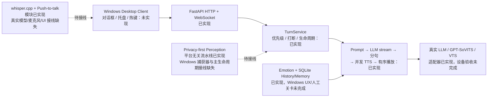

# Megumin Desktop Companion AI：Windows 接续开发计划

> 计划基线：Mac 可自动验证的 AI 后端已经收口；本计划只安排 Windows 平台接线、真实服务/设备验收、桌面客户端和发布工作，不重复开发已通过自动门禁的后端模块。
>
> 计划口径：单人开发、Codex 辅助、每天约 4～6 小时有效开发时间，按 **16 个有效开发日** 估算，允许 `±3` 个有效开发日浮动。Gate F 仍需覆盖至少两个自然日的实际使用，不等同于连续 16 个自然日。
>
> Windows MVP 目标：在 Windows 11 上得到一个可日常试用的单用户桌面陪伴原型——文字与按键说话共享会话，能连接真实 LLM、GPT-SoVITS 和 VTube Studio，能流式显示、说话、触发表情并被打断；用户可通过桌面对话框和托盘控制记忆、视觉与主动发话；应用可在干净 Windows 环境安装、退出、升级和卸载，且不携带密钥、用户数据或受保护资产。

---

## 1. 当前基线与总体判断

### 1.1 2026-07-13 Windows 自动化基线

- Windows 11 x64、PowerShell 5.1。
- `uv 0.11.28` 管理 CPython `3.11.15` 和仓库内 `.venv`。
- `uv sync --frozen --all-groups --all-extras` 成功，包含 RapidOCR/ONNX、Pillow、sounddevice 和全部开发依赖。
- pytest 收集 460 项：`459 passed, 1 skipped`，综合 statement/branch coverage 约 `92.5%`；唯一跳过项是 Windows 环境缺少确定性测试字体，不能据此宣称真实 OCR 已验收。
- Ruff lint、Ruff format check、mypy strict 全部通过。
- 已补齐 Windows 所需 `tzdata`，并修正路径分隔符、pytest 超长参数 ID、Windows 子进程终止语义等跨平台测试假设。
- 已提供 `tools/setup_windows.ps1`，CI 已配置 `macos-latest + windows-latest` 矩阵；远端 Windows CI 仍需在恢复 Git 仓库/推送后确认。

### 1.2 当前架构状态



这是一个边界清晰的 **Python 3.11 模块化单体**：FastAPI 负责本机协议，`TurnService` 负责轮次仲裁与取消，`DialoguePipeline` 负责低延迟生成链，外部 LLM/TTS/VTS 通过适配器接入，SQLite/Memory/Emotion/Perception/Proactive 通过组合根连接。MVP 继续保持一个 Python App；GPT-SoVITS、VTube Studio 和用户选择的云端模型仍是外部服务。

### 1.3 能力完成度矩阵

| 能力 | 代码状态 | Windows 已有证据 | Windows 剩余工作 |
| --- | --- | --- | --- |
| 配置、脱敏日志、HTTP/WS | 已实现 | 自动门禁通过 | Unicode 路径、标准用户权限、打包资源定位 |
| Turn/LLM/TTS/有序播放/打断 | 已实现 | Mock 与故障测试通过 | 真实服务、WASAPI/设备切换、实际延迟与音质 |
| VTS client/bridge/token store | 已实现 | loopback 测试通过 | VTS Allow、真实 hotkey、Windows ACL、断线恢复体验 |
| Emotion/Prompt | 已实现 | 规则和映射测试通过 | 真人角色体验 Gate C |
| SQLite History/Memory/FTS5 | 已实现 | Windows 自动回归通过 | 管理 UX、导出人工审阅、用户数据目录与 ACL、Gate D |
| Perception/Privacy | 平台无关核心已实现 | fake adapter、清理和隐私属性测试通过 | 前台窗口元数据、捕获、多显示器/DPI、主生命周期、真实 OCR/网络审计 |
| Proactive | 引擎与 idle runtime 已实现 | 并发、抑制、关闭屏障测试通过 | 感知发布者、专注/全屏抑制、至少两个自然日试用 |
| whisper.cpp STT | provider/录音状态机已实现 | Windows 子进程与清理测试通过 | 合法来源二进制/模型、真实麦克风、中文准确率、UI/热键 |
| Desktop Client | 只有 `inputs` 模块 | 无 | PySide6 窗口、InputController、托盘、重连、热键 |
| 打包/安装 | 未实现 | 无 | PyInstaller、安装器、升级/卸载、杀毒/防火墙/残留验证 |

### 1.4 架构优点与优先风险

当前最值得保留的设计是：默认离线且静默、真实 provider 不伪装成 Mock 成功、显式输入统一进入 `TurnService`、每轮独立取消、视觉 fail-closed、记忆与截图有严格来源边界、关闭 feature 时等待在途任务完成。这些边界已经有高覆盖率测试，不应在 Windows UI 开发中绕开。

Windows 阶段的主要风险不在 LLM 业务代码，而在以下系统边界：

1. GUI 主线程与 asyncio/uvicorn 生命周期是否能稳定启动、退出和恢复。
2. 多显示器、负坐标、DPI、全屏和窗口切换下是否只捕获被允许的前台窗口。
3. 麦克风、扬声器、VTS、GPT-SoVITS 和 whisper.cpp 的真实设备/进程行为。
4. `%LOCALAPPDATA%` 用户数据、Windows ACL、打包资源与升级/卸载语义。
5. 全局热键冲突、重复注册、注销失败和进程残留。
6. 打包后 RapidOCR/ONNX、Qt plugin、PortAudio 和配置文件是否齐全。

---

## 2. Windows 阶段原则

### 2.1 三种协作标记

| 标记 | 含义 | 执行方式 |
| --- | --- | --- |
| AI 主导 | 可由自动测试重复证明的纯工程工作 | Codex 实现、运行门禁并给出证据，开发者审阅关键 diff |
| 人机协作 | 涉及 Windows API、设备或外部进程 | Codex 完成代码与测试，开发者在真实机器操作并反馈 |
| 人工关卡 | 隐私、声音、模型表现、打扰度或发布责任 | 必须由开发者亲自确认并记录；Codex 不能代签通过 |

### 2.2 固定技术决策

- 保持一个 Python App 的模块化单体，不把 Desktop Client 和 Backend 拆成两个独立产品或长期驻留进程。
- 桌面 UI 首选 PySide6，托盘使用同一 Qt 生命周期；不同时引入 pystray/PySide 两套事件循环。
- W-Day 10 先用小型 spike 决定 Qt 主线程与 asyncio 的桥接方式。验收重点是可取消、可等待的统一关闭，不以框架偏好代替实测。
- 开发态数据可继续放在仓库忽略的 `data/`；打包态数据必须迁移到 `%LOCALAPPDATA%\MeguminCompanion\`，安装目录只读且不保存用户数据。
- 本机服务继续只监听 `127.0.0.1`；没有明确需求时不弹防火墙公网授权。
- VTS token、数据库、日志和配置按 Windows ACL 单独审查；POSIX `chmod` 不能作为 Windows 安全证据。
- 首次打包使用 PyInstaller `onedir`，先解决资源与动态库问题；稳定后再决定是否需要 installer，默认不追求 `onefile`。
- 前台窗口元数据、截图和热键只增加当前纵向闭环需要的最小 Windows API 依赖。引入 pywin32、mss、PySide6、PyInstaller 等依赖时逐项记录必要性与许可证。
- Whisper 模型、GPT-SoVITS 模型、参考音频、Live2D 资产和 API key 由用户自行准备，永不进入源码、测试 fixture 或发布包。

### 2.3 Windows 数据目录建议

| 数据 | 开发态 | 打包态建议 | 说明 |
| --- | --- | --- | --- |
| 只读程序资源 | 仓库根目录 | 安装目录 | 默认配置模板、Qt/ONNX 运行资源 |
| SQLite、VTS token、STT 临时文件 | `data/private/` | `%LOCALAPPDATA%\MeguminCompanion\private\` | 限当前用户；退出/卸载边界需明确 |
| 日志 | `data/logs/` | `%LOCALAPPDATA%\MeguminCompanion\logs\` | 继续递归脱敏并设置滚动/容量上限 |
| 可清理缓存 | `data/cache/` | `%LOCALAPPDATA%\MeguminCompanion\cache\` | 可由 UI 清理；敏感 TTS 缓存仍禁止持久化 |
| 用户导入模型/声音 | 仓库外 | 用户明确选择的外部目录 | 只保存路径，不复制进发布包 |
| 开发密钥 | 未跟踪 `.env` | W-Day 15 决定 DPAPI/Credential Manager 或受限本地方案 | 不写日志、不进安装目录、不随卸载误删其他文件 |

---

## 3. 每日开发计划

### Phase W0：Windows 工程基线（W-Day 1～2）

| 天数 | 当前状态 | 协作方式 | 当天目标 | Codex 主要工作 | 必须人工审阅/验收 | 当天完成标准 |
| ---: | --- | --- | --- | --- | --- | --- |
| W-Day 1 | **自动化完成** | AI 主导 | 建立 Windows 3.11/uv/frozen sync 与全量质量基线。 | 安装 uv 与 Python 3.11；同步 all-groups/all-extras；修复 `tzdata`、路径、超长测试 ID、Windows subprocess 测试语义；增加初始化脚本与双平台 CI。 | 确认没有安装模型、写入密钥或导入受保护资产；审阅新增依赖仅为 Windows 时区数据。 | 本机 460 项收集、459 passed/1 明确 skip、coverage 约 92.5%；Ruff/format/mypy 通过；初始化脚本可重复运行。 |
| W-Day 2 | **部分完成** | 人机协作 | 收口 Windows 文件、路径和运行时语义。 | 增加标准用户、空格/中文路径、非系统盘测试；验证 SQLite FTS5/WAL；实现或选择 Windows ACL helper；让 VTS token 与 private 目录有可检查的 ACL；补真实 RapidOCR 合成图测试字体/fixture 方案；运行远端 Windows CI。 | **使用非管理员账户检查 token、数据库和日志 ACL；确认安装目录与用户数据目录边界；人工查看 OCR 测试材料许可。** | Windows 基线关卡通过：远端 CI 绿色；无仅在管理员账户可运行的假设；ACL 和路径检查有可重复证据；没有意外 skip。 |

### Phase W1：真实主链路与第一次打包冒烟（W-Day 3～5）

| 天数 | 当前状态 | 协作方式 | 当天目标 | Codex 主要工作 | 必须人工审阅/验收 | 当天完成标准 |
| ---: | --- | --- | --- | --- | --- | --- |
| W-Day 3 | 待开始 | 人机协作 | 在 Windows 联通 VTube Studio 与一个真实 OpenAI-compatible LLM。 | 增加只读连接诊断、VTS 状态展示和失败分类；核对 token ACL/脱敏；输出首 token 延迟与重连日志。 | **在 VTS 点击 Allow，逐个确认 hotkey；用专用低额度 key 检查请求目标、费用、断网和限流提示。** | VTS 重启后能复用 token；LLM token 进入现有 Segmenter；任一服务失败不伪造 Mock 回复。 |
| W-Day 4 | 待开始 | 人工关卡 | 联通 GPT-SoVITS 与 Windows 音频输出。 | 增加服务健康检查、preset 诊断、默认输出设备枚举和失败提示；记录首句/逐句 TTS 与播放延迟；验证打断时 WASAPI/PortAudio 释放。 | **确认模型、参考音频和声音授权；实际听取音质、语速、句间连续性；切换/拔出音频设备并检查恢复。** | 有效 WAV 能连续按序播放；快速打断无尾音恢复；TTS 失败时字幕继续，设备不被占用。 |
| W-Day 5 | 待开始 | 人工关卡 | 真实 LLM→TTS→Audio→VTS 压力回归，并完成首次 `onedir` 打包冒烟。 | 编写真实服务 smoke harness、故障注入和打包资源清单；处理开发态/打包态路径；生成延迟报告。 | **连续提问、长回复、快速打断、断网、关闭 TTS/VTS；在另一 Windows 用户或干净 VM 启动第一次产物。** | Gate B 通过：能说、能动、能被打断，故障可解释降级；第一次打包产物能启动/退出且无残留进程。 |

### Phase W2：Windows 屏幕感知与隐私（W-Day 6～8）

| 天数 | 当前状态 | 协作方式 | 当天目标 | Codex 主要工作 | 必须人工审阅/验收 | 当天完成标准 |
| ---: | --- | --- | --- | --- | --- | --- |
| W-Day 6 | 待开始 | 人工关卡 | 只实现前台窗口元数据和 Privacy Guard，暂不截图。 | 实现 `ActiveWindowSource`：窗口句柄、PID/进程名、标题、DWM 边界、显示器/DPI 元数据；失败/超时统一为 guard error；补窗口切换 race 测试。 | **补充密码、支付、聊天、邮件、远程桌面、无痕/隐私窗口规则；确认元数据也不进入普通日志。** | 视觉关闭时零轮询；敏感窗口与 Guard 异常均不进入 capture；普通未知窗口仅在成功检查后允许。 |
| W-Day 7 | 待开始 | 人机协作 | 实现受控前台窗口捕获、本地 OCR、变化检测和清理。 | 选择并实现最小 `WindowCapture`；处理多显示器负坐标、100/125/150/200% DPI、窗口边框、最小化/切换；把真实 RapidOCR 推理纳入 Windows 测试；验证 owned buffer 清理。 | **使用专门构造的假密码、假银行卡、聊天页面、未知普通窗口测试；确认敏感/失败场景没有截图落盘。** | 只捕获当前允许窗口；窗口在 Guard 后切换时安全放弃；原图/OCR 全文不持久化；关闭视觉后任务立即停止。 |
| W-Day 8 | 待开始 | 人工关卡 | 将 PerceptionPipeline 接入主生命周期和 ProactiveRuntime，完成网络出口审计。 | 增加有界调度器、feature transition barrier、`update_perception` 发布和关闭顺序；为可选 cloud analyzer 做明确目标域、限流和请求审计；生成数据流报告。 | **人工检查文件、日志、SQLite、记忆候选和模拟/真实网络请求；确认视觉开关文案清楚说明云端截图出口。** | Gate E 通过：敏感场景不截图、不 OCR、不上传；Guard 错误跳过；合规窗口数据有明确生命周期；屏幕内容永不进入长期记忆。 |

### Phase W3：本地语音与 Windows Desktop Client（W-Day 9～12）

| 天数 | 当前状态 | 协作方式 | 当天目标 | Codex 主要工作 | 必须人工审阅/验收 | 当天完成标准 |
| ---: | --- | --- | --- | --- | --- | --- |
| W-Day 9 | 待开始 | 人工关卡 | 安装并验证真实 whisper.cpp、模型和按键说话链路。 | 增加二进制/模型只读诊断、版本与哈希记录、设备枚举；把 recorder 接入统一 `UserMessageSink`；完善 Windows terminate/kill 与临时目录检查。 | **用真实麦克风检查设备、权限、中文准确率、延迟、取消、无声超时和连续录音；确认不开启时零采集。** | voice/text 共享 session、上下文和打断；原始 PCM/WAV 成功/失败/取消后均清理；STT 失败时文字输入可用。 |
| W-Day 10 | 待开始 | 人机协作 | 建立 PySide6 单进程桌面壳与统一 InputController。 | 先验证 Qt 主线程 + asyncio 生命周期方案；实现应用启动、后端 ready barrier、基本窗口、连接状态和统一退出；InputController 只在显式发送时创建 `UserMessage`。 | 人工反复启动/退出、强制关闭窗口、托盘退出并检查进程；审阅线程/事件循环所有权。 | 一个进程内 UI 与后端可启动、可等待关闭；未发送草稿只在 UI 内存；无重复后端实例或端口占用。 |
| W-Day 11 | 待开始 | 人工关卡 | 完成文字对话框、流式事件、打断与重连。 | 实现消息列表、输入框、发送/换行语义、增量 delta、segment 状态、错误提示、指数重连和重复事件防护。 | **验证中文输入法、候选框、复制粘贴、多行/长文本、空消息、连续发送、断线重连和快速打断；确认草稿不进网络/日志/数据库。** | 文字对话可稳定日用；流式顺序正确；旧 turn 不混入新 turn；断线后状态可解释且能恢复。 |
| W-Day 12 | 待开始 | 人工关卡 | 完成托盘、核心 feature 开关、push-to-talk 按钮/全局热键和脱敏 Debug。 | 使用同一 Qt 生命周期实现 tray；实现视觉/记忆/主动/静音/VTS 控制；注册并释放 Windows 全局热键；处理冲突、重复注册和焦点切换。 | **逐个切换开关并确认后台任务停止屏障；验证热键冲突、退出释放、管理员/普通应用焦点、按键说话取消；检查 Debug 不泄露正文、密钥、OCR 或完整记忆。** | Windows 交互里程碑通过：文字和语音均可用；开关真实控制后台能力；退出后热键、设备、端口和线程全部释放。 |

### Phase W4：情绪、记忆与主动发话人工关卡（W-Day 13～14）

| 天数 | 当前状态 | 协作方式 | 当天目标 | Codex 主要工作 | 必须人工审阅/验收 | 当天完成标准 |
| ---: | --- | --- | --- | --- | --- | --- |
| W-Day 13 | 待开始 | 人工关卡 | 通过 Emotion 与 Memory 的 Windows UX 验收。 | 增加记忆列表/搜索/确认/编辑/删除/导出入口和来源时间展示；制作情绪/Preset/VTS 回放；提供禁用后零读写检查。 | **逐条体验典型情绪场景；打开 SQLite 与导出文件检查；用姓名、关系、健康信息、假凭据和 AI 猜测验证边界。** | Gate C/D 通过：情绪自然且不过度；记忆可见、可解释、可改、可删、可禁用；凭据和屏幕内容永不保存。 |
| W-Day 14 | 待开始 | 人工关卡 | 补齐主动发话生产接线并完成至少两个自然日试用。 | 接入已审核的安全感知发布者；增加显式专注模式、全屏/敏感窗口抑制和必要 trigger；汇总频率、原因、重复和打断数据。 | **至少两个自然日记录合适/打扰/尴尬/重复；确认游戏、全屏、敏感窗口、专注模式、刚被打断时不会主动发话。** | Gate F 通过：频率与时机可接受，可一键关闭，关闭返回前在途主动轮次已清理。 |

### Phase W5：发布工程与最终验收（W-Day 15～16）

| 天数 | 当前状态 | 协作方式 | 当天目标 | Codex 主要工作 | 必须人工审阅/验收 | 当天完成标准 |
| ---: | --- | --- | --- | --- | --- | --- |
| W-Day 15 | 待开始 | 人机协作 | 完成用户数据目录、密钥方案、正式打包和安装/升级/卸载。 | 固化 PyInstaller spec、Qt/ONNX/PortAudio hidden imports、资源定位和版本信息；实现 `%LOCALAPPDATA%` 迁移/诊断；选择安装器并记录升级回滚、可选开机启动和清理边界。 | **在干净 Windows 标准用户环境检查安装、首次启动、杀毒提示、防火墙、ACL、升级、卸载和“保留/删除用户数据”选择。** | 无开发环境可启动；安装目录只读；用户数据不随程序覆盖；退出/卸载无进程、端口、热键和临时文件残留。 |
| W-Day 16 | 待开始 | 人工关卡 | 全量回归、许可/隐私审计、文档和发布候选决策。 | 执行自动门禁、真实链路 smoke、故障风暴、打包产物扫描和依赖许可清单；更新用户配置、排错、隐私、卸载和已知限制文档。 | **按最终清单完整操作一次，确认发布包不含密钥、聊天、截图、记忆、声音、模型或 Live2D 资产；开发者决定发布/延期/缩小范围。** | Gate G 通过才可称为 Windows MVP：阻塞问题为零；非阻塞问题有 owner/优先级/回退方案；发布决定由项目所有者记录。 |

---

## 4. 阶段关卡与依赖顺序

| 关卡/里程碑 | 对应日 | 最低证据 | 当前状态 |
| --- | ---: | --- | --- |
| Gate A：Mock 主链路 | 既有 | 流式、分句、TTS、有序播放、打断与清理 | 已通过 |
| Windows 工程基线 | W-Day 2 | 本机与远端 Windows 门禁、路径/ACL/FTS/OCR 基线 | 自动化部分完成，ACL/OCR/远端 CI 待完成 |
| Gate B：真实主链路 | W-Day 5 | LLM、GPT-SoVITS、VTS、音频、打断与早期打包 | 未通过 |
| Gate E：屏幕隐私 | W-Day 8 | 真实 Windows 捕获、fail-closed、残留与网络出口审计 | 未通过 |
| Windows 交互里程碑 | W-Day 12 | UI、文字、PTT、托盘、热键、重连与统一退出 | 未完成 |
| Gate C / D：情绪与记忆 | W-Day 13 | 真实表现体验与完整记忆管理/隐私审计 | 未通过 |
| Gate F：主动发话 | W-Day 14 | 至少两个自然日试用、抑制与总开关 | 未通过 |
| Gate G：发布候选 | W-Day 16 | 干净 Windows 安装、全链路、隐私/许可/残留检查 | 未通过 |

依赖顺序保持为：

```text
Windows 工程基线
→ 真实主链路 / 第一次打包
→ 屏幕隐私平台接线
→ 本地语音与桌面控制
→ 情绪 / 记忆 / 主动发话人工关卡
→ 正式打包与 Gate G
```

未通过关卡时，不把该能力包装成“已完成”。允许继续处理彼此独立的低风险工作，但不得用后续 UI 或打包进度掩盖隐私、设备或资源清理问题。

---

## 5. Windows 每日完成定义（Definition of Done）

当天任务只有同时满足以下条件才算完成：

1. `uv sync --frozen --all-groups --all-extras` 可在新环境复现，未为了通过 Windows 临时放宽锁文件或质量门槛。
2. pytest、Ruff lint、Ruff format check、mypy strict 全部通过；任何 skip 都有明确原因、owner 和关闭日。
3. Windows 专项测试至少覆盖空格/中文路径、标准用户、取消/退出和资源释放；涉及窗口时覆盖负坐标与 DPI，涉及设备时覆盖不可用/切换。
4. 新增外部依赖有必要性、版本范围、许可证和打包验证记录。
5. GUI 不直接调用云端 LLM/TTS；文字与语音统一创建 `UserMessage` 并进入同一 `TurnService`。
6. 未发送草稿、原始音频、截图、OCR 全文、密钥和完整记忆不进入普通日志、Debug、网络或非预期持久化。
7. feature 关闭、用户打断和应用退出都必须等待在途任务清理；不以“进程被强杀后文件消失”代替正确生命周期。
8. Windows ACL、用户数据目录、安装目录和卸载边界有实际标准用户证据；不把 POSIX mode bit 当作 Windows 权限结论。
9. 真实服务、设备、隐私、声音、角色体验和发布关卡由开发者亲自操作并记录结果。
10. 仓库与产物不包含 API key、真实聊天/截图/记忆、声音模型、参考音频、Whisper 模型、Live2D 模型或其他未授权资产。

---

## 6. 每日验证入口

基础环境和完整自动门禁：

```powershell
powershell -ExecutionPolicy Bypass -File tools/setup_windows.ps1
```

日常开发环境已经建立时：

```powershell
uv sync --frozen --all-groups --all-extras
uv run pytest
uv run ruff check .
uv run ruff format --check .
uv run mypy
```

后端与本地 STT 诊断：

```powershell
uv run python app/main.py
uv run python tools/stt_smoke.py --mode check
```

所有真实服务 smoke 都应使用专用测试文本、低额度密钥和合法自备资产；真实密钥、用户对话和屏幕材料不得粘贴到 Codex 对话或测试日志。

---

## 7. 工期与回退规则

- W-Day 2、5、8、12、15、16 各允许增加 1 个诊断日；不要通过跳过 ACL、隐私、设备或干净环境验证追回进度。
- 若 PySide6 与 asyncio 的单进程方案在 W-Day 10 连续两天无法稳定退出，先保留单进程目标并缩小 UI 功能，不立即扩张为多进程架构。
- 若前台窗口捕获在多显示器/DPI 下无法可靠限定范围，MVP 视觉功能保持默认关闭且不发布，不降级为全屏截图。
- 若真实 TTS/STT/VTS 任一外部能力不稳定，文字对话必须保持可用；发布说明明确列出可选依赖，不以 Mock 冒充真实能力。
- 若全局热键与目标应用冲突，保留窗口内 push-to-talk 按钮和可配置热键，不使用需要管理员权限或低级键盘 hook 的高风险方案强行绕过。
- `onefile`、自动更新、复杂设置页、插件系统、向量库、唤醒词和自动控制电脑仍属于 Post-MVP，不进入这 16 天计划。

一句话执行原则：**保留已验证的后端边界，把 Windows 阶段的时间花在真实系统接线、人工体验、隐私证据和可发布生命周期上。**
