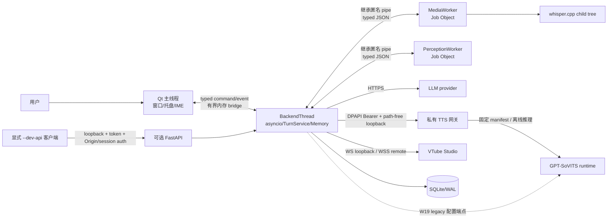
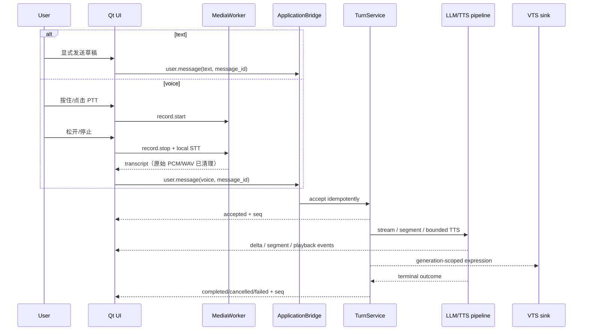
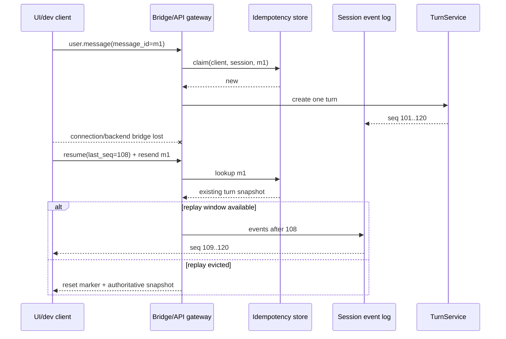
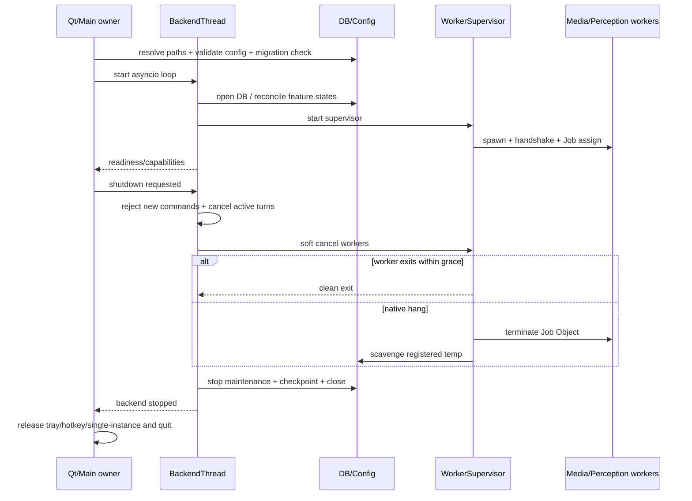
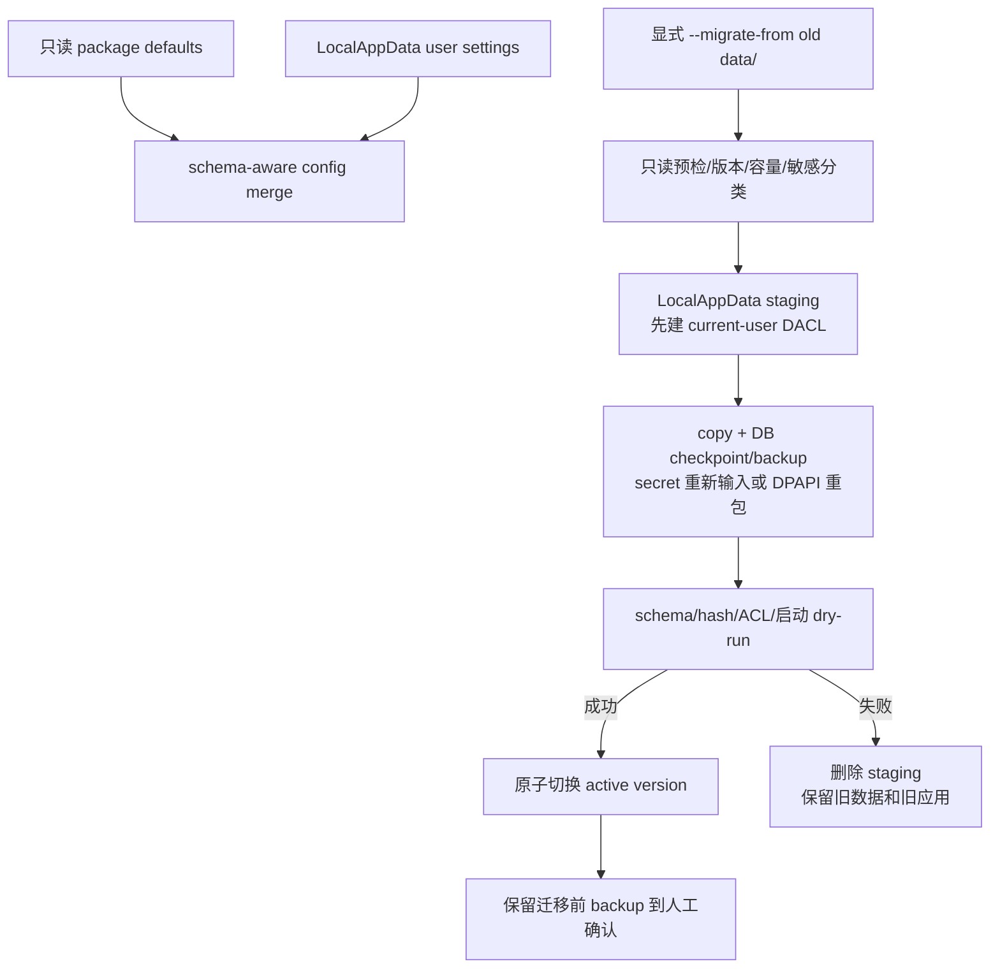
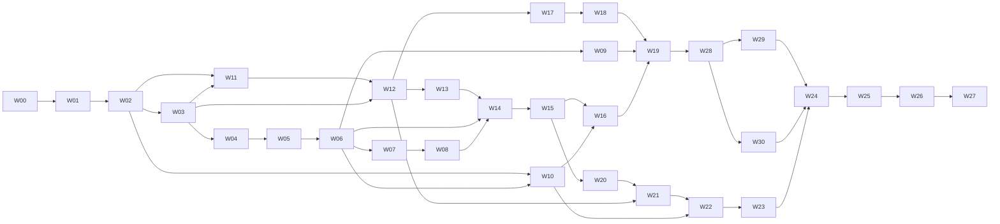

# Megumin Desktop Companion AI：Windows 开发执行计划

> 原始版本：2026-07-17 Gate W0 决策落版
>
> 最新修订：2026-07-31 所有者已授权合并当前全部 PR，包括 W30/DeepSeek，并接受已记录的主观 Gate 与残余发布风险。W29 PR #34 已合入 W28；W30 必须先与该最新 W28/W29 组合、解析重叠并通过新 exact-head 质量门，随后再按堆栈逆序合并。未验证的真实 DeepSeek Key/账号/计费/远端保留不因合并授权而变成已验证；W20～W27 编号与范围不变。
>
> 代码基线：`agent/windows-development-baseline` / `d56cfbd`
>
> 状态：Gate W0 已由项目所有者有条件批准；允许私人开发范围进入 W01，残余风险与发布限制见 [`gates/gate_w0.md`](./gates/gate_w0.md)
> 本文件覆盖此前的 `windows_development_plan.md`、`daily_development_plan.md`，以及 `project_architecture.md` 中所有按天排期和阶段顺序。旧计划只保留历史意义，不再作为任务、工期或验收依据。

## 0. 执行摘要

当前仓库不是“只差 Windows GUI”，而是处于以下状态：

- Python 后端核心、Mock/真实 provider 适配、取消、TTS 有序播放、VTS、情绪、记忆、感知核心、主动发话核心和本地 STT 库已有较强自动化证据。
- Windows/macOS 源码质量 CI 已通过，但 wheel 已复现为“能构建、不能在仓库外独立导入”，因此不具备安装产物基线。
- Windows GUI、托盘、单实例、全局热键、前台窗口/窗口捕获、Focus/DND/锁屏信号、设备热插拔、安装/升级/卸载均未形成生产闭环。
- HTTP/WebSocket 控制面无认证、Origin 校验和 session 隔离；断线重发会重复创建 turn。
- 数据、日志、VTS token、录音和合成临时文件尚无统一的 Windows 目录、DACL、DPAPI 与崩溃清理语义。
- native thread 可能永久阻塞退出或隐私关闭屏障；这不能靠再套一层 `asyncio.wait_for` 解决。

因此新路线固定为：

```text
W0 架构/隐私决策
→ W1 可安装且安全的运行基座
→ W2 幂等、有界、可恢复的后端
→ W3 Windows 文本桌面垂直切片
→ W4 语音、音频、VTS 与 Avatar Runtime 真实设备闭环
→ W5 Windows 感知与主动发话
→ W6 安装、升级、长稳与发布审计
```

首个可用里程碑不是完整 MVP，而是“标准用户可安装、可卸载、能安全文字对话和退出”的 Beta A。视觉和主动发话不得阻塞 Beta A/B，但必须通过独立隐私 Gate 后才能进入完整 RC。

### 0.1 Executive decision

- **PR #11 当前不可称为 Windows 产品基线，也不可据此宣布 Windows MVP。** 它只证明提交 `d56cfbd` 的源码能在 Windows/macOS CI 执行质量门。
- 如果 PR #11 的标题和承诺严格缩小为“源码级跨平台质量基线”，则至少补上 W01/W05 的 wheel 隔离安装 smoke、修正过时文档并明确 P0-01/P0-03/P0-04 未完成后，才建议合并。
- 如果 PR #11 仍被描述为“Windows development/product baseline”，建议保持 Draft，直到 Gate W1 通过。
- 当前 4 个 P0 全部成立；P2-11 的“计划过时”已由本文件处理，但不改变其在 `d56cfbd` 基线上的审计判定。

### 0.2 项目理解校验

1. 产品是 Windows 单用户、个人私用的常驻桌面陪伴原型，不是直播工具或电脑控制 Agent。
2. 当前生产入口是 FastAPI backend；`desktop_client` 只有输入/STT 库，没有 GUI、托盘或生产调用方。
3. `TurnService`、LLM→分句→并发 TTS→有序播放、取消和 VTS event sink 已实现且有自动化证据。
4. SQLite 近期历史、长期记忆 policy/CRUD/FTS、feature flag 已实现，但保留清理、维护恢复、删除语义和最小证据仍有风险。
5. Perception 的平台无关 Guard/OCR/遮挡/wipe 已实现，但没有 Windows 前台窗口/捕获 adapter，也未接入 `app.main`。
6. Proactive 已接 idle 主链路，真实 Windows focus/DND/lock/fullscreen/perception 信号尚未接入。
7. 本地 push-to-talk/whisper.cpp 库已实现，但没有 UI、Job Object、可靠 exe discovery 或真实设备证据。
8. 默认 LLM/TTS 为 Mock、播放 silent、VTS/STT/vision/proactive/long-term memory 关闭；默认会保存显式对话近期历史。
9. 当前 loopback HTTP/WS 没有认证、Origin/session 隔离；loopback 本身不是可信边界。
10. wheel 构建成功但仓库外导入失败；当前资源路径、CWD 和 import side effect 不适合安装或冻结。
11. Windows MVP 必须包含文字、PTT、本地 STT、TTS/VTS、可控记忆、默认关闭的视觉/主动能力、托盘/设置和可安装退出闭环。
12. Mock、macOS 和 GitHub Windows 源码绿灯都不能替代标准用户、真实设备、ACL/DPAPI、安装升级、隐私和长稳 Gate。

## 1. 文档分析结论与权威级别

### 1.1 事实源

| 文档 | 本计划如何使用 |
| --- | --- |
| 本文第 1.3 节、`decisions/w00_owner_decisions.md`、`gates/gate_w0.md` | 当前产品、隐私、资产、非目标、人工决定与 Gate 状态的最高级业务约束；任何改变需人工重新批准。旧 Day 1～7 范围/验收文件仅保留在 Git 历史。 |
| `ai_backend_mac_implementation_report.md` | 证明后端模块和平台无关代码的实现范围，同时明确真实设备、Windows UI 和 Gate B～G 未验证。 |
| `full_code_windows_risk_audit_2026-07-15.md` | 当前 4 个 P0、24 个 P1、13 个 P2 的风险基线和因果证据。 |
| `pro_handoff/00_read_me_first.md` | 规定阅读顺序、事实权威、禁止模式和第一轮必须交付物；本计划按其顺序组织证据。 |
| `pro_handoff/01_project_overview.md`、`02_architecture_and_data_flow.md` | 用于交叉核对当前组装、数据流、资源 owner 和未接线模块。 |
| `pro_handoff/03_prompt_for_pro.md` | 作为计划完整性清单：ADR-01～08、五张目标图、逐风险判定、PR 迁移/回滚/复杂度、质量矩阵和所有者问题均须覆盖。 |
| `project_architecture.md` | 只取产品意图、数据结构和隐私不变量；目录树、技术栈建议、Phase/Day 排期均不视为当前事实。 |
| `README.md`、当前源码、测试、配置和 CI | 最终实现事实；与文档冲突时以当前代码为准。 |

### 1.2 明确忽略的内容

- 旧的 Day 8～31、16 个 Windows 开发日、Phase 0～7 排期。
- 任何“测试绿灯等于 Windows MVP 完成”的推断。
- 架构文档中尚未出现在源码的目录、插件、向量库、Diary、自研 Live2D 或自动控制电脑能力。
- 历史报告中的 PR 状态、CI 状态和测试数量作为未来完成标准；未来 Gate 必须以对应提交重新执行。

### 1.3 继续保持的产品不变量

1. Windows 单用户、个人私用桌面陪伴原型；不是电脑操作 Agent。
2. 文字与 push-to-talk 语音统一进入 `UserMessage → TurnService`，不得复制业务链。
3. 默认启动不联网、不发声、不截图、不请求麦克风；长期记忆、视觉和主动发话默认关闭。
4. 真实 provider 失败显式失败，不静默回退 Mock。
5. 新用户输入可以快速打断旧 turn；旧字幕、声音和 VTS 动作不得恢复或补播。
6. 近期历史默认保留 7 天；长期记忆显式授权、可解释、可管理，凭据永不保存。
7. 截图、OCR 全文、原始音频、API key、VTS token 不进入普通日志、历史或长期记忆。
8. 屏幕和主动上下文是 untrusted data，不是用户指令，不得产生长期记忆候选。
9. Guard 未知错误、超时、锁屏、权限拒绝和捕获 race 一律跳过本次观察。
10. 仓库和安装包不得携带角色图片、Live2D、声音模型、参考音频、Whisper 模型、真实用户数据或密钥。

### 1.4 `pro_handoff` 完整纳入矩阵

| 文件 | 已吸收的核心要求 | 本计划落点 |
| --- | --- | --- |
| `00_read_me_first.md` | 代码优先于旧文档；先决策后实现；不得用 loopback/chmod/wait_for 伪造安全；必须有 ADR、依赖、PR、Gate、风险和 owner 问题 | 0.1、1.1、3、4、5、8、9 |
| `01_project_overview.md` | 产品/非目标、当前成熟度、默认行为、10 个不变量、Windows 未接线清单和 7 个先决策问题 | 0.2、1.3、3、W13～W27 |
| `02_architecture_and_data_flow.md` | 当前启动组装、turn/memory/perception/proactive/STT 数据流、resource owner、目录分类、shutdown 和 8 个架构问题 | 4.1～4.9、6、W06～W23 |
| `03_prompt_for_pro.md` | 41 项判定、ADR-01～08、五张图、外部边界 owner、PR 影响/迁移/回滚/复杂度、质量门、残余风险、最多 10 个 owner 问题 | 3、4、5.2、6、8、9.1～9.3、10 |

四个文件均已读取；`03_prompt_for_pro.md` 的第二轮反方检查被转化为 W00 ADR review checklist，第三轮“每次只实现一个 PR”被写入第 10 节完成定义。

## 2. AI 与人工责任标记

所有 PR、任务和 Gate 使用以下标记：

| 标记 | 含义 | 合并规则 |
| --- | --- | --- |
| **AI-F** | 可完全依赖 AI 完成的低风险、确定性工作 | 自动测试、格式、类型和产物校验通过后，可不安排专项人工审计；仍需正常确认变更范围。 |
| **AI-R** | AI 可主导设计、编码和测试，但必须人工审计 | 人工必须阅读关键 diff、失败语义和测试证据，并在 PR 清单签字。 |
| **H** | 必须由人执行或决定 | AI 只能准备脚本、测试材料和记录模板，不能代替真实判断或签字。 |

### 2.1 可完全依赖 AI 的范围（AI-F）

- 按已批准契约生成 Pydantic schema、类型、序列化器和无副作用的数据转换。
- Mock/fake provider、故障注入器、测试数据工厂、合成 WAV/图片、慢消费者和断线模拟器。
- 对已批准行为补充 unit/property tests、覆盖率缺口、基准测试驱动和 CI 报告解析。
- 不处理秘密、不改变 feature 行为的普通 UI 展示组件、空状态、错误码到文案的映射。
- 文档索引、风险—PR 追踪表、发布清单、变更日志、SBOM/许可证清单的机械生成。
- Ruff/format/mypy 修复、跨平台路径 fixture、构建产物文件清单比对。

AI-F 不等于 AI 可以自行改变需求；输入契约和验收值必须先冻结。

### 2.2 AI 可实现但必须人工审计的范围（AI-R）

- 身份认证、Origin/session 授权、DACL、DPAPI、秘密轮换和远端 TLS 规则。
- 数据目录、配置迁移、数据库迁移、备份恢复、删除/卸载语义。
- 幂等、事件 replay、取消、背压、资源 owner、线程/进程关闭和崩溃恢复。
- Windows Job Object、进程创建 flags、全局热键、单实例和开机启动。
- 麦克风、音频输出、前台窗口、截图、OCR、Focus/DND/锁屏适配器。
- PyInstaller/安装器、升级/回滚、签名输入、release workflow。
- 任何会触达截图、音频、对话、记忆、密钥或日志的实现。

### 2.3 必须由人工完成的范围（H）

- 批准第 3 节 ADR，特别是“辅助 worker 进程是否修订早期单 OS 进程约束”。
- 使用真实 Windows 设备验证 IME、DPI、多显示器、声卡、麦克风、蓝牙、RDP、锁屏和热插拔。
- 使用专门准备的敏感/非敏感窗口检查 Guard false negative、截图范围和遮挡效果。
- 真实 LLM、GPT-SoVITS、VTS、Whisper 的凭据/模型/资产配置与体验判断。
- 音质、延迟、打断自然度、表情语义、主动发话打扰度和人格表现判断。
- DPAPI/DACL 威胁模型、隐私数据流、安装/卸载保留文案、删除承诺的安全审计。
- Qt、模型、字体、安装器、角色名称、角色资产、声音和公开分发的许可证/法律审计。
- 代码签名证书保管与签名操作、RC 放行和发布声明。

## 3. Gate W0：必须先批准的架构决策

在 W0 未签字前，只允许 AI-F 的测试夹具和文档工作，不允许开始 GUI、截图或安装器实现。

### ADR-W01：GUI、FastAPI/asyncio 与 native worker 拓扑（AI-R + H）

**当前问题：** Qt 必须拥有主线程，现有 backend 以 asyncio/FastAPI lifespan 为 owner；PortAudio/OCR 等 native 调用又可能永久阻塞。继续把所有模块塞进同一事件循环会产生双重 owner 和不可完成的退出。

**推荐方案：**

```text
MeguminCompanion.exe
├─ Qt 主线程：PySide6 Widgets、窗口、托盘、IME、热键状态、用户交互
├─ BackendThread：独立 asyncio event loop、TurnService、memory、provider、VTS bridge
├─ 有界 ApplicationBridge：typed command/event；Qt signal 只传脱敏数据
├─ MediaWorker 子进程：麦克风、播放、whisper.cpp 子进程树
└─ PerceptionWorker 子进程：前台窗口复核、窗口捕获、OCR、wipe，只返回脱敏摘要

外部用户进程：VTube Studio、GPT-SoVITS、用户配置的 LLM 服务
```

PySide6 官方 `QtAsyncio` 当前仍是 technical preview，且只覆盖基础 event-loop 层，不覆盖 sockets、servers、subprocesses，因此不作为发布架构的唯一支柱。worker 是同一安装包内的受监管实现细节，不是网络微服务。

### ADR-W02：desktop client 与 backend 的安全 IPC（AI-R + H）

**当前问题：** 当前 HTTP/WS 无认证、Origin/session 隔离，桌面若直接复用它会继承网页劫持、跨 session 和重放风险。

**推荐方案：** 生产 Qt 通过进程内 `ApplicationBridge` 与 BackendThread 通信，不启动 Uvicorn、不监听 TCP。FastAPI 只用于测试和显式 `--dev-api`；仅 loopback、每次启动随机短期 token、HTTP/WS 双认证、严格 Origin allowlist、session authorization、chat/admin scope 和 frame/rate limits。helper 使用继承匿名 pipe + length-prefixed typed JSON，不用命名全局对象、pickle 或 shell。

非 loopback dev API 直接拒绝启动；未来远程控制、多用户或插件 IPC 是 Post-MVP。

### ADR-W03：package resource、Windows 路径与旧数据迁移（AI-R + H）

**当前问题：** `PROJECT_ROOT`、CWD 和包位置被混用；wheel 缺默认配置，Program Files/开始菜单/中文路径均不可靠。

**推荐模型：**

| 数据类别 | 目标位置/机制 | 规则 |
| --- | --- | --- |
| 只读默认配置、Prompt 模板 | package resource / 冻结包资源 | `importlib.resources` 读取；不得从 CWD 推断。 |
| 用户设置 | `%LOCALAPPDATA%\MeguminCompanion\config\settings.yaml` | 带 `schema_version`；不含明文 secret。 |
| SQLite/WAL | `...\state\companion.sqlite3` | 迁移前 checkpoint + backup。 |
| 日志/崩溃摘要 | `...\logs` | 无正文/截图/音频/secret；rotation + retention。 |
| TTS cache | `...\cache\audio` | persistent 默认关闭；容量/TTL/清理状态可见。 |
| STT/TTS 临时文件 | `...\temp\<run-id>` | registry 跟踪；成功删除后才注销；启动 scavenger。 |
| 模型/角色/参考音频 | 用户选择的外部路径 | 安装包不复制；只记录路径和 fingerprint。 |

旧 `data/` 只由显式 migration tool 复制、校验、切换；不自动扫描 CWD、不静默移动或删除原数据。

### ADR-W04：Windows DACL、DPAPI、秘密轮换与卸载（AI-R + H）

**当前问题：** VTS token、API key、DB/WAL、日志和 temp 缺少 Windows 等价安全边界；POSIX mode 不是 DACL 证据。

**推荐方案：** app 私有根使用当前用户限定 DACL；LLM/VTS secret 使用 DPAPI current-user 密文文件，禁止 machine scope；密文带 format version、purpose 和 key id，支持 replace/revoke/reset。环境变量只保留为 dev 输入，不作为生产存储。卸载由用户选择保留或删除数据；逻辑删除与 best-effort 物理清理分开，不承诺 SSD 物理擦除。

### ADR-W05：message idempotency、turn state 与 event replay（AI-R + H）

**当前问题：** 相同 `message_id` 会创建新 turn，event 无 seq/ack/replay，内存状态和 subscriber queue 无界。

**推荐方案：** `(client_id, session_id, message_id)` 为幂等键；进行中/终态重复请求返回原 snapshot，不重复 provider/TTS/VTS/observer。每 session 单调 `seq`，client 保存 `last_seq`；窗口内 replay，窗口外 snapshot + reset marker。终态保留 TTL/LRU，subscriber 有界；delta 可合并，终态/错误/feature/playback 边界不可丢。cancel 幂等并与新 turn 抢占线性化。

### ADR-W06：LLM→segment→TTS→audio→VTS 有界背压（AI-R + H）

**当前问题：** TTS/audio queue、文本和 provider 输出缺少端到端硬上限；TTS timeout 双源、LLM 截断 EOF 可被视为成功。

**推荐方案：** 采用第 4.8 节统一预算；每条 queue 有 `maxsize`，LLM producer 对慢 TTS/audio 背压；限制 UTF-8 bytes/token/segments/总时长/in-flight temp；连接、首字节、总时长、取消 deadline 分层且只有一个配置源。LLM 显式区分 finish/[DONE]/合法 EOF/截断；已播放部分后不透明重试整轮。VTS action 带 turn generation，取消/重连 purge 旧动作。

### ADR-W07：native worker 隔离、hard timeout 与敏感清理（AI-R + H）

**当前问题：** `asyncio.to_thread` 无法停止卡死的 OCR/PortAudio；whisper 只管理直接子进程。等待 drain 保护隐私却可能让关闭永久挂起。

**推荐方案：** MediaWorker 和 PerceptionWorker 由 `WorkerSupervisor` 启动，使用 `CREATE_NO_WINDOW`、Job Object `KILL_ON_JOB_CLOSE`、heartbeat、hard deadline、crash budget 和 quarantine。worker 内持有 PCM/截图/OCR/raw buffer，主进程只接收 transcript/脱敏摘要；soft cancel 失败后 terminate job，随后 scavenger 清理登记 temp。worker protocol 不接受任意路径或 Python object。

### ADR-W08：wheel、onedir、installer、升级与发布（AI-R + H）

**当前问题：** wheel 当前不可独立运行，无 GUI entry、冻结包、安装器、单实例、升级/回滚或崩溃恢复。

**推荐方案：** 先修 wheel/app factory；再用 PyInstaller `onedir + windowed` 形成可审计目录，不用 onefile 自解压；最后使用 per-user 安装器。MVP 不静默自动更新，升级前 backup/checkpoint，迁移失败回滚应用并保留原数据。私人构建当前不要求签名；若未来进入公开分发，主/helper/installer 签名必须由人工执行并重新通过发布 Gate。MSIX/商店/自动更新单独评估。

### ADR 完整性与取舍矩阵

| ADR | 可行备选 | 明确拒绝 | Windows/迁移与隐私影响 | 失败语义与验收 |
| --- | --- | --- | --- | --- |
| W01 | Qt 主线程 + backend 独立 OS 进程 + Named Pipe | Qt 主线程直接跑全部 asyncio/native；依赖 technical-preview event loop | 推荐方案保留单 app，同时引入 helper 进程，需修订早期单进程冻结 | BackendThread/worker crash 可见且可重启；100 次启停、UI 不冻结、owner graph 审计 |
| W02 | 全部组件走带 DACL 的 Named Pipe | 无认证 loopback、CORS 代替 WS Origin、pickle IPC | 生产零端口；dev token 每次运行失效，无长期 IPC secret 迁移 | attacker Origin/token/session/flood 全拒绝；端口扫描确认生产零监听 |
| W03 | RoamingAppData 保存非敏感设置 | 写 Program Files/CWD；自动扫描并移动旧 data | 配置/DB/cache/temp 全部显式分类；旧数据 copy-verify-switch | 迁移中断保留原数据；wheel/onedir/中文/长路径/非系统盘 smoke |
| W04 | Windows Credential Locker 存少量 credential | 明文 `.env`/JSON；DPAPI machine scope；`chmod` 证据 | current-user DPAPI 换机不可恢复，必须有重输和撤销 UX | wrong user/tamper/purpose 失败；两账户 effective access 与卸载选择审计 |
| W05 | 仅 snapshot、不做 event replay | UI debounce 代替后端幂等；全局 `*` 订阅 | 新 protocol version 和有限 idempotency store；不保存正文 | 重复消息零副作用；gap→snapshot；10k turn/慢消费者内存上界 |
| W06 | 完全串行 TTS 降低并发复杂度 | 无界 queue；字符预算代替全部 token 预算；截断当成功 | 可能改变长回复截断行为，UI 必须解释 | 慢 TTS/阻塞音频/违规 provider 故障注入；temp/queue/disk 上界 |
| W07 | 关闭真实 OCR/音频，只发布文字版 | `wait_for` 声称杀 thread；强杀前无 owner/cleanup | helper 接触高敏数据，因此协议、DACL、temp 和 crash recovery 必须审计 | hang 后 hard kill；job 子树归零；vision disable/exit 有 deadline 和残留扫描 |
| W08 | Nuitka/正式 MSIX 路线 | 直接 onefile；安装器写用户数据到安装目录；无备份迁移 | 引入 bundle manifest、SBOM、schema/version/rollback contract | 干净标准用户 fresh/upgrade/rollback/uninstall；签名和 license 人工 Gate |

### 项目所有者附加决策（H）

**D01 支持矩阵（已批准）：** MVP 只承诺 Windows 11 x64、标准用户、单交互用户会话。Windows 10、ARM64、多用户同时登录、服务模式、企业代理/域策略只做兼容性调查；需要管理员权限的功能安全降级。

**D02 捕获和云视觉（已批准并修订）：** 首选 Windows Graphics Capture 指定窗口；不得用全屏截图裁剪作为无提示 fallback。先做 WinRT/冻结包 spike；失败直接跳过。`PrintWindow` 只可作为另行审计的兼容路径。云视觉默认关闭，但项目所有者允许在 W21/W22 的本地隐私检查全部通过、用户显式启用且上传内容仅为脱敏后的指定窗口图像时调用云端；任何 Guard/OCR 遮挡/最终检查未知、错误或超时都必须跳过上传。

**D03 安装与分发（已批准）：** 首发采用 per-user、无静默自动更新的模型；具体安装器实现暂定，W25 前通过 spike 冻结。项目目前仅私人使用，不要求代码签名；任何公开分发会重新打开许可证、命名、资产、签名与独立审查 Gate。

**D04 审查角色（已批准并披露限制）：** 当前项目所有者兼任架构、安全/隐私和许可证 reviewer，没有独立人工审查。该安排只允许私人开发继续，必须在 Gate 和风险登记中保留“非独立自审”标记，不得描述为独立复核。

## 4. 冻结的跨模块契约与目标图

### 4.1 进程、线程、事件循环与 trust boundary



Trust boundary：用户输入只经 Qt；dev API 是不可信边界；外部 provider 不可信；helper protocol 即使是继承 handle 也按不可信输入校验；截图/PCM 原始数据不返回主进程。

### 4.2 text/voice turn 时序



### 4.3 断线、幂等与 replay



### 4.4 startup、shutdown 与 resource ownership



### 4.5 package resource、用户数据与迁移流



### 4.6 ApplicationBridge 命令与事件

UI、测试 API 和未来可能的 IPC 共用同一业务命令，不允许 UI 直接操作 repository/provider：

```text
CommandEnvelope
  protocol_version
  command_id
  client_id
  session_id
  type
  payload
  received_at  # backend 生成；客户端时间只作不可信 metadata

EventEnvelope
  protocol_version
  session_id
  seq          # 每 session 单调递增
  event_id
  turn_id?
  type
  payload
  emitted_at
```

规则：

- `(client_id, session_id, message_id)` 是用户消息幂等键。
- 重复的进行中消息返回原 turn snapshot；重复的终态消息返回原终态，不再次调用 LLM/TTS/VTS/observer。
- cancel 是幂等命令；取消已终止 turn 返回原终态。
- 客户端恢复时提供 `last_seq`；buffer 内则 replay，超出窗口则发送 snapshot + reset marker。
- assistant delta 可合并，终态、错误、feature 状态和播放边界事件不可丢弃。
- command/event payload 禁止 Python object、pickle、任意路径和任意嵌套 metadata。

### 4.7 Feature 状态机

每个长期运行 feature 使用：

```text
desired_state: disabled | enabled
actual_state: disabled | enabling | enabled | disabling | failed
generation: int
reason_code: str | null
updated_at: UTC
```

- 先持久化 desired，再执行 transition；成功后提交 actual。
- 启动时 reconcile desired/actual；残留 `enabling/disabling` 进入安全 disabled 或显式 recovery。
- vision 的 `disabled` 只有在 worker 终止、队列清空、buffer/temp 清理完毕后才成立。
- UI 必须显示“正在关闭”和“关闭失败”，不能把 desired=false 伪装成资源已释放。

### 4.8 初始资源硬上限

以下为首轮实现值；只有基准测试和人工体验证据可调整，不能删除上限：

| 资源 | 初始硬上限/策略 |
| --- | --- |
| UI → backend command queue | 64；满时拒绝新命令并显示 busy，不阻塞 Qt 主线程。 |
| backend → UI event queue | 512；delta 合并；不可丢事件满时断开/重建 snapshot。 |
| session replay | 2,000 events 或 10 分钟，先到者淘汰。 |
| 内存终态 turn | 每 session 200 或 24 小时；长期历史留 SQLite。 |
| dev HTTP body / WS frame | 64 KiB；解析 JSON 前限制字节数。 |
| `UserMessage.text` | 保留 20,000 字符 schema 上限；另设 provider token 总预算。 |
| metadata | 8 KiB、最多 16 keys、深度 3；只允许批准字段。 |
| LLM 完整输出 | 64 KiB UTF-8、128 segments、provider token 上限，任一达到即受控终止。 |
| W29 结构化回合 | 顶层 plan + segments；只释放完整 schema 段；每轮最多 8 个红眼段；未知/重复/截断/超限 fail closed。 |
| TTS job queue | 8；生产者背压；取消时原子清空和删除未消费文件。 |
| ready audio queue | 4；总在途临时音频 64 MiB。 |
| W29 私有 TTS gateway | JSON body 32 KiB；1 个活动推理 + 2 个等待请求；额外请求 429；单 worker/单切模锁。 |
| 麦克风 PCM | 16 kHz mono int16，最长 120 秒约 3.84 MiB；预分配/有界，满后停止并报错。 |
| perception | 同时 1 帧；新 tick 丢弃旧未开始 tick；单帧沿用 20 MiB 上限。 |
| worker stderr | 每进程 1 MiB ring；只保留无内容诊断。 |
| 日志 | 10 MiB × 5，且最多 14 天；两者均执行。 |
| app temp | 默认总量 256 MiB；启动清理超过 24 小时的已登记残留。 |
| persistent TTS cache | 默认关闭；开启时沿用 512 MiB / 7 天并显示实际占用。 |

### 4.9 外部/native 边界的 owner 与失败语义

| 边界 | timeout/cancel 后 owner | 是否真的停止 | 清理与重试 | 用户状态与无敏感日志 |
| --- | --- | --- | --- | --- |
| LLM HTTP stream | provider task，直到 response close | asyncio/httpx 可取消并 close；远端计算可能继续 | 不自动重放已播 turn；按错误类别人工/退避重试 | `llm_timeout/connection/protocol`，只记 provider/model/latency/id |
| W30 DeepSeek Flash HTTP | 专用 provider task，直到 response close | 同上；本地取消不保证 DeepSeek 已停止处理 | 固定 endpoint/model/disabled thinking；图像、multipart content/tool call 本地拒绝，资源不足为 retryable unavailable；不得改为通用 key 或图像回退 | 稳定 `llm_*` reason code；不记 key、header、正文、视觉摘要或远端错误 body |
| GPT-SoVITS HTTP/WAV | W19 legacy provider，或 W29 provider + 私有 gateway/manifest owner | request 可取消；上游/本机 CUDA 推理在取消瞬间未必停止；launcher close 可杀完整 gateway 子树 | `.part`/ephemeral 登记删除；W29 事务切换完整 pair、失败回滚/quarantine；文件锁下次重试 | 字幕与视觉 fallback 继续，音频 degraded；只记 job id/bytes/duration/稳定码，不记 reference/prompt/path |
| VTS WebSocket/action | VTS bridge + generation | socket 可关闭；W28 使用已验证的专用 release 入口收束主体动作 | purge 旧 generation、release 主体动作、关闭程序红眼、参数归零、jitter reconnect；不得播放伪 Neutral motion | `vts_disconnected/auth/config`，不记 token/text |
| PortAudio playback | MediaWorker | soft abort 失败则 Job hard kill | worker temp/lease scavenger，设备重枚举 | `audio_device_lost/hung`，不记 WAV 路径或正文 |
| 麦克风采集 | MediaWorker bounded buffer | stream close 失败则 Job hard kill | PCM wipe、temp registry、设备重选 | `mic_denied/disconnected/overflow`，不记 PCM/transcript |
| whisper.cpp | MediaWorker supervisor/Job Object | terminate→grace→kill 整个子树 | 删除 WAV/JSON，crash budget 后 quarantine | `stt_timeout/model/process`，stderr 有界脱敏 |
| 窗口捕获/OCR | PerceptionWorker | thread 内卡死时杀整个 worker Job | worker 内 wipe；temp 默认零；重启前 scavenger | `guard_error/capture_denied/worker_hung`，不记 title/OCR/image |
| SQLite/WAL | MemoryRuntime/DB owner | 事务 rollback/连接 close；外部文件锁不可强停 | bounded retry、backup/safe mode、physical cleanup 后台化 | `db_busy/full/corrupt/cleanup_pending`，不记记录内容 |
| 日志/诊断包 | 单 writer/diagnostic exporter | close/flush 有 deadline，失败不阻塞无限退出 | rotation；导出前 allowlist + sentinel scan | 只记 version/error code/queue/latency/fingerprint |

## 5. 分阶段 PR 执行计划

每个 PR 必须小到能独立回滚；不得把相邻 PR 的未完成接口用空实现伪装成完成。

### 5.1 PR 依赖图



不可逆基础是 W01～W12。W13 以后不得通过复制临时路径、旧 WS 契约或无界 queue 绕过前置 PR。

### 独立工作项 W30：DeepSeek V4 Flash 文本接入

W30 是从 W28 基线派生的独立、可回滚工作项，不是原 W00～W27 线性阶段的完成声明，也不依赖或修改暂停的 W29。
详细范围以 [`plans/w30_deepseek_flash_execution_plan.md`](./plans/w30_deepseek_flash_execution_plan.md) 和
[`adr/ADR-W30-deepseek-flash.md`](./adr/ADR-W30-deepseek-flash.md) 为准。

- **当前状态：** 实施中；没有 W30 exact commit、完整质量门、Draft PR 或真实 Key 连通性证据。
- **范围：** 专用 `DeepSeekFlashLLMProvider` 固定到 chat-completions、Flash 和 disabled thinking；专用
  current-user DPAPI Key；桌面配置/停用命令；既有历史、长期记忆**检索**和视觉开关的受限复用；仅发送无 ID、无 URI/path
  且无自由文本入口的 `ApprovedVisualSummary` 有限语义标签文本。
- **禁止：** 不引入 SDK，不改通用兼容 Provider，不上传截图/图像 URL/OCR 原文/窗口标题，不接入 Pro 或长期记忆写入；
  candidate analysis 开启时必须 fail closed。
- **自动验收：** MockTransport、fake DPAPI、headless UI 与 prompt-context 测试覆盖固定请求、SSE/JSON、错误、
  密钥隔离/撤销、无泄漏、上下文 gate 和预算。真实 API 不在自动化中调用。
- **人工/外部边界：** 用户提供 Key 后才可显式进行一次不含历史、长期记忆或视觉摘要的非敏感检查。它不能证明远端
  保留、地域、费用或长期可用性，且 Key/请求/响应正文不进入证据。
- **回滚：** 先令 `llm.provider=none` 生效，再撤销专用密钥；保留通用 Provider 配置，不以通用密钥或图像输入绕过失败。

### Phase W0：决策、威胁模型与测试基准（2～4 工程日 + 人工签字）

#### PR W00：ADR、威胁模型和 Gate 模板

- **责任：AI-R；最终决策 H。**
- **依赖：无。**
- 把 ADR-W01～W08 拆为独立记录，列出选择、备选、被拒绝方案、迁移、失败语义和回滚。
- 建立数据流图：文字、转写、PCM/WAV、截图/OCR、记忆、secret、日志逐一标明 owner、出口和保留。
- 建立威胁模型：恶意网页、本机低权限进程、另一 Windows 用户、被占用文件、恶意/异常 provider、崩溃残留、提示注入。
- 按 `03_prompt_for_pro.md` 第二轮清单做独立反方审查：双重 owner、IPC 重放、幂等/计费/已播放矛盾、半迁移启动、native 表面 timeout、所有无界资源和 privacy fallback；问题未关闭不得签 Gate W0。
- 记录 Windows 11 x64、设备矩阵、测试 VM、是否签名、是否发布云视觉的所有者决定。
- **自动验收：** 文档链接、风险 ID、PR ID 和 Gate ID 无缺失；可由 AI-F 脚本检查。
- **人工 Gate W0：** 项目所有者、安全/隐私审计者对八个 ADR 和资产/许可边界签字；签字角色是否独立必须披露。
- **W00 记录：** [`adr/README.md`](./adr/README.md)、[`security/windows_threat_model.md`](./security/windows_threat_model.md)、[`architecture/windows_data_flow_inventory.md`](./architecture/windows_data_flow_inventory.md)、[`decisions/w00_owner_decisions.md`](./decisions/w00_owner_decisions.md)、[`gates/gate_w0.md`](./gates/gate_w0.md)。
- **回滚：** 纯文档；未签字即停止后续实现。

### Phase W1：可安装、安全、路径稳定的运行基座（8～12 工程日）

#### PR W01：无 import side effect 的 app factory 与 package resource

- **状态：2026-07-17 已完成自动验收。** 实现、迁移、回滚和本机 wheel 隔离证据见 [`implementation/w01_app_factory_and_resources.md`](./implementation/w01_app_factory_and_resources.md)。
- **责任：AI-R。依赖：W00。风险：P0-02。**
- 删除模块导入时的 `app = create_app()` 副作用；提供显式 ASGI factory、CLI entry point、GUI entry point。
- 将默认配置放入 package resource；支持 editable、wheel、onedir、只读安装目录和任意 CWD。
- `--help`、`--version`、`--check-config` 不启动数据库、设备或网络。
- 配置读取/运行时构造/启动分层；import 只定义对象，不访问磁盘。
- **AI-F 子任务：** wheel 内容断言、任意 CWD/中文空格路径 fixture、CLI snapshot tests。
- **自动验收：** build wheel → 新隔离环境安装 → 仓库外 import/CLI/health；源码和 wheel 行为一致。
- **人工审计：** 冻结包资源定位、错误信息是否暴露真实路径。
- **回滚：** 保留旧开发 CLI 一个版本的兼容 shim，但不得恢复 import side effect。

#### PR W02：统一路径服务、配置分层与显式旧数据迁移

- **状态：2026-07-17 自动验收与项目所有者人工审计均已通过；等待 W02 提交/合并，合并前不得进入 W03。** 实现、迁移/回滚、自动证据和审计签字见 [`implementation/w02_paths_config_migration.md`](./implementation/w02_paths_config_migration.md)。
- **责任：AI-R。依赖：W01。风险：P0-03、P2-12。**
- 实现 `AppPaths`，集中提供 resource/config/state/secrets/log/cache/temp/model 路径；禁止业务模块拼接 `PROJECT_ROOT` 或 CWD。
- 配置优先级固定为 package defaults → LocalAppData user settings → dev-only env/CLI；生产不自动读取仓库 `.env`。
- 为设置加入 `schema_version`、原子写、备份、升级迁移、未来版本拒绝和安全默认值。
- 旧仓库 `data/` 只通过显式 `--migrate-from` 导入；复制到安全目录、校验后再提示用户删除旧数据，不静默移动。
- `.env` 内 secret 不自动迁移，要求用户重新输入并进入 DPAPI。
- **自动验收：** C/D 盘、中文/空格/长路径、只读安装目录、缺目录、重定向 LocalAppData、迁移中断。
- **人工审计：** 迁移覆盖/合并规则、用户提示和失败后的原数据保留。

#### PR W03：DACL、DPAPI 与临时资产 registry

- **责任：AI-R；安全签字 H。依赖：W02。风险：P0-03、P1-14。**
- **状态：2026-07-17 已合并；项目所有者在后续任务中明确确认 W03 已完成并授权从 W04 开始。** 实现、自动证据、人工方案和阶段关闭记录见 [`implementation/w03_windows_security_and_temp_assets.md`](./implementation/w03_windows_security_and_temp_assets.md)。
- app 私有目录创建时设置明确 DACL；至少验证另一标准用户无法读取，不能以 `chmod` 作为证据。
- secret 使用 DPAPI current-user；密文格式带版本、用途和 key id；支持替换、撤销、损坏和用户重置。
- VTS token 与 LLM key 从 plain file/env 迁入 secret store；日志中只出现稳定 secret id，不出现值。
- temp registry 只有删除成功才注销；文件占用时指数退避；启动 scavenger 只处理 app 私有根内、年龄和命名均合法的条目。
- 崩溃恢复扫描 `.part`、WAV、JSON、TTS 临时文件；路径解析必须防 junction/symlink/reparse-point 越界。
- **自动验收：** DPAPI round-trip/tamper/wrong purpose；占用句柄；崩溃重启；路径越界拒绝。
- **Windows VM 验收：** 两个标准账户、继承 ACL 变化、安装目录只读、杀软占用模拟。
- **人工审计：** DACL SDDL/effective access、DPAPI scope、备份/换机后 secret 不可恢复的文案。

#### PR W04：关闭生产网络面并加固 dev API

- **状态：2026-07-17 实现、自动验收与项目所有者人工安全审计均已通过；PR #14 已合并，W04 已关闭。** 实现、攻击证据、残余风险接受和非独立审计记录见 [`implementation/w04_secure_dev_api.md`](./implementation/w04_secure_dev_api.md)。
- **责任：AI-R；安全签字 H。依赖：W01、W03。风险：P0-01、P1-17。**
- GUI 生产入口不包含 Uvicorn 生命周期；dev API 必须显式 flag 才启动。
- 非 loopback host 直接配置错误；不提供“忽略风险继续”的开关。
- HTTP/WS 统一 bearer/session auth、scope、速率/连接数限制；WebSocket accept 前校验 token、Origin 和 session。
- 移除 `subscribe("*")`；客户端只能订阅已授权 session。
- `/debug/state`、`/ws/echo` 仅 dev；memory/export/delete/feature 需要 admin scope。
- 在 JSON 解析前限制 body/frame；限制 metadata 深度/键数、ID 长度和客户端时间。
- **AI-F 子任务：** attacker Origin、无 token、错 token、错 session、flood 和 oversized body 的测试矩阵。
- **自动验收：** 所有攻击组合失败且响应不回显 input/token；桌面入口端口扫描无监听。
- **人工审计：** trust boundary、token 生命周期、Origin 规则和错误日志。

#### PR W05：安装产物与源码双轨 CI smoke

- **状态：2026-07-17 已实现，本地与 GitHub 双 OS 自动验收及项目所有者非独立人工审计通过；所有者显式接受 RR-W05-01/02，Gate W1 按例外路径关闭，PR #15 获准受控合并。** 实现证据、未消除的 GitHub 设置差距和关闭记录见 [`implementation/w05_installed_artifact_ci.md`](./implementation/w05_installed_artifact_ci.md)。
- **责任：AI-F（workflow/fixture）+ AI-R（供应链配置）。依赖：W01～W04。风险：P2-07、P2-08。**
- Windows/macOS 源码质量门保留；新增 wheel 隔离安装、仓库外 CLI/ASGI、任意 CWD smoke。
- push 覆盖 `main` 和实际开发分支；required checks 与 branch protection 由仓库管理员配置。
- Actions 固定 commit SHA，并建立更新流程；pytest 安全公告升级另开依赖 PR。
- 构建结果记录 Python/lock/hash，不把 cache 当作发布产物。
- **自动验收：** 干净 runner 从 wheel 启动，且包中没有 `.env`、data、模型、音频、图片、数据库、日志或用户配置。
- **人工审计：** Action 权限、第三方 action 来源和分支保护设置。
- **Gate W1：** wheel 可安装、生产无端口、路径/secret/ACL 在真实 Windows VM 通过后方可进入 W2。

### Phase W2：幂等、有界、可恢复的后端（12～18 工程日）

#### PR W06：消息幂等、event seq/replay 与有限状态保留

- **责任：AI-R。依赖：W04。风险：P1-01、P1-02。**
- 实现第 4.6 节 envelope；幂等记录覆盖 accepted/running/terminal，并设置明确 TTL。
- turn 状态内存 TTL/LRU；历史摘要按现有隐私规则进入 SQLite，不把完整 outcome 永久留内存。
- 每 session 有界 subscriber queue；慢消费者采用 delta 合并、gap marker、断开和 snapshot 恢复。
- cancel、disconnect、duplicate、replay、new-turn preemption 的线性化顺序写入测试。
- **AI-F 子任务：** state-machine/property tests、10k turn/慢消费者/重复重发模拟器。
- **自动验收：** 同一 message 只产生一次 provider/TTS/VTS/observer 副作用；10k turn 后内存进入稳定平台。
- **人工审计：** 幂等保留时间、失败重试是否可能重复计费/播放、replay 是否泄露跨 session 数据。

#### PR W07：端到端背压与统一预算

- **责任：AI-R。依赖：W06。风险：P1-03、P1-17、P1-24。**
- 将第 4.8 节限制做成集中配置和启动自检；所有 queue 显式 `maxsize`。
- LLM producer 在 TTS/audio 慢时被背压；达到文本/segment/token/总时长上限时产生可解释终态。
- provider/model-aware token estimator；system、current user、history、memory、screen 各有配额和固定降级顺序。
- metadata、UTF-8 bytes、JSON depth、音频秒数分别限制，不能用一个字符数代替。
- 取消时清队列、释放 lease、删除 temp；队列满和 cleanup 竞态做 property test。
- **自动验收：** LLM 快/TTS 慢、声卡阻塞、超长 provider、emoji/中日英混合、WS flood。
- **人工审计：** 截断对话的产品文案和 prompt 来源优先级。

#### PR W08：LLM/TTS 完成语义、timeout 与远端 TLS

- **责任：AI-R。依赖：W07。风险：P1-04、P1-05、P1-23、P1-24。**
- TTS 的连接/首字节/总时长/取消 deadline 只有一个配置来源，并注入每个 `TTSJob`。
- LLM 按 provider capability 区分 `[DONE]`、finish reason、合法 EOF 和截断 EOF；部分已播放后不得透明重试整轮。
- 非 loopback LLM/TTS/VTS 地址强制 HTTPS/WSS 和证书验证；loopback 明文必须显式分类。
- 禁止 TLS 静默降级；企业代理/自签 CA 走明确的用户配置和人工说明。
- **AI-F 子任务：** 7.9/8.1/30 秒、半包、连接重置、重复 delta、错误 JSON fake server。
- **自动验收：** 截断不会持久化为成功；timeout/error code 稳定且无 provider 正文。
- **人工验收：** 用低额度真实 provider 验证方言、冷启动、代理和错误体验。

#### PR W09：VTS 重连、generation 与 capability preflight

- **责任：AI-R。依赖：W06。风险：P1-06、P1-07、P2-04。**
- reconnect 下限必须 `>0`；capped exponential backoff + jitter；认证/配置错误分类为非热重试。
- action 带 turn generation；取消/新 turn/断线时 purge 旧动作。W09 历史实现中的 neutral 恢复语义由 W28
  改为显式 release、红眼清理和参数归零；真正 Neutral 不播放主体 motion。
- 启动 preflight 校验 VTS 可用性、认证、模型、hotkey ID；错误只禁用表情，不影响对话。
- GPT-SoVITS reference path 分本机服务路径与远端服务资源，不假定 Windows 盘符可被远端看见。
- **自动验收：** 零退避配置拒绝、断线交错、旧动作不重放、认证撤销、队列溢出。
- **人工验收：** VTS Allow、token 撤销、真实 hotkey、模型切换和视觉语义。

#### PR W10：记忆/feature 状态机、保留、删除和恢复

- **责任：AI-R；隐私签字 H。依赖：W02、W06。风险：P1-08、P1-09、P1-10、P1-18、P1-22、P2-05。**
- recent-history“停止新增/停止读取”和“到期清理”解耦；关闭后旧数据仍按 7 天清理。
- maintenance 每周期隔离异常、有界退避、健康状态和恢复；磁盘满/锁库/损坏可见但不泄露内容。
- 逻辑删除结果与 physical cleanup 状态分开；cleanup 后台重试，不让客户端误判删除失败。
- 长期记忆只保存最小 evidence quote + hash + provenance；旧 source 的迁移、supersede、export/FTS 级联明确。
- feature 使用第 4.2 节状态机；transition 失败可恢复，vision 关闭的强屏障在 W22 接线。
- SQLite 迁移前 backup/checkpoint；未来 schema 拒绝；提供只读安全模式和用户选择恢复。
- **自动验收：** 关闭后时钟推进、DB busy/full/corrupt、WAL 占用、迁移回滚、旧 source 不可搜索/导出。
- **人工审计：** memory export/confirm/delete UX、删除保证、备份是否包含敏感数据。

#### PR W11：有界日志、key-aware 脱敏与健康模型

- **责任：AI-R。依赖：W02、W03。风险：P1-11、P1-12、P2-01、P2-13。**
- 日志固定 LocalAppData；rotation/retention；多进程各自文件或单 writer，禁止并发抢同一 handler。
- 结构化递归脱敏按 key + value 双重策略；secret 只记录 fingerprint/id；异常对象安全序列化。
- liveness/readiness/capability 分开；数据库、worker、provider、VTS、设备以 error code 暴露，不含文本/路径细节。
- 诊断包由用户显式导出，先生成 manifest，再扫描 secret/正文/sentinel；默认不含 DB、截图、WAV。
- **AI-F 子任务：** 随机嵌套 key/value、异常 repr、Unicode、日志体积和保留 property tests。
- **人工审计：** 诊断字段 allowlist、导出包实物和崩溃报告内容。

#### PR W12：Windows WorkerSupervisor 与 Job Object 基座

- **责任：AI-R；并发/安全签字 H。依赖：W03、W11。风险：P1-13、P1-14、P1-15。**
- 通用 supervisor 使用无 shell参数数组、`CREATE_NO_WINDOW`、Job Object `KILL_ON_JOB_CLOSE`、hard deadline 和 bounded stderr。
- helper IPC 使用继承匿名 pipe + length-prefixed UTF-8 JSON + schema；不使用 pickle，不创建全局可连接命名对象。
- worker heartbeat、protocol version、startup handshake、crash budget、退避、quarantine 和用户可见 actual state。
- 关闭顺序：停止新 job → soft cancel → grace → terminate job → wait → temp scavenger → report。
- helper 只能读取批准根/句柄；路径 canonicalize 后再校验，拒绝 reparse-point escape。
- **AI-F 子任务：** fake hanging child、forked child tree、超大 stderr、畸形 frame、crash loop 模拟。
- **Windows 验收：** 子进程再派生、强杀、GUI 无闪窗、主进程崩溃后 job 被终止。
- **Gate W2：** 安全 reviewer 通过协议/资源 owner；10k turn、慢消费者、故障风暴和 native hang 门槛通过。

### Phase W3：Windows 文本桌面垂直切片（8～12 工程日）

#### PR W13：PySide6 技术 spike 与桌面骨架

- **责任：AI-R；框架/许可/体验 H。依赖：W12。风险：P0-04。**
- PySide6 Widgets 主线程；BackendThread 独立 asyncio；ApplicationBridge 有界队列与 Qt signal。
- 验证启动/关闭 100 次、backend crash/restart、10k delta 合并、UI 主线程不阻塞。
- 最小窗口只包含消息区、编辑器、发送、停止、连接/feature 状态；不提前做精美皮肤。
- 未发送草稿只在 UI 内存；窗口关闭、崩溃和诊断不持久化草稿。
- **AI-F 子任务：** presenter/model、假 event timeline、空/错误/loading 状态、headless UI tests。
- **人工验收：** 中文/日文 IME、复制粘贴、键盘导航、125/150/200% DPI、屏幕阅读器基础。
- **退出条件：** spike 达标后再冻结 PySide6 版本/许可证策略；失败则回到 W0 重新选拓扑。

#### PR W14：文字对话、streaming、取消与恢复

- **责任：AI-R。依赖：W13、W06～W08。**
- UI 只发送 approved `user.message` command；显示 accepted/delta/segment/terminal；所有 event 按 seq 应用。
- 双击发送/超时重试不重复 turn；停止按钮和新消息抢占遵循同一 cancel 协议。
- backend thread 重启后 UI 通过 snapshot 恢复；gap 不拼接错误字幕。
- 输入长度、busy、provider/TTS/VTS 降级以稳定 error code 显示，不泄露原始异常。
- **自动验收：** 断线/重启、重复发送、乱序/缺失 event、新输入打断、草稿不出边界。
- **人工验收：** 连续文字对话、IME composition 期间 Enter、快速发送、滚动/选中体验。

#### PR W15：单实例、托盘和统一生命周期

- **责任：AI-R；Windows 行为 H。依赖：W14。风险：P0-04。**
- 单实例使用当前用户范围的 securable primitive；第二实例只发送“显示窗口”且不能注入任意命令。
- 托盘：显示/隐藏、停止当前 turn、隐私总览、退出；关闭窗口默认行为必须明确。
- 生命周期 owner graph 统一管理 UI、backend loop、workers、VTS、memory、logs；退出有进度和 hard deadline。
- 开机启动默认关闭，使用当前用户机制；路径变更/卸载时清理；绝不创建提权计划任务。
- crash marker 区分正常退出和异常；下次启动提供安全模式，默认不恢复 vision/proactive actual state。
- **自动验收：** 第二实例、当前 session 隔离、重复退出、worker hang、启动项 stale path、关闭期快捷键/托盘命令阻断、关闭期激活阻断、offscreen owner graph 与托盘重显计时器。
- **人工验收（单机单用户）：** 仅在实际 Explorer 中确认托盘图标可见、主窗口关闭后可从托盘显示/隐藏/退出，以及 Explorer 重启后图标恢复。多用户/RDP/快速切用户为范围外；锁屏/注销/关机信号属于 W20；冻结包无控制台窗口属于 W24。

#### PR W16：设置、feature 与记忆管理最小 UI

- **责任：AI-R；文案/隐私 H。依赖：W10、W15。**
- 配置 LLM/TTS/VTS/STT 路径和设备；secret 输入直接进入 DPAPI，不回填明文。
- 展示 desired/actual/transition/failed；关闭 vision/proactive 的按钮等待强屏障结果。
- 最近历史清空、长期记忆 list/search/confirm/edit/delete/export；所有危险操作二次确认。
- 视觉开关旁固定显示截图范围和可能云端出口；cloud vision 独立开关。
- Debug 页面只显示无内容 capability/error code/版本/队列占用。
- **AI-F 子任务：** 普通表单控件、schema 驱动 validation、error-code 文案映射。
- **人工验收：** 用户是否能正确理解历史、记忆、视觉、云端和删除语义。
- **Gate W3 / Beta A：** 干净标准用户安装后，文字对话、取消、托盘、设置、退出和卸载 smoke 通过。

### Phase W4：语音、音频、VTS 和 Avatar Runtime 真实设备闭环（原 W17～W19 估算 8～12 工程日；W28/W29 另行校准 + 设备人工 Gate）

#### PR W17：MediaWorker 播放、设备枚举与热插拔

- **责任：AI-R；设备验收 H。依赖：W12、W14。风险：P1-13、P2-02、P2-03。**
- 将 PortAudio 播放放入 MediaWorker；主进程只发送受限 cache path/lease，不传任意文件。
- 枚举输出设备并持久化稳定 device identity；设备消失时停止、释放、回退默认设备并提示。
- low latency 失败后允许 high latency/shared fallback；不得无限重试或阻塞退出。
- 修复 `gate_a_review.py` interrupt 路径并给工具加 dry-run 测试。
- **自动验收：** 模拟热插拔、句序、打断、占用、worker hang、WAV lease/temp cleanup。
- **人工验收：** 内置声卡、USB、蓝牙、RDP，正常结束无尾音截断，打断不补播。

#### PR W18：Push-to-talk、麦克风 ring buffer 与 whisper Job

- **责任：AI-R；隐私/设备 H。依赖：W17。风险：P1-15、P1-16。**
- **实现状态（2026-07-23）：** 实现及 CI 修复提交 `439fa88`、`69b46dd`、`6c66dc0` 已推送，Draft PR
  [#31](https://github.com/mizusawa-matsuri937/megumin_companion_ai/pull/31) 的功能 head 已通过
  [PR workflow](https://github.com/mizusawa-matsuri937/megumin_companion_ai/actions/runs/29941194620) 和
  [push workflow](https://github.com/mizusawa-matsuri937/megumin_companion_ai/actions/runs/29941191361)。仅文档验证记录
  [`a577031`](https://github.com/mizusawa-matsuri937/megumin_companion_ai/commit/a577031) 也已通过
  [PR workflow](https://github.com/mizusawa-matsuri937/megumin_companion_ai/actions/runs/29942329034) 和
  [push workflow](https://github.com/mizusawa-matsuri937/megumin_companion_ai/actions/runs/29942326396)。按钮优先路径已实现；
  系统级 global hotkey 与 W20 的真实 lock/session adapter 尚未启用，不能把其真实行为写作已通过；后续新 head 必须重新核验。
- **本轮受管 runtime 补充（`224e06f` code head 已核验）：** 内置受管 Whisper 配置档目录当前只登记 CPU 离线
  `whisper.cpp` v1.9.1 + `ggml-base-q5_1.bin`，仅支持 `--language zh`。后续更大 Whisper 模型只能新增同样受审的静态
  profile（独立目录、来源、版本、archive/CLI/model SHA-256、大小与真实峰值验证），不能变为任意模型路径/URL/hash 入口。
  用户确认的 UI/CLI 安装才从所选已登记 HTTPS 清单下载，使用大小/timeout、ZIP/reparse 预检、staging 原子切换和 worker
  首次使用前完整性复验；默认关闭且绝不后台下载、不自动启用麦克风。手工路径保留但标为非受管。来源、MIT 许可与未关闭上游风险见
  [W18 runtime 决策](decisions/w18_managed_chinese_stt_runtime.md)。该 code head 的新 exact-head CI 已记录在 W18 实现
  记录；后续 head 仍不能把旧 green run 当作自身的验收证据。
- callback 写预分配有界 buffer，不对每 frame 向 asyncio loop 排队；overflow/设备断开成为显式事件。
- UI 按钮先实现，global hotkey 后启用；start 才打开设备，stop 后本地 STT 并生成一个 voice `UserMessage`。
- whisper executable/model 做版本、架构、hash/fingerprint 和路径预检；canonical 受管路径在每个 MediaWorker 首次使用时
  全量 SHA-256 复验；进程树纳入 Job Object。
- 临时 PCM/WAV/JSON 由 MediaWorker 私有目录持有，转写完成/失败/取消均登记清理。
- hotkey 注册冲突、按键丢失、锁屏、焦点切换和释放均有状态；默认不持续监听。
- **自动验收：** event loop freeze、高速 callback、120 秒上限、terminate→kill、中文空格路径、子进程树；以及合成
  runtime 的无启动下载、hash/timeout/恶意 ZIP/取消/并发/修复、手工路径差异、完整性失败不启动 CLI、UI/CLI bridge 和
  wheel 资产拒绝。CI 不下载真实模型或录音。
- **唯一保留的真实设备 Gate：** 约 30 秒中文 PTT，确认离线转写、真实麦克风/系统提示并记录
  `whisper-cli PeakWorkingSetSize ≤512 MiB`；模型约 57 MiB 的文件大小不能替代该测量，超限阻止交付并重新选型。
  IME/高 DPI、锁屏和系统级 hotkey 没有通过结论，属于后续桌面体验或 W20 工作，而不是本轮受管 runtime 的额外 Gate。

#### PR W19：真实 VTS/GPT-SoVITS 配置向导与联动

> **当前状态（2026-07-25）：** W19 已在 `codex/w19-provider-preflight` 工作树实现 typed 联合 preflight、
> 默认 preset/reference 保存、固定文本且不播放的 GPT-SoVITS 端到端检查，以及 VTS API/auth/model/hotkey
> 分阶段状态。fake HTTP/WebSocket、冷启动、撤销、断线、错误 preset、远端路径不回显和旧 generation 不重放的
> 扩展聚焦矩阵为 60 passed；完整本地质量门已通过，功能提交
> [`d641c29`](https://github.com/mizusawa-matsuri937/megumin_companion_ai/commit/d641c29b744bf400d46fe4453aefec0ed69044ee)
> 已推送并创建 Draft PR [#32](https://github.com/mizusawa-matsuri937/megumin_companion_ai/pull/32)；交付 head
> `fc9222f` 的 [PR](https://github.com/mizusawa-matsuri937/megumin_companion_ai/actions/runs/30157041353) /
> [push](https://github.com/mizusawa-matsuri937/megumin_companion_ai/actions/runs/30157040265) 双 OS 自动门已通过；
> CI 关闭记录的新纯文档 head 仍须独立复核，下列真实体验 Gate 尚未完成。

- **责任：AI-R；真实体验/资产 H。依赖：W09、W16～W18。**
- preflight 页面展示服务连通、认证、模型、hotkey、preset、reference 资源可见性，不显示 secret。
- 首次 VTS Allow 必须用户在 VTS 内操作；撤销/重连状态清楚。
- 真实 TTS 失败保持文字；VTS 失败保持文字/音频；状态恢复不得重放旧 turn。
- **自动验收：** fake capability server、冷启动、撤销、断线、错误 preset、远端路径不可见。
- **人工验收：** 专用低额度 key、真实服务、声音/延迟、表情、取消与服务重启。
- **Gate W4 / Beta B：** text + PTT + local STT + TTS + VTS 在至少三类音频设备上通过；无模型/服务时仍可文字使用。

#### PR W28：Avatar Runtime、程序微动作与音量口型

> **实施状态（2026-07-29）：** 产品代码、完整本地质量门、真实 VTS 和真实 MediaWorker/输出设备验收已在
> `codex/w28-avatar-runtime` 完成；当前精确树为 `1334 passed, 3 skipped`、aggregate branch coverage
> `90.55%`，静态/类型/lock/文档/隐私与 CI 同款 wheel 隔离门均通过。三项交付代码提交已推送，以 W19
> `a64f5ac12a4b14175ecbfd2ac0d76168ac01f589` 为 base 的 stacked Draft PR
> [#33](https://github.com/mizusawa-matsuri937/megumin_companion_ai/pull/33) 已创建；交付代码 head
> `a0b46bc8d7d46087b5cbf2db1a43f063ede62ab8` 的 push/PR 双 OS `quality` 与 `installed-wheel`
> 共 8 项全部通过。PR 仍为 open Draft、未合并；当前用户设置没有 GPT-SoVITS preset，故真实中文 TTS
> 播放仍未验证，主观自然度 Gate 也仍待所有者判断。
> 详细执行包与证据见 [`plans/w28_avatar_runtime_execution_plan.md`](./plans/w28_avatar_runtime_execution_plan.md)
> 和 [`implementation/w28_avatar_runtime.md`](./implementation/w28_avatar_runtime.md)。

- **责任：AI-R；真实 VTS/音频和主观自然度 H。依赖：W19；风险：P1-03、P1-06、P1-07、P1-13、P2-04。**
- 建立唯一 `AvatarRuntime` 和唯一 VTS 参数写入器；离散动作使用有界优先队列，高频参数使用
  latest-frame mailbox，VTS 慢时合并旧帧而非排队追赶。
- 扩展 VTS client 的参数能力查询/注入、Expression state/activation 和经严格 schema 验证的事件订阅；
  按当前模型的唯一语义名称解析 hotkey，不硬编码私人 ID。
- 整轮只冻结一个主情绪；主体动作在真实播放开始时触发一次，无音频时仍触发视觉一次。同情绪不重播，
  情绪变化先调用专用 release，Neutral 只释放，取消立即闭嘴并释放，取消后同情绪下一轮可重播。
- 本地控制器生成眨眼、说话/空闲视线、呼吸、低幅头动和低强度情绪微表情；音量包络只控制
  `MouthOpen`，不做 MouthForm、FFT 宽/圆嘴或 viseme。
- MediaWorker 按实际输出 PCM 分块计算 RMS，只通过严格、有界、latest-wins 的 `job.progress`
  传递 0～1 标量；PCM、路径、设备名、对话和声音内容不离开 worker。取消、失败、崩溃和终态均由父侧
  强制 MouthOpen=0。
- 红眼使用显式 Expression activation 和 `off/manual/system` 所有权：系统约 2 秒关闭，活动中重触发只续期，
  人工开启只能人工关闭；启动、重连、切模和正常退出无条件清理。
- 私有模型、动作、Expression、声音、日志、截图、备份和绝对路径不得进入仓库、fixture、wheel 或 PR。
- **自动验收：** VTS fake server；fake clock/seeded RNG；动作/Neutral/取消/red-eye 状态机；
  worker progress schema/flood/stale/terminal；8/16/24/32-bit PCM RMS；慢 VTS、Worker crash、断线、
  无音频、shutdown、数万帧稳定性；完整质量门和产物隔离。
- **真实验收：** 真实 VTS 参数能力和 release→motion 顺序；真实 MediaWorker 分块播放、取消、静音和中文
  TTS 口型；红眼人工/系统交错；模型切换/重连/退出清理。Mock、合成 WAV 和单个代表动作不得冒充完整证据。
- **人工 Gate：** 只保留嘴部 gain/attack/release、眨眼、视线、呼吸和头动的主观自然度；协议、状态机、
  计时、取消、队列和日志必须先由 AI 自动验证。
- **回滚：** Avatar 参数和自动红眼 disabled；MouthOpen=0；主体动作在 release 不可靠时 disabled；
  文字和原有安全音频路径继续。不得以损坏播放或可能关闭人工红眼换取功能。
- **交付：** 聚焦提交、推送和 Draft PR 是 W28 完成定义的一部分；未获明确授权不得合并。

#### PR W29：五情绪 GPT-SoVITS 与 VTS 动作联动

> **实施状态（2026-07-30）：** `codex/w29-five-emotion-tts` 已完成公共实现、五槽仓库外私有安装、
> 真实中文 gateway→MediaWorker→VTS 链路和本地完整质量门。当前精确树收集 1,470 项，
> `1467 passed, 3 skipped`，aggregate branch coverage `90.55%`；Ruff、279 文件格式、strict mypy
> 272 source 和根/网关两个 lock check 通过。功能提交
> [`3de8bc5`](https://github.com/mizusawa-matsuri937/megumin_companion_ai/commit/3de8bc599b2dde2db42460f39dd231739c9422ec)
> 已推送，以 `codex/w28-avatar-runtime` 为 base 的 stacked Draft PR
> [#34](https://github.com/mizusawa-matsuri937/megumin_companion_ai/pull/34) 已创建并核对 base/head；
> 状态 head [`4404460`](https://github.com/mizusawa-matsuri937/megumin_companion_ai/commit/4404460c6b9fb4cd6140c070ab3831c491d0ca1b)
> 的 [push workflow](https://github.com/mizusawa-matsuri937/megumin_companion_ai/actions/runs/30491796135)
> 与 [PR workflow](https://github.com/mizusawa-matsuri937/megumin_companion_ai/actions/runs/30491797289)
> 均 completed/success，macOS/Windows `quality` 与 `installed-wheel` 共 8 项通过。本 CI 关闭记录仍须
> 独立检查，最终报告以 PR live latest head/checks 为准。证据见
> [`plans/w29_five_emotion_tts_vts_execution_plan.md`](./plans/w29_five_emotion_tts_vts_execution_plan.md)、
> [`implementation/w29_five_emotion_tts_vts.md`](./implementation/w29_five_emotion_tts_vts.md) 和
> [`adr/ADR-W29-private-tts-gateway-and-structured-turns.md`](./adr/ADR-W29-private-tts-gateway-and-structured-turns.md)。

> **P0 稳定性修复（2026-07-30，代码 head CI 已通过）：** 应用 gateway client 在完成 worker callback 中漏掉
> `BoundedSemaphore` permit 归还，已确认为 #34 合并阻断项。现有“未结算取消 worker 时拒绝所有新请求”是 W08
> 明确的 fail-closed circuit，而非可直接删除的偶然代码；在单 owner、三请求 admission 与不可中止推理线程下，
> 删除它会把故障改为队列堆积/429，不能称为恢复。P0 必须证明连续成功合成不会耗尽容量并保留取消/清理语义；
> 本地验证与 P0 提交 `a790f47` 的 push/PR 双 workflow 8/8 均已通过；当前状态记录仍待自身 exact-head CI。
> 完整 WAV 的首句延迟、流式 PCM 和卡死 gateway 的 restart/self-healing 需后续架构/安全设计。

- **责任：AI-R；声音/角色资产和主观自然度 H。依赖：W28；风险：P1-03、P1-04、P1-05、P1-07、
  P1-14、P2-04、P2-06。**
- 真实 LLM 使用严格增量 JSON，只允许整轮 emotion、focused variant 和逐段 red-eye；完整对象校验后才
  释放正文，控制字段、半成品或非法输入不显示、不朗读。
- EmotionEngine 保留最终裁决；声音槽、速率、主体动作语义、transition 和爆裂/中二病最低红眼规则均由
  本地派生。`excited` 固定映射 `excited_explosion@1.00`；LLM 不能输出权重、路径、槽位或 VTS 入口。
- 五个 v2ProPlus 声音槽只在仓库外私有 manifest 中绑定权重、参考 WAV 和日语提示；
  `prompt_lang=ja`、`text_lang=zh`。安全 ZIP 导入、SHA-256、CurrentUser ACL、固定官方提交/公共模型树
  和 inference-only 锁共同约束可加载输入。
- 私有 gateway 只暴露 DPAPI Bearer 认证后的 loopback health/TTS，request path-free；单 worker、一个活动
  推理和两个等待请求。GPT/SoVITS pair 在同一锁内事务切换，失败完整回滚，回滚失败 quarantine。
- 主程序不自动启动 gateway；桌面启动器使用 kill-on-close Windows Job Object。取消、失败和关闭清理
  临时 WAV、口型、主体动作与子进程树，文字和安全视觉 fallback 继续。
- **自动验收：** 任意 chunk/截断/重复/超限 JSON、控制字段不泄漏、本地路由与候选防重复、播放顺序红眼、
  generation 取消；ZIP/hash/ACL/source tree、Host/Origin/auth/body/admission、切模/回滚/quarantine、
  launcher cleanup、wheel/source quarantine 和私有 denylist。
- **真实验收：** 五槽中文非静音 WAV、batch 20、20 次交替切模；14 个 VTS 外观语义 preflight；
  production provider、MediaWorker、实际输出和 VTS 的口型/动作/红眼/取消/清理。
- **人工 Gate：** 只保留五种音色差异、中文自然度、情绪表达和随机动作与台词协调的所有者试听。
- **回滚：** 关闭 gateway 启动器并将 TTS 切回 Mock 或 silent；Avatar 与文字继续、嘴保持闭合。
  不删除私有声音、runtime、VTS 配置或备份。
- **交付：** 聚焦提交、push、stacked Draft PR 和最新 exact-head 双 OS CI 是完成定义；不得合并。

### Phase W5：Windows 感知与主动发话（10～15 工程日 + 至少两个自然日体验）

#### PR W20：Windows 状态信号适配器

- **责任：AI-R；真实 OS 行为 H。依赖：W15。风险：P1-19。**
- 提供 foreground HWND/PID/process identity、user idle、session lock/unlock、full-screen、RDP、DND/focus 的 typed snapshot。
- 未知/权限拒绝对 vision/proactive fail closed；不请求管理员权限读取高完整性窗口。
- 信号带 generation/monotonic timestamp；wall clock 仅用于 quiet hours，冷却使用 monotonic。
- proactive 日计数/最后触发持久化，正确处理重启、时区/DST和手动改时间。
- **自动验收：** fake clock、乱序信号、锁屏、RDP、时区跳变、权限拒绝。
- **人工验收：** Windows 通知/专注模式、全屏应用、锁屏/切用户/RDP 的真实表现。

#### PR W21：指定窗口捕获 spike 与 PerceptionWorker

- **责任：AI-R；隐私 Gate H。依赖：W12、W20。风险：P1-13、P1-20、P1-21。**
- 按 ADR-W05 对 Windows Graphics Capture 做独立 spike；报告 API、绑定、打包、权限和失败矩阵。
- Worker 内部在 capture 前后两次复核 HWND/PID/process start/title/foreground generation；发生切换立即 wipe/drop。
- 只捕获目标窗口；禁止全屏 fallback；锁屏、secure desktop、最小化、不透明受保护窗口安全跳过。
- capture、OCR、sanitizer 都在 worker 内；主进程只接收短小 `PerceptionContext`。
- hard deadline 到达终止 worker job；重启前清理 app temp；原图永不写普通文件/日志。
- **AI-F 子任务：** 合成窗口矩阵、buffer ownership/fault injection、sentinel 扫描。
- **人工 Gate：** 多显示器负坐标、DPI、UWP、管理员窗口、全屏、RDP、锁屏实测；确认截图范围无其他窗口。

#### PR W22：Perception 接线、stale 防护和 vision 强关闭

- **责任：AI-R；隐私签字 H。依赖：W10、W21。风险：P0-04、P1-18、P1-20、P1-21。**
- 将现有 guard/change/OCR/redact pipeline 接到真实 worker；继续保持先 window guard 再 capture。
- change cache 加短 TTL、窗口 identity/title 变化强制重检、小敏感区域和通知 popup 触发重检。
- 主动发送前执行最后一次轻量敏感检查；任何检查不确定都不发布 context。
- vision disable：停止 tick → 禁止新捕获 → 终止/等待 worker → wipe → 清 cache → actual disabled。
- 本地-only 先通过；私人范围的 cloud upload 已由项目所有者在 W0 批准设计方向，但真正启用仍需要 W21/W22 本地隐私 Gate、图像全 OCR bbox 遮挡、最终检查、显式 opt-in 和出口审计。公开分发时另需独立人工隐私/法律批准。
- **自动验收：** 小密码框、通知、小面积变化、标题变化、disable race、worker crash、网络 sentinel。
- **人工验收：** 使用专门的测试账户/窗口检查聊天、邮件、银行、密码管理器、无痕、远程桌面和普通窗口。

#### PR W23：Proactive Windows 接线与长期体验

- **责任：AI-R；体验放行 H。依赖：W20、W22。风险：P0-04、P1-19。**
- 接入 idle/focus/DND/lock/fullscreen/sensitive/perception；未知信号一律抑制。
- 用户 turn 永远抢占主动 turn；active recording、会议/全屏、锁屏、安静时段均抑制。
- 日限额、cooldown、最后触发跨重启持久化；只保存 reason code，不保存屏幕文本。
- UI 可立即关闭；关闭返回前等待 runner/worker 清理并显示 actual state。
- **自动验收：** 重启、时区、乱序 perception、用户抢占、关闭 race、旧 generation 重放。
- **人工 Gate：** 至少两个自然日真实使用，记录打扰、错误时机、停用是否立即、人格是否施压；只记录计数/原因码，不记录对话正文。
- **Gate W5：** 本地视觉隐私 Gate 与主动体验均签字；云视觉可单独保持 disabled，不阻塞 local-only RC。

### Phase W6：冻结包、安装升级、CI 和发布（8～12 工程日 + soak）

#### PR W24：PyInstaller onedir、原生依赖 manifest 与 SBOM

- **责任：AI-R；许可 H。依赖：W28、W22、W23。风险：P2-06。**
- 生成 `windowed` 主 exe 和独立 helper exe；默认配置、Qt plugin、RapidOCR/ONNX、VC runtime 资源显式列入 manifest。
- 不打包 Whisper/声音/Live2D/参考音频/角色素材/用户配置/secret/data/log。
- 对每个二进制记录版本、来源、hash、许可证和目标架构；生成 SBOM。
- 冻结产物在无 Python/uv/Git 的干净 VM 启动；helper 无控制台闪窗。
- **AI-F 子任务：** 产物 allowlist/denylist、SBOM diff、重复构建文件清单。
- **人工审计：** Qt/ONNX/RapidOCR/PortAudio/安装器许可证与再分发条款。

#### PR W25：per-user 安装器、升级/回滚、卸载与启动项

- **责任：AI-R；安装/文案/签名 H。依赖：W24。风险：P0-03、P0-04、P2-05。**
- per-user 默认安装；运行不提权；升级前关闭单实例、备份配置/DB、检查磁盘空间。
- 数据 schema 向前迁移；旧程序遇到未来 schema 拒绝写入；迁移失败回滚应用并保留备份。
- 卸载提供“保留用户数据”与“删除用户数据”明确选择；两者都清理启动项、快捷方式和程序文件。
- 删除数据时报告 busy/残留，安排下次登录重试；不承诺物理擦除。
- crash/断电/杀软锁文件/安装中止后可再次运行安装器恢复。
- **自动验收：** fresh install、upgrade、downgrade refusal、rollback、repair、uninstall、reinstall、non-system drive。
- **人工验收：** UAC 行为、开始菜单/托盘/启动项、卸载文案、签名和 SmartScreen 表现。

#### PR W26：Windows 场景 CI、供应链与 release workflow

- **责任：AI-R；仓库配置 H。依赖：W24、W25。风险：P2-06～P2-10。**
- PR 快速门：unit/integration/property、Ruff、format、mypy、wheel install、onedir smoke。
- nightly：10k turn、慢消费者、crash loop、temp scavenger、SQLite busy/full、worker hang、72h 缩短模拟时钟测试。
- release：标准用户 VM、只读安装、中文/空格/长路径、C/D 盘、另一个用户 ACL、installer matrix。
- dependency audit、license/SBOM、artifact hash、Actions SHA、最小 permissions；发布产物不可从普通 CI cache 提升。
- `setup_windows.ps1` 改为幂等、可选 extras、不强制修改用户 shell，覆盖无 WinGet/代理/手工安装路径。
- aggregate coverage 保留，但 security/installer/device scenario 是独立 required gate。
- **人工配置：** branch protection、environment approval、signing secret 和 release approval。

#### PR W27：RC 验收、长稳、隐私残留和发布判断

- **责任：自动脚本 AI-F；执行/判断 H。依赖：W25、W26。**
- 真实设备矩阵：声卡、USB/蓝牙耳机、麦克风、RDP、休眠唤醒、锁屏、设备热插拔、DPI/多显示器。
- 外部服务矩阵：LLM/TTS/VTS/whisper 正常、冷启动、断网、限流、撤销、崩溃和重启。
- 数据故障：磁盘满、WAL busy、杀软锁、数据库损坏、secret 损坏、temp 删除失败、升级中断。
- 运行至少 72 小时自动 soak；发布候选建议 7 个自然日日常运行，记录 RSS/handle/thread/queue/log/cache/temp 上界。
- 隐私残留扫描：logs、DB/WAL、cache/temp、诊断包、安装目录、卸载残留；使用合成 sentinel，不使用真实秘密。
- 人工复核 Gate A 的分句/有序播放/打断，并完成真实 Gate：记忆 UX、视觉隐私、主动打扰、角色/版权、安装卸载。
- 生成已知限制和未验证矩阵；任一 P0、未接受的 P1、隐私 Gate、安装回滚或标准用户场景失败则不得称为 RC。
- **Gate W6：** 项目所有者、安全/隐私 reviewer、Windows/发布 reviewer 三方签字。

### 5.2 PR 影响面、迁移、回滚与复杂度总表

各 PR 正文定义自动/VM/真实设备 Gate；下表补齐主要文件/接口、schema/config/protocol/data migration、回滚和复杂度。实际开始 PR 前必须按当前树重新确认文件清单。

| PR | 主要影响文件/新接口 | schema/config/protocol/data migration | 必需验证 | 回滚方式 | 复杂度 |
| --- | --- | --- | --- | --- | --- |
| W00 | `docs/adr/`、threat model、Gate templates | 无运行迁移 | 文档完整性自动检查 + 反方架构审查 H | 撤回未批准 ADR，后续停止 | M |
| W01 | `app/main.py`、`app/config/settings.py`、`pyproject.toml`、entry points | package resource/CLI contract v1 | unit + wheel 仓库外/中文路径 VM | 保留一个版本的开发 CLI shim，不恢复 import side effect | M |
| W02 | 新 `app/platform/paths.py`、settings loader、migration CLI | config `schema_version`；旧 `data/` 显式 copy-verify-switch | migration fault tests + 标准用户/只读目录 VM + H | 删除 staging，继续使用原数据/原版本 | L |
| W03 | 新 Windows DACL/DPAPI/temp registry、VTS token store | secret blob v1；旧明文 token 只读导入后撤销 | DPAPI tests + 两账户 effective-access VM + 安全 H | 保留旧 token 备份到人工确认；功能可 disabled | L |
| W04 | `app/api/routes.py`、auth dependencies、server settings | dev API auth/session envelope v1 | auth/Origin/session/flood attack suite + 安全 H | 完全关闭 dev API；不得回退无认证模式 | L |
| W05 | `.github/workflows/ci.yml`、wheel smoke fixtures | 无数据迁移；CI policy 变更 | 双 OS CI + installed wheel smoke + repo settings H | 回滚 workflow 但保留 wheel smoke 为 required | M |
| W06 | `app/core/turns.py`、contracts、idempotency/event store | protocol v1、idempotency TTL/store；可能加 SQLite 表 | state/property + 10k turn/slow client soak + 并发 H | 兼容读旧 event；禁用 replay 仅可 snapshot，不得禁用幂等 | XL |
| W07 | dialogue pipeline、prompt budgets、settings | limits config v1；无用户数据重写 | fault/property + queue/memory/disk bounds + 产品 H | 调整有界值，不允许恢复无界 queue | L |
| W08 | LLM/TTS providers、`TTSJob`、URL validators | timeout/capability config migration | fake half-stream/deadline + 真实低额度 provider H | provider feature disable/旧配置只读提示 | L |
| W09 | VTS bridge/settings/preflight | action generation/probe contract | reconnect/generation tests + 真实 VTS H | 禁用 VTS；文字/音频继续 | M |
| W10 | memory runtime/service/repositories、DB migrations | feature state、minimal evidence、backup metadata | DB fault/migration tests + WAL VM + 隐私 H | 迁移前 DB backup；失败旧版只读安全模式 | XL |
| W11 | logging/health/diagnostic exporter | log schema/retention config；诊断 manifest v1 | redaction/property/size tests + 诊断包 H | 回到上个日志 schema reader，保留新脱敏规则 | L |
| W12 | 新 worker supervisor/helper protocol/platform process code | helper protocol v1、crash/quarantine config | hanging child/tree tests + Windows Job VM + 安全/并发 H | 禁用 native features，文字模式继续 | XL |
| W13 | `desktop_client/ui/`、ApplicationBridge、backend thread host | command/event protocol 复用；无持久数据 | headless UI/100 次启停 + IME/DPI/许可 H | spike 可整体移除，回到 CLI/dev API | L |
| W14 | chat presenter/models、bridge adapters | UI cursor/snapshot contract，无新敏感存储 | replay/restart/duplicate tests + 文字体验 H | 回到只读 snapshot/CLI，保留 backend v1 | L |
| W15 | lifecycle/single-instance/tray/startup | startup setting、crash marker v1 | lifecycle/native current-session/offscreen tests + 单机单用户 Explorer/tray visual H | 禁用 startup/tray；保留统一 shutdown | L |
| W16 | settings/feature/memory UI | config UI schema、feature actual-state 展示 | UI state tests + memory/privacy comprehension H | UI 回滚不回滚 DB/config；功能默认 disabled | L |
| W17 | MediaWorker playback/device adapters、Gate A tool | media helper protocol、device identity config | fake device/hang tests + 多输出设备 H | `playback_mode=silent`，文字继续 | XL |
| W18 | voice input、hotkey、whisper supervisor | STT helper protocol、device/hotkey config | callback/process tests + 多麦克风/热键/锁屏 H | `stt.enabled=false`，键盘继续 | XL |
| W19 | VTS/TTS configuration wizard/preflight | preset/capability status schema | fake services + 真实 VTS/GPT-SoVITS/资产 H | text-only 或 silent 模式 | M |
| W28 | AvatarRuntime、VTS parameter/event API、MediaWorker envelope | avatar config、受限 `job.progress`、turn plan/state contract | fake clock/VTS/worker stress + 真实 VTS/音频/自然度 H | avatar/lip-sync/auto-red-eye disabled；文字和原音频继续 | XL |
| W29 | structured turn parser、五槽私有 TTS gateway、safe importer/launcher | avatar JSON v1、gateway protocol v1、私有 manifest、DPAPI token | parser/security/transaction tests + 五槽/真实播放/VTS/试听 H | gateway 关闭，TTS 切回 Mock/silent；Avatar/文字继续 | XL |
| W30 | 专用 DeepSeek Flash Provider、secret store、bootstrap、prompt context、桌面设置 | 只切换 `llm.provider=deepseek`；独立 DPAPI 槽；不迁移/改写通用 LLM 配置或用户记忆 | MockTransport/DPAPI/UI/prompt gate + 全量质量门；用户显式、非敏感真实 Key 检查 | `llm.provider=none` 后 revoke 专用 key；保留通用配置 | M |
| W20 | Windows session/focus/idle adapters、proactive counters | OS signal snapshot、counter DB migration | fake clock/state tests + Windows focus/lock/RDP H | vision/proactive actual disabled | L |
| W21 | PerceptionWorker/capture adapter/WinRT binding | perception helper protocol v1；不迁移截图 | buffer/fault tests + 多显示器/权限/范围隐私 H | `vision=disabled`，移除 worker artifact | XL |
| W22 | `app/main.py` perception composition、feature lifecycle | vision actual-state/generation DB migration | race/stale/sentinel tests + 敏感窗口 H | vision 强制 disabled，保留迁移后的状态 | XL |
| W23 | proactive runtime/Windows publishers | persistent cooldown/daily counter migration | restart/time/race tests + 至少两自然日 H | proactive disabled；保留计数避免重启绕过 | L |
| W24 | PyInstaller specs、bundle manifest、SBOM | bundle manifest/version，无用户数据迁移 | artifact allowlist/SBOM + 干净 VM + 许可 H | 发布上一个 onedir artifact | L |
| W25 | installer scripts、migration/backup/uninstall UI | installer/app/data schema compatibility matrix | fresh/upgrade/rollback/uninstall VM + 签名/文案 H | 安装事务回滚应用；原 DB/config backup 保留 | XL |
| W26 | CI/release workflows、setup script、scenario harness | release policy/constraints/SBOM schema | PR/nightly/release matrices + branch/environment H | workflow 回滚；已发布 artifact 不覆盖 | L |
| W27 | acceptance tools、evidence bundle、release notes | 无 schema；只生成脱敏证据 | 72h/7d soak + 全 VM/设备/隐私/法律 H | 拒绝 RC，回到上一 Beta，不修改用户数据 | L |

## 6. 数据与协议迁移计划

### 6.1 迁移顺序

1. **资源/入口：** W01 先让 import/CLI/wheel 不依赖仓库根，尚不搬用户数据。
2. **路径/config：** W02 创建 LocalAppData staging、写 config schema version；旧数据仍为唯一 active source。
3. **秘密：** W03 建 DACL/DPAPI；用户重新输入 API key，VTS token 经明确导入后撤销旧明文副本。
4. **控制协议：** W04/W06 引入 protocol v1；测试/dev client 在一个开发版本内双读 v0/v1，但写出只用 v1；生产 GUI 从第一版只支持 v1。
5. **数据库：** W06/W10/W20/W22/W23 各自使用单向、事务化 migration；迁移前 checkpoint + backup，未来 schema 只读拒绝。
6. **冻结包/安装：** W24/W25 只消费已经稳定的 AppPaths/config/protocol/DB；安装器不得包含新的业务迁移逻辑副本。

### 6.2 原子切换与回滚规则

- 每次迁移记录 `migration_id/from/to/start/completed/backup/hash`，不记录内容。
- copy/transform 在 staging 完成；schema、ACL、hash 和启动 dry-run 全通过后才原子切换 active pointer/version。
- 失败时关闭新版本、删除 staging、保留原应用和原数据；不在失败路径“尽力继续”。
- DB migration 成功后旧二进制不得写未来 schema；需要回退应用时使用迁移前备份，不做未经设计的 downgrade SQL。
- secret 不进入 DB backup、诊断包或配置 export；换机/换账户后提示重新输入。
- 幂等记录和 event replay 可淘汰，但在升级窗口内不得让已完成 message 重新产生付费/播放副作用。
- uninstall 的“保留数据”保留 config/state/secrets/cache 选择结果；“删除数据”仍只承诺逻辑/文件级删除和可见残留重试。

### 6.3 版本兼容矩阵

| 组件 | 兼容规则 | 不兼容时行为 |
| --- | --- | --- |
| Config | 当前版读当前和上一个 schema；写当前 schema | 更未来版本拒绝启动写路径，提供只读诊断 |
| Command/event protocol | dev 过渡期读 v0/v1，生产 GUI 只发/收 v1 | 握手失败，显示升级要求，不猜字段 |
| Helper protocol | 主/helper major 必须相同，minor 做 capability negotiation | 不启动 worker，对应 feature actual=failed/disabled |
| SQLite | 单向 migration；未来版本拒绝写 | safe mode + restore/export UI |
| Installer/app | 升级包声明支持的源版本区间 | 超出区间要求中间版本或显式离线迁移 |
| Bundle/native models | manifest/hash/architecture 精确匹配 | capability disabled，不在线自动下载替换 |

## 7. 里程碑与现实工期

工期按“1 名开发者 + AI 主导实现 + 必要人工审计”估算，不再使用按自然日写死的旧计划：

| 里程碑 | 包含 | 累计工程量 | 发布含义 |
| --- | --- | ---: | --- |
| Gate W0 | W00 | 2～4 日 | 只有决策，无产品。 |
| Secure Core | W01～W05 | 10～16 日 | wheel/路径/secret/API 基线；仍无桌面。 |
| Reliable Core | W06～W12 | 22～34 日 | 核心可长运行、可恢复；允许开始 GUI。 |
| Beta A | W13～W16 | 30～46 日 | 可安装的安全文字桌面切片。 |
| Beta B | W17～W19 | 38～58 日 | 增加真实语音、音频和 VTS provider/preflight。 |
| Avatar Runtime closure | W28 | 旧估算外；完成基线/调研后校准 | 增加程序微动作、实际播放音量口型和可靠 VTS 生命周期。 |
| Five-emotion TTS/VTS closure | W29 | W28 后独立校准 | 增加结构化回合、五槽私有中文 TTS 和有序动作/红眼联动。 |
| DeepSeek Flash（独立） | W30 | 不纳入原线性工期；以独立质量门校验 | 可选固定文本 Provider；不表示视觉、Pro 或长期记忆写入完成。 |
| Local RC | W20～W27 | 56～85 日 + soak | 完成 Windows 感知、主动发话、安装升级和发布 Gate。 |

说明：

- 工程日不含等待代码签名、真实模型下载、外部服务维护、设备采购和两自然日主动体验。
- AI 能显著减少脚手架、测试和文档时间，但不能压缩真实设备、隐私观察、许可证审阅和 soak 的自然时间。
- 若目标只是个人本机使用，可在 Beta B 停止；视觉/主动发话保持关闭。不得因此把未通过的 W5/W6 标成完成。

## 8. Gate 验收矩阵

| Gate | 自动 CI | Windows VM/脚本 | 必须人工 |
| --- | --- | --- | --- |
| W0 架构 | 文档/ID 完整性 | 无 | ADR、进程模型、支持矩阵、隐私/资产签字 |
| W1 安全基座 | wheel/install/API 攻击测试 | 两账户 ACL、DPAPI、路径、只读安装 | 安全边界和迁移审计 |
| W2 可靠核心 | 10k turn、慢消费者、故障/属性测试 | Job Object、hang/kill、文件占用 | 幂等、取消、资源 owner 审计 |
| W3 Beta A | UI model、桥接、恢复、installer smoke | 标准用户、IME/DPI、单实例、退出 | 中文输入、托盘、设置/记忆理解 |
| W4 Beta B | fake device/provider/hotplug/avatar、worker progress/RMS | 多声卡/麦克风/蓝牙/RDP、真实 VTS/MediaWorker | 音质、延迟、打断、VTS/资产、口型和微动作自然度 |
| W5 隐私/主动 | sentinel、race、stale、feature barrier | 多显示器/锁屏/UWP/管理员窗口 | 敏感窗口 false negative、两日打扰度 |
| W6 RC | build/SBOM/dependency/soak telemetry | 安装升级回滚卸载/故障矩阵 | 许可、签名、隐私残留、发布放行 |

## 9. 审计判定、风险追踪与残余风险

### 9.1 P0/P1/P2 逐项判定

基于 `d56cfbd` 当前代码，没有发现足以 Rejected 任一审计项的反证。下表中的能力缺口是确认“实现/证据不存在”，不代表已经在真实设备复现具体故障。

| 风险 | 判定 | 代码/测试证据锚点 | 主修复 PR | 最终证明 |
| --- | --- | --- | --- | --- |
| P0-01 控制面 | Confirmed | `app/api/routes.py:websocket_client` 无条件 accept、`subscribe("*")`；HTTP memory/feature 路由无 auth | W04、W14 | 生产零监听；dev auth/Origin/session 攻击测试 |
| P0-02 安装产物 | Confirmed（已复现） | `app/config/settings.py:DEFAULT_CONFIG_PATH`、`app/main.py:app = create_app()`、`pyproject.toml` 无 scripts/resource | W01、W05、W24 | wheel/onedir 仓库外 smoke |
| P0-03 Windows 数据/secret | Confirmed | `app/main.py` DB 相对 `PROJECT_ROOT`；`app/config/logging.py` 相对 CWD；`FileTokenStore` 只给 POSIX mode | W02、W03、W25 | 两账户 ACL、DPAPI、迁移/卸载 |
| P0-04 产品闭环 | Confirmed（能力缺口） | `app/main.py` 未组装 perception/STT/UI；`desktop_client/` 仅有 `inputs`；无 installer/GUI | W13～W29 | Beta A/B、Avatar Runtime、Five-emotion TTS/VTS、Local RC Gates |
| P1-01 无界状态/事件 | Confirmed | `TurnService._states/_outcomes` 永久 dict；`subscribe()` 建无界 `asyncio.Queue` | W06、W07 | 10k turn/慢消费者/RSS 上界 |
| P1-02 幂等/replay | Confirmed（已复现） | `TurnService.accept()` 无 message lookup；同 `message_id` 复现实验产生两个 turn | W06 | 重复消息单副作用、snapshot/replay |
| P1-03 TTS/audio 背压 | Confirmed | `app/pipelines/dialogue.py` 的 TTS/audio queue 无 `maxsize` | W07、W17、W28、W29 | 慢 TTS/阻塞设备/progress flood/gateway admission/临时文件上界 |
| P1-04 TTS timeout | Confirmed | `TTSJob.timeout_ms` 默认 8000；pipeline 建 job 未注入 `settings.tts.timeout_seconds` | W08、W29 | deadline 边界、真实冷启动和长模型切换 |
| P1-05 LLM 截断成功 | Confirmed | `openai_compatible.py:stream` 自然 EOF 后无完成标记检查 | W08、W29 | 半流/EOF/finish reason + 结构化截断/控制字段不泄漏矩阵 |
| P1-06 VTS 热循环 | Confirmed（已复现） | `VTSConfig.reconnect_*` 允许 0；`VTSBridge` 零 delay retry | W09、W28 | 零值拒绝、backoff+jitter、参数 coalescing 指标 |
| P1-07 旧 VTS 动作 | Confirmed | `VTSBridge` action 虽带 turn id，但消费前不校验 current generation | W09、W28、W29 | generation/cancel/reconnect/model-switch/迟到 TTS 与有序红眼交错 |
| P1-08 历史关闭后不清理 | Confirmed | `HistoryService.cleanup()` 在 feature disabled 时直接返回 | W10 | 关闭后推进时钟仍清理 |
| P1-09 maintenance 死亡 | Confirmed | `MemoryRuntime._maintenance_loop()` 只捕获 timeout；close 吞 task exception | W10、W11 | DB 故障恢复和健康状态 |
| P1-10 删除语义 | Confirmed | memory service 先 repository commit，再 `database.secure_cleanup()`；失败语义未分层 | W10、W16 | logical/physical 状态分离 |
| P1-11 日志无界/路径 | Confirmed | `configure_logging()` 用 CWD + 普通 `FileHandler`，无 rotation/retention | W11 | rotation/retention/LocalAppData |
| P1-12 日志敏感键 | Confirmed | `Redactor.redact()` 对 mapping 只递归 value，不按 key policy | W11 | key-aware property/sentinel tests |
| P1-13 native hang | Confirmed（静态） | `audio_player.py`、`perception/thread_jobs.py` 使用 `to_thread` 并等待 drain | W12、W17、W21、W28 | Job kill、分块播放取消、feature/exit deadline |
| P1-14 Windows temp 残留 | Confirmed | `gpt_sovits.py` unlink 前从 `_paths` 移除；无统一启动 scavenger | W03、W12、W29、W27 | 占用/崩溃/scavenger/gateway cancel/残留扫描 |
| P1-15 whisper 进程树 | Confirmed | `whisper_cpp.py:create_subprocess_exec` 无 Job Object/`CREATE_NO_WINDOW` | W12、W18 | no-window + Job Object child tree |
| P1-16 mic callback backlog | Confirmed | `voice_input.py` 每 frame `loop.call_soon_threadsafe` + bytes copy | W18 | bounded buffer/event-loop freeze |
| P1-17 传输体积 | Confirmed | HTTP/WS 在 schema/JSON parse 后才限制；`receive_json()` 无 frame policy | W04、W07 | parse 前限制、metadata/WS flood |
| P1-18 feature 非原子 | Confirmed | `MemoryRuntime.set_feature()` 先持久化 enabled，再异步 transition | W10、W22 | desired/actual/reconcile/barrier |
| P1-19 proactive 易失/缺信号 | Confirmed | `ProactiveRuntime` 日计数/冷却在内存；生产 focus/DND/sensitive 默认 false | W20、W23 | 重启/时钟/真实 OS 信号 |
| P1-20 perception stale | Confirmed（静态风险） | `PerceptionPipeline` change cache 可复用上一非敏感结果，缺短 TTL/小区域重检 | W21、W22 | TTL/小区域/最终敏感检查 |
| P1-21 感知无硬 timeout | Confirmed（能力/证据缺口） | `perception/thread_jobs.py` 明示 thread 不可停止；无 Windows capture adapter | W12、W21 | worker hard kill/wipe evidence |
| P1-22 memory source 过量 | Confirmed | `memory/policy.py` 将完整 `proposal.source_text` 写入 `source_excerpt` | W10 | 最小证据迁移/export/FTS |
| P1-23 远端明文 | Confirmed | settings 只校验 URL 前缀，未限制明文只可 loopback | W08 | 非 loopback HTTP/WS 拒绝 |
| P1-24 token 预算 | Confirmed | prompt/context builder 主要使用字符预算，非 provider tokenizer 总预算 | W07、W08 | 多模型/中日英/emoji 边界 |
| P2-01 health/debug | Confirmed | `routes.py:health` 恒定 ok；`debug_state` 始终注册 | W04、W11 | liveness/readiness/capability + dev gate |
| P2-02 Gate A 工具 | Confirmed | `gate_a_review.py` response factory 接 `ChatRequest` 却读 `input_mode` | W17 | dry-run CI + 真实人工复测 |
| P2-03 Windows 音频设备 | Confirmed（能力缺口） | `SystemAudioPlayer` 固定 `latency="low"`，无设备/热插拔状态机 | W17 | 设备/hotplug/latency matrix |
| P2-04 VTS/TTS preflight | Confirmed | config 接受 hotkey/ref path，启动前无 capability/path visibility probe | W09、W19、W28、W29 | capability/config wizard + parameter/event/Expression + private manifest/gateway probe |
| P2-05 SQLite 恢复 | Confirmed（能力缺口） | `storage/database.py` 有 migration/WAL，但无 backup/corruption recovery/downgrade | W10、W25 | backup/rollback/safe mode |
| P2-06 依赖/原生包 | Confirmed | `pyproject.toml` 运行依赖为宽范围；无 bundle manifest/SBOM/arch policy | W29、W24、W26 | inference-only lock、manifest、SBOM/license |
| P2-07 安装/Windows CI | Confirmed | `.github/workflows/ci.yml` 仅源码 sync/test/lint/type；无 installed artifact | W05、W26 | wheel/onedir/installer gates |
| P2-08 CI 触发/Action | Confirmed | workflow push 只匹配 `codex/**`；Actions 用 major tag 非 SHA | W05、W26 | branch protection/SHA pin |
| P2-09 覆盖率盲点 | Confirmed | aggregate 90%；真实 OCR/声卡/GUI/ACL/installer/soak 无独立 Gate | W26、W27 | 独立安全/设备/安装 Gate |
| P2-10 setup 假设 | Confirmed | `tools/setup_windows.ps1` 依赖 WinGet、改 shell、一次装 all extras | W26 | 幂等/无 WinGet/代理/可选 extras |
| P2-11 旧 Windows 计划 | Confirmed → 文档已处理 | 基线旧 plan 的 Windows CI 描述过时；本文件和 daily tombstone 已覆盖 | 本文件 | 旧计划已覆盖并标记失效 |
| P2-12 配置覆盖 | Confirmed | loader 使用 `config.yaml + .env + env`；无 schema migration/UI write contract | W02、W16 | schema/layers/migration/UI |
| P2-13 隐私可观测性 | Confirmed | 错误码/日志有脱敏基础，但无诊断字段 allowlist/export contract | W11、W27 | allowlist 诊断包与人工检查 |

### 9.2 残余风险登记表

| 残余风险 | Owner | 复杂度/发生条件 | 降低方式 | 接受/关闭 Gate |
| --- | --- | --- | --- | --- |
| 早期单 OS 进程冻结与 helper 进程冲突 | 项目所有者 + 架构 reviewer | 高；W12 前必须决策 | 批准受监管 helper，或永久关闭真实 OCR/音频发布 | W0 |
| PySide6/Qt 主线程 + asyncio thread 的生命周期竞态 | Windows/asyncio reviewer | 高；启动退出/崩溃时 | spike、100 次启停、owner graph、hard deadline | W3 |
| Windows Graphics Capture Python/冻结包可行性 | Windows 平台 owner | 高；WinRT binding/驱动差异 | W21 spike；失败保持 vision disabled，无全屏 fallback | W5 |
| OCR false negative 无法被自动证明为零 | 隐私 reviewer | 高；真实字体/缩放/通知 | 敏感窗口前置拦截、最终轻量检查、人工对抗样本 | W5，保留已知限制 |
| 管理员可接管文件，DACL/DPAPI 不等于对管理员保密 | 安全 reviewer | 中；同机管理员/恶意软件 | 准确威胁模型、current-user DPAPI、最小留存 | W1 接受并披露 |
| SSD/备份/系统还原可能保留已删除数据 | 隐私/产品 owner | 中；物理介质层 | 不承诺 secure erase；逻辑删除+清理状态+用户文案 | W1/W6 接受并披露 |
| PortAudio/ONNX/Qt/VC runtime/杀软组合差异 | Release owner | 高；设备/安装环境 | bundle manifest、设备矩阵、nightly/release VM | W6 |
| 真实 provider 方言、计费和远端取消不可控 | Provider owner + 项目所有者 | 中；真实 LLM/TTS | capability、deadline、低额度 key、禁止透明重试 | W4 |
| 云视觉供应商保留、区域和条款变化 | 隐私/法律 owner | 高；启用 cloud vision 时 | 默认关闭；私人范围由所有者自审并显式 opt-in，公开分发要求逐供应商独立人工审计 | W21/W22 隐私 Gate；公开时独立 H Gate |
| 角色名称、声音、Live2D、模型许可证 | 项目所有者/法律 reviewer | 高；任何公开分发 | 安装包零资产；公开前改名/许可清单/签名审计 | W6 |

### 9.3 项目所有者答复（2026-07-17）

完整逐项记录见 [`decisions/w00_owner_decisions.md`](./decisions/w00_owner_decisions.md)。

| 原阻塞项 | 答复 | 当前状态 |
| --- | --- | --- |
| helper 进程修订单 OS 进程约束 | 批准 MediaWorker/PerceptionWorker + Job Object | 已关闭设计阻塞；实现待 W12/W17/W21 |
| PySide6 + Qt/BackendThread | 批准 | 已关闭设计阻塞；私人自审，公开分发重新许可 Gate |
| 生产 HTTP/WS | 批准完全关闭；dev API 仅显式安全启用 | 已关闭设计阻塞；实现待 W04 |
| 支持矩阵 | 只承诺 Windows 11 x64 标准用户 | 已关闭 |
| 捕获 fallback | spike 失败接受延期视觉，不做全屏裁剪 fallback | 已关闭 |
| 安装器 | 接受 per-user、无静默更新；具体实现暂定 | 约束已关闭；技术选型留 W25 spike |
| 卸载与 secret | 明确选择；默认保留非秘密数据，删除/revoke secret | 已关闭设计阻塞 |
| 云视觉 | 不要求永久 disabled；本地隐私检查全部通过并显式启用时允许脱敏图像上传 | 设计已批准；实际启用待 W21/W22 隐私 Gate |
| 设备矩阵 | 所有者声明基本具备 | 未形成实测证据；W4～W6 逐项 Gate |
| 分发、许可和签名 | 当前仅私人使用，不需要签名；本人兼任所有 reviewer | 私人开发可继续；公开分发保持阻塞 |

## 10. 每个 PR 的统一完成定义

每个 PR 必须同时满足：

1. 范围只覆盖一个可回滚主题；没有隐藏的顺手重构。
2. 先写或更新契约/失败语义，再实现；新 queue、task、thread、process、file 都标明 owner 和上限。
3. unit/integration/property/场景测试与风险成比例；Mock 证据不得冒充真实 Windows 证据。
4. `pytest`、Ruff lint、Ruff format、strict mypy 和对应产物 smoke 全部通过。
5. 日志、错误响应、fixture、artifact 扫描确认不含正文、secret、截图、OCR、WAV 或用户路径。
6. PR 描述列出风险 ID、数据迁移、兼容性、回滚方式、自动证据、未验证人工项。
7. AI-R PR 有指定人工 reviewer 签字；H Gate 未执行时明确保持未完成。
8. 文档只更新当前事实，不预先把后续阶段写成“已实现”。
9. 每次实现只选择一个已批准 PR；开始前重读该 PR 的 ADR/源码/测试，结束时报告 diff、迁移/回滚、验证证据、未验证设备项和剩余风险。

## 11. 立即执行顺序

2026-07-30 起，下列顺序覆盖本节此前基于 W28 的历史停点：

1. 完整读取 [`current/CURRENT_GOAL.md`](./current/CURRENT_GOAL.md)、
   [`plans/w29_five_emotion_tts_vts_execution_plan.md`](./plans/w29_five_emotion_tts_vts_execution_plan.md) 与
   [`plans/w30_deepseek_flash_execution_plan.md`](./plans/w30_deepseek_flash_execution_plan.md)，再以当前远端 PR/工作树核验事实。
2. 将 W29 先合入 W28，再把更新后的 W28 合入 W30；重叠 gateway/bootstrap/UI/测试/文档必须保留两侧安全语义。
3. 对 W29+W30 组合树运行聚焦回归、完整 pytest/coverage、Ruff、format、strict mypy、双 lock、wheel/source-quarantine 和敏感边界检查。
4. 只在新 exact head 的 push/PR 检查全部成功后，才用 expected-head guard 合并 W30；随后等待 W28、W19 父分支新 head 各自 CI，再逆序合并 #33/#32。
5. 合并授权不会把真实 DeepSeek Key、远端隐私/计费、真实 Windows DPI 或未完成的外部事实写成已验证。

## 12. 官方平台依据

- [Qt for Python / PySide6](https://doc.qt.io/qtforpython-6/)
- [PySide6.QtAsyncio（当前为 technical preview，且仅覆盖基础 event-loop 层）](https://doc.qt.io/qtforpython-6/PySide6/QtAsyncio/index.html)
- [Windows Job Objects](https://learn.microsoft.com/en-us/windows/win32/procthread/job-objects)
- [Windows Process Creation Flags / `CREATE_NO_WINDOW`](https://learn.microsoft.com/en-us/windows/win32/procthread/process-creation-flags)
- [Windows DPAPI `CryptProtectData`](https://learn.microsoft.com/en-us/windows/win32/api/dpapi/nf-dpapi-cryptprotectdata)
- [Windows Known Folders / LocalAppData](https://learn.microsoft.com/en-us/windows/win32/shell/knownfolderid)
- [Windows DACLs and ACEs](https://learn.microsoft.com/en-us/windows/win32/secauthz/dacls-and-aces)
- [Windows.Graphics.Capture](https://learn.microsoft.com/en-us/uwp/api/windows.graphics.capture)
- [DeepSeek Chat Completions](https://api-docs.deepseek.com/api/create-chat-completion/)
- [DeepSeek 多轮对话](https://api-docs.deepseek.com/guides/multi_round_chat)
- [DeepSeek 隐私政策](https://cdn.deepseek.com/policies/en-US/deepseek-privacy-policy.html)
